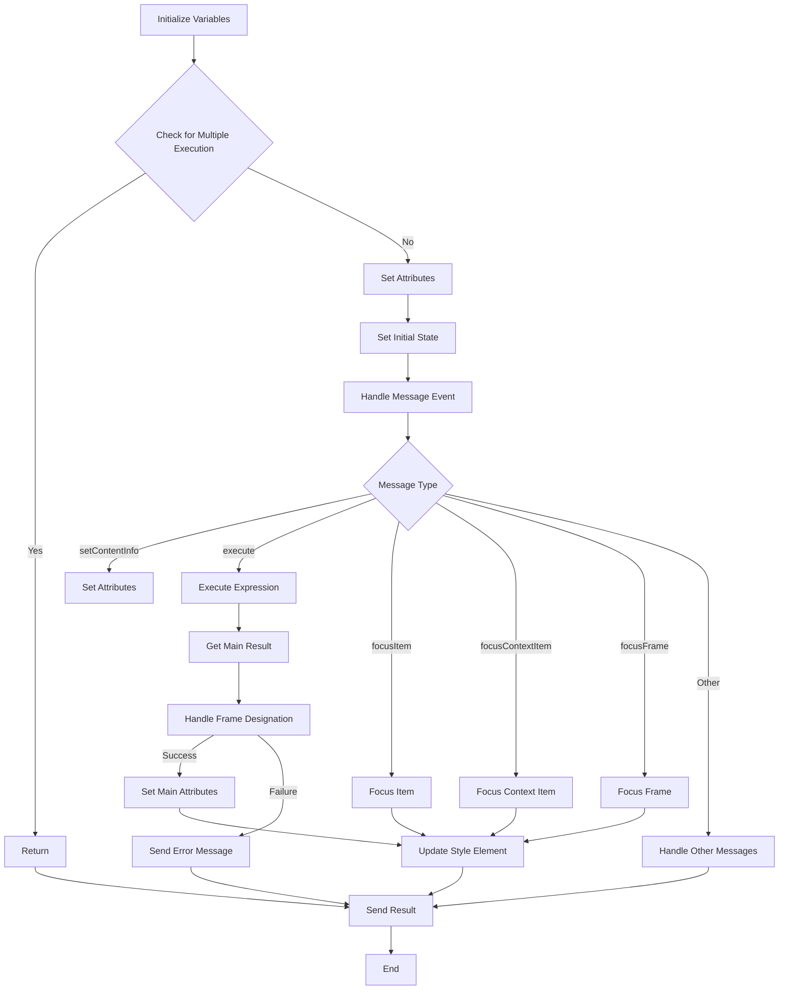

```
/* This Source Code Form is subject to the terms of the Mozilla Public
 * License, v. 2.0. If a copy of the MPL was not distributed with this
 * file, You can obtain one at http://mozilla.org/MPL/2.0/. */

(function (window, undefined) {
    "use strict";

    // alias
    var tx = tryxpath;
    var fu = tryxpath.functions;

    // prevent multiple execution
    if (tx.isContentLoaded) {
        return;
    }
    tx.isContentLoaded = true;

    const dummyItem = "";
    const dummyItems = [];
    const invalidExecutionId = NaN;
    const styleElementHeader
          = "/* This style element was inserted by browser add-on, Try xpath."\
          + " If you want to remove this element, please click the reset"\
          + " style button in the popup. */\\n";

    var attributes = {
        "element": "data-tryxpath-element",
        "context": "data-tryxpath-context",
        "focused": "data-tryxpath-focused",
        "focusedAncestor": "data-tryxpath-focused-ancestor",
        "frame": "data-tryxpath-frame",
        "frameAncestor": "data-tryxpath-frame-ancestor"        
    };

    var prevMsg;
    var executionCount = 0;
    var inBlankWindow = false;
    var currentDocument = null;
    var contextItem = dummyItem;
    var currentItems = dummyItems;
    var focusedItem = dummyItem;
    var focusedAncestorItems = dummyItems;
    var currentCss = null;
    var insertedStyleElements = new Map();
    var expiredCssSet = Object.create(null);
    var originalAttributes = new Map();
    

    // ... (rest of the code)
});
```

**<algorithm>**



**Examples:**

* **A:** `tx.isContentLoaded = true`, `dummyItem = ""`, `attributes` object initialization.
* **B:**  If `tx.isContentLoaded` is `true`, the function returns immediately.
* **I:**  Executing an XPath expression (`main.expression`).
* **K:** Determining if a frame designation is present, handling blank window navigation, and setting `contextItem` accordingly.

**Data Flow:**

The code receives messages via `browser.runtime.onMessage` and handles different message types.  Data flows from the message payload (e.g., expressions, frame designations) through various functions to update internal variables (`contextItem`, `currentItems`, etc.), and finally to generate a result message sent back to the popup or other parts of the extension.

**<explanation>**

* **Imports:** This code likely relies on `tryxpath` and its associated functions (`fu`). The `tryxpath` object (and potentially the `tryxpath.functions` object) might be defined in other JavaScript files in the project.  Without access to those source files, this analysis is limited.

* **Classes:** There are no classes in the provided code. This is pure JavaScript function logic.


* **Functions:**
    * `setAttr()`, `setIndex()`:  These functions are used to set attributes to elements, saving original attribute values to a map (`originalAttributes`) for later restoration. They likely use functions from `fu` to manipulate DOM elements (e.g., setting data attributes on elements).
    * `isFocusable()`: Checks if an item is a node or an attribute suitable for focusing.
    * `focusItem()`:  Handles the process of focusing an element (or an item which references an element), optionally traversing up the DOM tree to find an ancestor element. It uses `fu` methods (`getParentElement`, `getAncestorElements`, `removeAttrFromItem`, etc.) for manipulation.
    * `setMainAttrs()`, `restoreAttrs()`, `resetPrev()`, `createResultMessage()`: Manage state related to results, messages, execution counts, and restoring attributes to previous states before re-execution.
    * `updateCss()`:  Sends a message to the browser runtime to update the CSS.
    * `getFrames()`, `parseFrameDesignation()`, `traceBlankWindows()`: Functions related to handling frame navigation and potentially switching to different browser windows.  Critically, `traceBlankWindows` detects frames that are blank or invalid.
    * `handleCssChange()`: Manages changes to CSS.
    * `findFrameByMessage()`: Finds the target frame based on a message received from a nested frame.
    * `setFocusFrameListener()`: Adds a listener for messages related to focusing frames.  It handles messages that contain an `index` and `frameIndex` to navigate the browser window hierarchy.
    * `initBlankWindow()`: Initializes a listener for messages related to focusing frames when operating within a blank window context.
    * `findStyleParent()`, `updateStyleElement()`, `updateAllStyleElements()`, `removeStyleElement()`, `removeAllStyleElements()`: These functions manage the browser style sheet for the specified document (`doc`).  This allows for potentially injecting custom CSS into the web page.
    * `genericListener()`: This is a key function to handle various messages from the background script or other parts of the extension. It's a message dispatcher. `genericListener.listeners` stores handlers for different events (`setContentInfo`, `execute`, `focusItem`, etc).
    * `genericListener.listeners.execute()`: This function is critical for handling XPath execution, parsing messages from the browser console and managing a complex flow of actions involving `contextItem` and `currentItems` (and other variables).


* **Variables:**
    * `attributes`: Stores data attributes used for marking elements (e.g., "data-tryxpath-focused").
    * `prevMsg`, `executionCount`: State management variables.
    * `inBlankWindow`, `currentDocument`, `contextItem`, `currentItems`: State variables managing the current context and results of the XPath operations, including whether the XPath execution is in a nested frame.
    * `currentCss`: Stores current CSS.
    * `insertedStyleElements`: A `Map` to store style elements and associated documents to manage the insertion and removal of style elements in the document.


* **Potential Errors/Improvements:**
    * **Error Handling:** The code has numerous `try...catch` blocks, which is good for robust error handling.  However, consider logging more informative error messages for debugging purposes.
    * **Data Validation:** The code has checks for valid frame indices (e.g., `if (fu.isNumberArray(inds) && (inds.length > 0))`).  These are important. Ensure checks are thorough in other areas, too.
    * **Asynchronous Operations:**  Some functions (especially those interacting with `browser.runtime.sendMessage`) could benefit from being rewritten to handle asynchronous operations.  These calls could be awaited to ensure proper sequencing.  This is extremely important.
    * **Global Variables:** Use of many global variables can make the code less readable and maintainable in larger projects. Consider refactoring to reduce this reliance or use a more structured data object in a class.


* **Relationships:** The code interacts with `browser.runtime` for communication and likely interacts with `tryxpath.functions` for XPath and DOM element manipulation. There's likely a communication channel (e.g., messages) between the extension's background script and the popup window.  The structure of this intercommunication is not detailed in the snippet shown. This dependency should be considered.


This analysis provides a high-level understanding of the code.  A complete understanding would require examining the implementations of the `fu` (tryxpath.functions) functions, which are not present here.