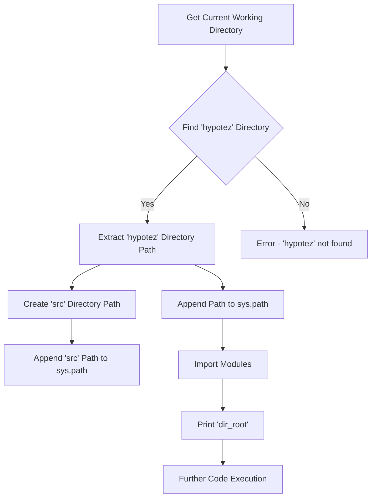

```
## File: hypotez/src/webdriver/edge/_examples/header.py
# -*- coding: utf-8 -*-\
#! venv/Scripts/python.exe
#! venv/bin/python/python3.12

"""
.. module: src.webdriver.edge._examples 
	:platform: Windows, Unix
	:synopsis:

"""
MODE = 'dev'

"""
	:platform: Windows, Unix
	:synopsis:

"""


"""
	:platform: Windows, Unix
	:synopsis:

"""


"""
  :platform: Windows, Unix

"""
"""
  :platform: Windows, Unix
  :platform: Windows, Unix
  :synopsis:
"""MODE = 'dev'
  
""" module: src.webdriver.edge._examples """


import sys
import os
from pathlib import Path

dir_root : Path = Path (os.getcwd()[:os.getcwd().rfind('hypotez')+11])
sys.path.append (str (dir_root) )  # Добавляю корневую папку в sys.path
dir_src = Path (dir_root, 'src')
sys.path.append (str (dir_root) ) 
...

print(dir_root)
# ----------------
from pathlib import Path
import json
import re
# ----------------

from src import gs
from src.suppliers import Supplier
from src.product import Product, ProductFields, ProductFieldsLocators
from src.category import Category
from src.utils import j_dumps, j_loads,   pprint, save_text_file
from src.logger import logger
from src.utils.string import StringFormatter, StringNormalizer, ProductFieldsValidator
...
```

**<algorithm>**



**Example Data Flow (Conceptual):**

* **Input:** `os.getcwd()` returns the current working directory.
* **Process:** The script finds the `hypotez` directory within the path and extracts its absolute path.
* **Output:** The absolute path of the `hypotez` directory is appended to `sys.path`. This allows the interpreter to import modules from within the project.


**<explanation>**

**Imports:**

* `sys`: Used to modify the Python path.  Crucially, this script modifies the system path to include the project root directory. This is essential for the script to correctly import modules from within the `src` directory, creating a module search path hierarchy.
* `os`: Used for interacting with the operating system, particularly for finding the current working directory (`getcwd`).
* `pathlib`: Provides object-oriented path manipulation. The `Path` object is used to safely construct file paths, preventing potential errors from string concatenation.  This is a crucial best practice for robust file handling.
* `json`: Used for encoding/decoding JSON data.
* `re`: Used for regular expression operations (if needed).
* `gs`:  (Implied) Imports a module from the `src` directory, likely related to Google Sheets or a similar data source. The relationship between this module and the current script is crucial for understanding the broader functionality.
* `Supplier`: A class likely defining supplier entities (related to a potentially e-commerce or inventory management system) from the `src.suppliers` package, indicating a project structure aimed at managing inventory information.
* `Product`, `ProductFields`, `ProductFieldsLocators`, `Category`:  Classes from respective packages (`src.product`, `src.category`), defining product and category data structures. This indicates the code likely deals with product information management.
* `j_dumps`, `j_loads`, `pprint`, `save_text_file`:  Utility functions from the `src.utils` module, likely for handling JSON data, formatting output, and saving text files.
* `logger`:  Import from the `src.logger` package, used for logging information during the script's execution. This shows that the code is part of a larger system with logging capabilities.
* `StringFormatter`, `StringNormalizer`, `ProductFieldsValidator`: Classes from the `src.utils.string` module. These classes likely handle string formatting, normalization, and validation tasks related to product data.


**Classes:**

* `Supplier`, `Product`, `ProductFields`, `Category`:  The presence of these classes indicates the code is likely working with a product catalog or similar database structure.

**Functions:**

* Functions like `j_dumps`, `j_loads`, `pprint`, `save_text_file`:  These functions are utilities, likely to assist in handling data (e.g., saving JSON data, pretty-printing data structures).

**Variables:**

* `dir_root`:  `Path` object representing the root directory of the `hypotez` project.
* `dir_src`: `Path` object representing the `src` directory, used for accessing project-related modules.
* `MODE`: A string variable (likely `'dev'` or `'prod'`) used for configuring the script's behavior in different environments.


**Potential Errors and Improvements:**

* **Error Handling:** The code lacks explicit error handling. If `os.getcwd()[:os.getcwd().rfind('hypotez')+11]` fails to find `hypotez` or if `Path` construction fails, the code might crash. Adding `try...except` blocks can help prevent such issues.
* **Redundancy:** The `sys.path.append(str(dir_root))` line is repeated.  A single append after correctly determining the path is sufficient.


**Relationships:**

The script imports from `src` packages, demonstrating a modular structure. The `src` directory likely contains modules related to data handling, product management, and logging. The `utils` module is a clear example of organizing reusable functions, and classes like `StringNormalizer` show an effort to make the code maintainable and extensible. The presence of `gs`, `Supplier`, and other domain-specific packages suggest a larger project focused on handling inventory or similar data.  The script likely interacts with and manipulates data structures and configuration files defined in the `src` packages.