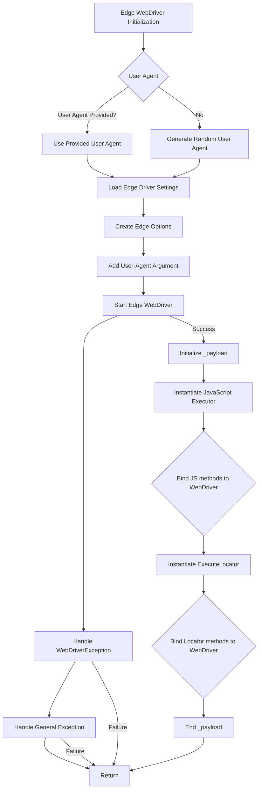

```
## File hypotez/src/webdriver/edge/edge.py
# -*- coding: utf-8 -*-\n#! venv/Scripts/python.exe\n#! venv/bin/python/python3.12\n\n"""\n.. module:: src.webdriver.edge\n   :platform: Windows, Unix\n   :synopsis: Custom Edge WebDriver class with simplified configuration using fake_useragent.\n\n"""\n\nMODE = \'dev\'\n\nimport os\nfrom pathlib import Path\nfrom typing import Optional, List\nfrom selenium.webdriver import Edge as WebDriver\nfrom selenium.webdriver.edge.service import Service as EdgeService\nfrom selenium.webdriver.edge.options import Options as EdgeOptions\nfrom selenium.common.exceptions import WebDriverException\nfrom src.webdriver.executor import ExecuteLocator\nfrom src.webdriver.js import JavaScript\nfrom fake_useragent import UserAgent\nfrom src import gs\nfrom src.logger import logger\nfrom src.utils.jjson import j_loads_ns\n\n\nclass Edge(WebDriver):\n    """\n    Custom Edge WebDriver class for enhanced functionality.\n\n    Attributes:\n        driver_name (str): Name of the WebDriver used, defaults to \'edge\'.\n    """\n    driver_name: str = \'edge\'\n\n    def __init__(self, user_agent: Optional[dict] = None, *args, **kwargs) -> None:\n        """\n        Initializes the Edge WebDriver with the specified user agent and options.\n\n        :param user_agent: Dictionary to specify the user agent. If `None`, a random user agent is generated.\n        """\n        self.user_agent = user_agent or UserAgent().random\n        settings = j_loads_ns(Path(gs.path.src / \'webdriver\' / \'edge\' / \'edge.json\'))\n\n        options = EdgeOptions()\n        options.add_argument(f\'user-agent={self.user_agent}\')\n\n        try:\n            logger.info(\'Starting Edge WebDriver\')\n            edgedriver_path = settings.executable_path.default  # Ensure this is correctly defined in your JSON file\n            service = EdgeService(executable_path=str(edgedriver_path))\n            super().__init__(options=options, service=service)\n            self._payload()\n        except WebDriverException as ex:\n            logger.critical(\'Edge WebDriver failed to start:\', ex)\n            ...\n            return\n        except Exception as ex:\n            logger.critical(\'Edge WebDriver crashed. General error:\', ex)\n            ...\n            return\n\n    def _payload(self) -> None:\n        """\n        Load executors for locators and JavaScript scenarios.\n        """\n        ...\n        j = JavaScript(self)\n        self.get_page_lang = j.get_page_lang\n        self.ready_state = j.ready_state\n        self.get_referrer = j.ready_state\n        self.unhide_DOM_element = j.unhide_DOM_element\n        self.window_focus = j.window_focus\n\n        execute_locator = ExecuteLocator(self)\n        self.execute_locator = execute_locator.execute_locator\n        self.get_webelement_as_screenshot = execute_locator.get_webelement_as_screenshot\n        self.get_webelement_by_locator = execute_locator.get_webelement_by_locator\n        self.get_attribute_by_locator = execute_locator.get_attribute_by_locator\n        self.send_message = self.send_key_to_webelement = execute_locator.send_message\n\n    def set_options(self, opts: Optional[List[str]] = None) -> EdgeOptions:  \n        """  \n        Create and configure launch options for the Edge WebDriver.  \n\n        :param opts: A list of options to add to the Edge WebDriver. Defaults to `None`.  \n        :return: Configured `EdgeOptions` object.  \n        """  \n        options = EdgeOptions()  \n        if opts:  \n            for opt in opts:  \n                options.add_argument(opt)  \n        return options  \n```

2. <algorithm>



**Example:**

If `user_agent` is `{'browser': 'chrome', 'os': 'win10'}`, then B1 is executed. Otherwise, B2 generates a random user agent string.

3. <explanation>

* **Imports:**
    * `os`, `pathlib`, `typing`: Standard Python modules for operating system interactions, file paths, and type hinting, respectively.
    * `selenium.webdriver.*`: Selenium modules for interacting with web browsers, crucial for automating web interactions. `Edge` for the Edge WebDriver interface.
    * `selenium.webdriver.edge.service`, `selenium.webdriver.edge.options`:  Specific modules for configuring the Edge WebDriver.
    * `selenium.common.exceptions`: Selenium exception handling.
    * `src.webdriver.executor`, `src.webdriver.js`: Internal modules likely providing functionalities related to executing JavaScript commands (like locator handling) and interacting with the browser's JavaScript environment.
    * `fake_useragent`: A library that provides user agent strings that can improve scraping and avoid detection.
    * `src.logger`: Internal module for logging messages.
    * `src.utils.jjson`: Internal module for parsing JSON files (likely containing configuration values).
    * `src.gs`: Likely a module for accessing global settings (e.g., paths).

* **Classes:**
    * `Edge(WebDriver)`: This class extends the base `WebDriver` class from Selenium. This inheritance allows the class to use the core WebDriver functionality while adding customized methods. `driver_name` is a simple attribute.
        * `__init__(...)`: Initializes the Edge WebDriver instance. It handles loading user agent settings, driver paths, and driver options. Critically, it initializes the `EdgeService` and the `WebDriver`.
        * `_payload()`: This method is crucial. It loads necessary executors (from the `ExecuteLocator` class) and JavaScript functionalities (from the `JavaScript` class), and it's where most of the browser interaction logic is delegated. The `...` signifies potential additional tasks within this method (not explicitly shown in the code snippet).

* **Functions:**
    * `set_options(opts)`: This function configures Edge WebDriver options based on provided options. `opts` is a list of strings. This function could be useful for passing custom arguments, e.g., setting browser window size or disabling certain features.

* **Variables:**
    * `MODE`: A global variable likely defining the execution mode (e.g., 'dev', 'prod').
    * `edgedriver_path`: Holds the path to the Edge WebDriver executable. This is likely fetched from the `edge.json` file, which is crucial for the driver to function correctly. `settings` contains the data loaded from this JSON file.


* **Potential Errors/Improvements:**
    * **Error Handling:** The `try...except` blocks are good for robustness.  Consider adding more specific exception types within the `try` block to pinpoint the cause of failure.
    * **JSON Validation:** The `j_loads_ns` part might have a validation step to ensure the `edge.json` file is well-formed.  Missing/incorrect `executable_path` in the JSON could cause the driver to fail.
    * **_payload() Completeness:** The `...` in the `_payload` method suggests missing code. Adding more detail about the internal workings of the method or better documentation would greatly improve the code's clarity. Consider logging the load status (success/failure) of these classes in the `_payload` method.
    * **Docstrings:**  While the docstrings are present, they could be more specific and provide detailed examples of how to use the functions and classes.

* **Relationships:**
    * `Edge` relies on `ExecuteLocator`, `JavaScript`, `gs`, `j_loads_ns`, `logger`, `selenium.webdriver`, `fake_useragent`, and the `edge.json` file to operate. The other modules likely provide common functions and a global configuration system within your application.

**Chain of relationships**:
`Edge` (hypotez/src/webdriver/edge/edge.py) depends on various modules within the `src` package, including `src.webdriver.executor`, `src.webdriver.js`, `src.utils.jjson`, `src.logger`, and `src.gs`. These modules in turn have their own dependencies, forming a broader chain of relationships throughout the project. The `edge.json` file is critical for specifying the Edge WebDriver executable path, tying it directly to the `Edge` class.