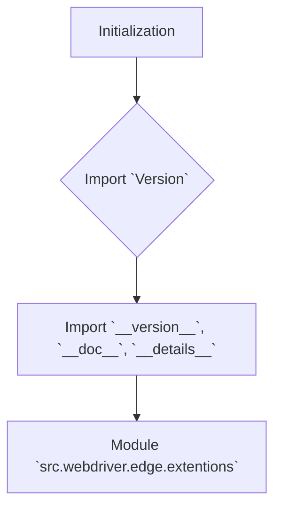

1. **<input code>**:

```python
## \file hypotez/src/webdriver/edge/extentions/__init__.py
# -*- coding: utf-8 -*-
#! venv/Scripts/python.exe
#! venv/bin/python/python3.12

"""
.. module: src.webdriver.edge.extentions 
	:platform: Windows, Unix
	:synopsis:

"""
MODE = 'dev'

"""
	:platform: Windows, Unix
	:synopsis:

"""


"""
	:platform: Windows, Unix
	:synopsis:

"""


"""
  :platform: Windows, Unix

"""
"""
  :platform: Windows, Unix
  :platform: Windows, Unix
  :synopsis:
"""MODE = 'dev'
  
""" module: src.webdriver.edge.extentions """


from packaging.version import Version
from .version import __version__, __doc__, __details__
```

2. **<algorithm>**:



The algorithm is straightforward.  The module initializes by importing necessary elements.  There's no complex logic; it's a simple module setup step.


3. **<explanation>**:

* **Imports**:
    * `from packaging.version import Version`: Imports the `Version` class from the `packaging` library. This is likely used for version comparison or handling within the package.  The `packaging` library is a well-established Python library for handling versions, particularly in package management scenarios. This import suggests a need for version-related operations, possibly in comparing versions or verifying package compatibility. Its relationship to other `src.` packages depends on the specific context of the package structure; it's a general-purpose library.
    * `from .version import __version__, __doc__, __details__`: Imports variables (`__version__`, `__doc__`, `__details__`) from a file named `version.py` within the same directory (`./version.py`). This is a common practice in Python to store package metadata and information.  The presence of these specific variables suggests that this is likely part of a package structure designed for clarity, and good coding practice. It allows maintaining versioning, documentation, and metadata separate from the core functionality of the code.

* **Classes**:  There are no classes defined in this file.

* **Functions**: There are no functions defined in this file.

* **Variables**:
    * `MODE = 'dev'`: This is a global variable. It's likely used for configuration, setting a mode (e.g., development, production). This type of variable is a global constant.  Its purpose is to store a string value defining the operational mode of the code (or potentially a wider project).  A more descriptive name like `OPERATION_MODE` or `EXECUTION_MODE` might be better than `MODE`. This constant is often used for configuration.

* **Potential errors or areas for improvement**:
    * **Missing Docstrings:** While there are docstrings in the module docstring and other parts of the code, the crucial function and method docstrings are absent. This is important for other developers to understand the purpose and expected behavior of the code without extensive analysis.
    * **Redundant comments:** The repeated `"""  :platform: ...  """` comments can be consolidated or removed.
    * **Global Variables:** The use of `MODE` as a global variable is potentially problematic if it will be used in multiple modules.  Consider using a configuration file or dedicated configuration module for global settings.

* **Relationships with other project components**:
    * The `__version__`, `__doc__`, and `__details__` variables imported from `version.py` strongly suggest a package structure. The package likely has other Python files (classes and functions), defining functionality related to edge webdriver extensions and associated version management. The package is likely part of a larger project.

**In Summary:** This Python file is a part of a larger package, likely for managing edge webdriver extensions. It initializes by importing version information from another module, setting up a possible constant (`MODE`) for operating mode selection.  Documentation should be expanded, and global variables should be evaluated for potential improvement.