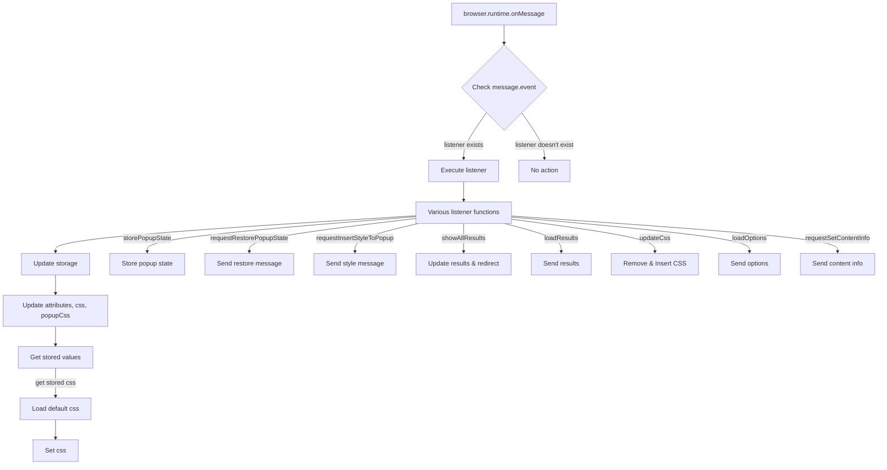

```
/* This Source Code Form is subject to the terms of the Mozilla Public
 * License, v. 2.0. If a copy of the MPL was not distributed with this
 * file, You can obtain one at http://mozilla.org/MPL/2.0/. */

(function (window, undefined) {
    "use strict";

    // alias
    var tx = tryxpath;
    var fu = tryxpath.functions;

    var popupState = null;
    var popupCss = "body{width:367px;height:auto;}";
    var results = {};
    var css = "";
    var attributes = {
        "element": "data-tryxpath-element",
        "context": "data-tryxpath-context",
        "focused": "data-tryxpath-focused",
        "focusedAncestor": "data-tryxpath-focused-ancestor",
        "frame": "data-tryxpath-frame",
        "frameAncestor": "data-tryxpath-frame-ancestor"
    };

    function loadDefaultCss() {
        return new Promise((resolve, reject) => {
            var req = new XMLHttpRequest();
            req.open("GET",
                     browser.runtime.getURL("/css/try_xpath_insert.css"));
            req.responseType = "text";
            req.onreadystatechange = function () {
                if (req.readyState === XMLHttpRequest.DONE) {
                    resolve(req.responseText);
                }
            };
            req.send();
        });
    }

    function genericListener(message, sender, sendResponse) {
        var listener = genericListener.listeners[message.event];
        if (listener) {
            return listener(message, sender, sendResponse);
        }
    };
    genericListener.listeners = Object.create(null);
    browser.runtime.onMessage.addListener(genericListener);

    // ... (rest of the code)
})(window);
```

**<algorithm>**



**Example Data Flow:**

* **`storePopupState`:**  A message with `event: "storePopupState"` and `state: "..."` is received. The `popupState` variable is updated.
* **`updateCss`:** A message with `event: "updateCss"` and `expiredCssSet` and `css` is received.  The code removes expired CSS and inserts new CSS into the specified tab and frame.
* **`loadOptions`:** A message with `event: "loadOptions"` is received. The listener function assembles a response object with `attributes`, `css`, and `popupCss` and sends it back.


**<explanation>**

* **Imports:**  There are no explicit imports in the strict sense.  The code uses the `tryxpath` and `tryxpath.functions` objects, indicating they are likely defined in another part of the project (`src.`).

* **Classes:** There are no classes in this code. It uses functions for various actions.

* **Functions:**
    * **`loadDefaultCss`:** Fetches CSS from `/css/try_xpath_insert.css` via `browser.runtime.getURL`.  Handles asynchronous loading with `Promise`.
    * **`genericListener`:**  The central event handling function, responsible for dispatching messages to appropriate handlers based on the `message.event` property.  Crucially, it uses `browser.runtime.onMessage.addListener` to listen for messages from other parts of the extension.
    * **`genericListener.listeners.*`:**  These are handlers for specific messages.  For example, `storePopupState` updates the `popupState` variable, `updateCss` manages CSS insertion and removal in tabs/frames.  Each function deals with specific message contents and sends responses as needed.

* **Variables:**
    * `popupState`: Stores the state of the popup window.
    * `popupCss`, `results`, `css`, `attributes`: Store configuration data, results, styles, and attributes for use in the extension.

* **Potential Errors/Improvements:**
    * **Error Handling:** The `catch(fu.onError)` blocks in `updateCss` are a good start, but it's worth considering more specific error handling to identify the reason for the error (e.g., network issues, permission denials).
    * **Asynchronous Operations:**  The use of `Promise` chains to load CSS and handle storage updates is good practice.
    * **Data Validation:**  The code assumes that messages from other parts of the extension will have the expected format.  Adding validation to `genericListener` would make the code more robust.
    * **Security Considerations:** If the code receives user-provided CSS, it would be wise to sanitize the code before applying it.

* **Relationship Chain:**
    1.  This code (try_xpath_background.js) listens for messages and responds to them.
    2.  The `browser.runtime` object acts as a communication channel with other scripts and background pages (presumably part of the same extension).
    3.  The `browser.tabs` API likely interacts with the content scripts running in the browser tabs.
    4. The `/css/try_xpath_insert.css` file is likely a resource file in the extension's manifest.
    5. The `/pages/show_all_results.html` is likely a template to present information from the extension.

This code is a critical part of an extension. It manages communication and update states for the rest of the components in the extension.  Proper handling of asynchronous actions is vital, and error handling should be made more robust to prevent unexpected behavior.