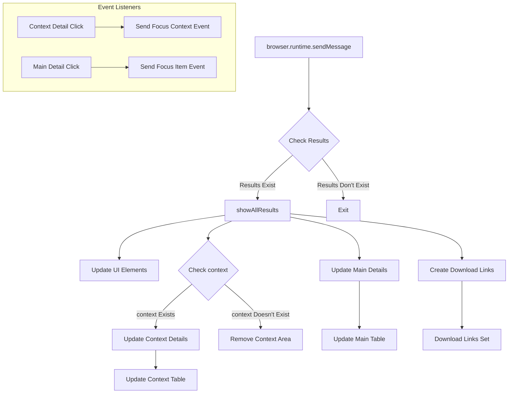

```
/* This Source Code Form is subject to the terms of the Mozilla Public
 * License, v. 2.0. If a copy of the MPL was not distributed with this
 * file, You can obtain one at http://mozilla.org/MPL/2.0/. */

(function (window, undefined) {
    "use strict";

    // alias
    var tx = tryxpath;
    var fu = tryxpath.functions;

    var document = window.document;

    var detailKeys = ["type", "name", "value", "textContent"];
    var headerValues = ["Type", "Name", "Value", "textContent"];
    var relatedTabId;
    var relatedFrameId;
    var executionId;

    function showAllResults(results) {
        document.getElementById("message").textContent = results.message;
        document.getElementById("title").textContent = results.title;
        document.getElementById("url").textContent = results.href;
        document.getElementById("frame-id").textContent = results.frameId;

        if (results.context) {
            let cont = results.context;
            document.getElementById("context-method").textContent
                = cont.method;
            document.getElementById("context-expression").textContent
                = cont.expression;
            document.getElementById("context-specified-result-type")
                .textContent
                = cont.specifiedResultType;
            document.getElementById("context-result-type").textContent
                = cont.resultType;
            document.getElementById("context-resolver").textContent
                = cont.resolver;
            let contTbody = document.getElementById("context-detail")
                .getElementsByTagName("tbody")[0];
            if (cont.itemDetail) {
                fu.updateDetailsTable(contTbody, [cont.itemDetail], {
                    "headerValues": headerValues,
                    "detailKeys": detailKeys
                }).catch(fu.onError);
            }
        } else {
            let area = document.getElementById("context-area");
            area.parentNode.removeChild(area);
        }

        var main = results.main;
        document.getElementById("main-method").textContent = main.method;
        document.getElementById("main-expression").textContent
            = main.expression;
        document.getElementById("main-specified-result-type").textContent
            = main.specifiedResultType;
        document.getElementById("main-result-type").textContent
            = main.resultType;
        document.getElementById("main-resolver").textContent = main.resolver;
        document.getElementById("main-count").textContent
            = main.itemDetails.length;
        var mainTbody = document.getElementById("main-details")
            .getElementsByTagName("tbody")[0];
        fu.updateDetailsTable(mainTbody, main.itemDetails, {
            "headerValues": headerValues,
            "detailKeys": detailKeys
        }).catch(fu.onError);
    };

    // ... (rest of the code)
```

2. **<algorithm>**



**Example Data Flow:**

* `results`: `{message: "some message", title: "test title", href: "some url", frameId: 123, context: {…}, main: {…}}`
* `cont`: `{method: "GET", expression: "some expression", ...}`


3. **<explanation>**

* **Imports:** The code uses `tryxpath` and `tryxpath.functions`, likely indicating that these are local modules or variables defined elsewhere within the project.  `browser` (likely through a browser extension API) and `URL` objects are likely part of the browser environment. The `tryxpath` object and its `functions` seem to encapsulate utility functions for handling results data and updating the UI.

* **Classes:**  There are no explicitly defined classes. This is a script containing functions and variables.

* **Functions:**
    * `showAllResults(results)`:  Takes a `results` object, updates various HTML elements with data from the object, and updates tables displaying details about the context and main results.  It handles the presence or absence of context data.  
    * `makeTextDownloadUrl(text)`: Creates a download URL for a text blob.
    * `makeInfoText(results)`: Formats the results into a human-readable string, suitable for downloading.
    * `makeConvertedInfoText(results)`: Formats the results into a human-readable string, similar to `makeInfoText` but includes JSON conversions of certain data (presumably for better readability/manipulation).  
    * `fu.updateDetailsTable(tbody, details, options)`: (Likely in `tryxpath.functions`) Takes a table body, an array of details, and options to update the table rows with the provided data.  The table format is expected to match the `detailKeys` variable, mapping fields to columns.
    * `fu.onError(err)`: (Likely in `tryxpath.functions`) A catch-all error handler.

* **Variables:**
    * `detailKeys`, `headerValues`: Arrays defining the keys/headers for the details tables.
    * `relatedTabId`, `relatedFrameId`, `executionId`: Variables holding IDs related to the current tab and frame.  Crucial for sending messages to the browser context.

* **Potential Errors/Improvements:**
    * **Error Handling:**  While `catch(fu.onError)` is used, the specific `onError` function should ideally log or report errors to the user rather than silently swallowing them.
    * **Data Validation:**  The code doesn't validate the structure of the `results` object.  If the object is malformed, it could lead to errors. Consider using assertion checks or `typeof` checks.
    * **UI Rendering Optimizations:**  Updating multiple elements in a loop could be optimized using DOM manipulation methods for better performance with large datasets.  Virtual DOM concepts or using a library could help.

* **Relationships:**
    * The code interacts with `browser.runtime.sendMessage` and `browser.tabs.sendMessage`, suggesting a browser extension that communicates with a content script or other parts of the extension.
    * The `fu` object indicates the code relies on functions (`updateDetailsTable`, `onError`, `makeDetailText` etc.) which are part of another module (`tryxpath.functions`).  These functions likely handle common table rendering or data processing tasks in a reusable manner.
    * `makeInfoText` and `makeConvertedInfoText` depend on the structure of the `results` object which could be generated by a different part of the extension or the background page.


This detailed analysis provides a comprehensive understanding of the provided Javascript code. Remember that without the full `tryxpath` and `tryxpath.functions` code, some specific functionalities and internal behaviors remain ambiguous.  Furthermore, the use of `browser` API indicates a browser extension context.