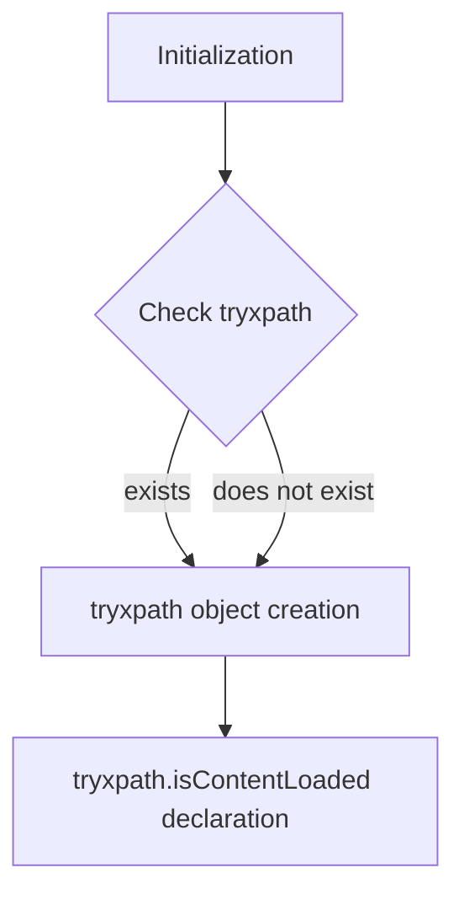

1. **<input code>**

```javascript
/* This Source Code Form is subject to the terms of the Mozilla Public
 * License, v. 2.0. If a copy of the MPL was not distributed with this
 * file, You can obtain one at http://mozilla.org/MPL/2.0/. */

// namespace
if (!tryxpath) {
    var tryxpath = {};
}

tryxpath.isContentLoaded;
```

2. **<algorithm>**



**Explanation of Logical Blocks:**

* **A[Initialization]:**  The code begins its execution.
* **B{Check tryxpath}:**  It checks if a variable named `tryxpath` already exists in the current scope.
* **C[tryxpath object creation]:** If `tryxpath` does not exist, it creates an empty object and assigns it to the `tryxpath` variable.
* **D[tryxpath.isContentLoaded declaration]:**  A property named `isContentLoaded` is declared as part of the `tryxpath` object.  Crucially, this line *does nothing* but *declare* the property.  It doesn't set a value.

**Data Flow:**

There's no significant data flow in this code.  The action of creating the object and declaring a property happens within a single function (the implicit global function that the code runs within).


3. **<explanation>**

* **Imports:** There are no imports in this code.
* **Classes:** There are no classes defined.
* **Functions:**  There are no functions explicitly defined. The code is a single statement block.
* **Variables:**
    * `tryxpath`: This variable is of type `object` (or `undefined` if it didn't exist previously).  It acts as a namespace.
* **Potential Errors/Improvements:**
    * **Missing Functionality:** The declaration of `tryxpath.isContentLoaded` does absolutely nothing.  If the purpose is to indicate that a certain property should be evaluated later or check a condition related to the content of a webpage, this needs to be populated. It's likely a placeholder for future code or a misinterpretation of what is needed in this code.  You would need to populate the `tryxpath.isContentLoaded` with a function to check if the content is loaded, for example.

**Chain of Relationships:**

This code snippet is likely part of a larger JavaScript library (`tryxpath`) related to browser automation (using Selenium or a similar WebDriver). The `tryxpath` object is likely used as a namespace for functions that help to manage content loaded or retrieved in webpages. The `isContentLoaded` property, when populated, would connect with other functions (e.g., `waitForContentLoaded`) that manage DOM loading.  Its presence, but with no implementation, implies it's a step in a larger process, and without the implementation, no webpage manipulation or other similar processes will be executed.  The `try_xpath_check_frame.js` file likely handles interaction with frames and handling content loaded within. Without seeing the surrounding code, we can't be sure of the exact usage of this property.


**In Summary:**

The code is very rudimentary. It sets up a namespace for a library, `tryxpath`, and declares an uninitialized property. This alone does not perform any actions. It needs a function to define how to handle the `isContentLoaded` status. This lack of implementation implies a crucial piece of functionality is missing. Future code will need to assign a function to this property.