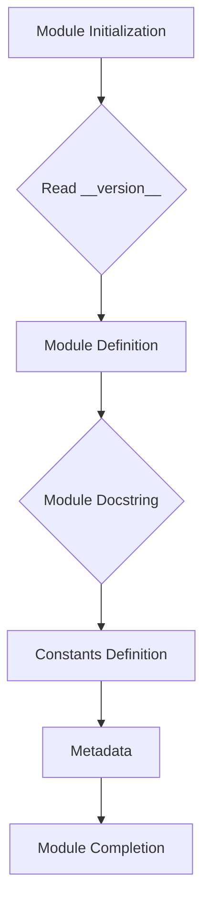

```
## File hypotez/src/webdriver/edge/extentions/version.py
# -*- coding: utf-8 -*-
#! venv/Scripts/python.exe
#! venv/bin/python/python3.12

"""
.. module: src.webdriver.edge.extentions 
	:platform: Windows, Unix
	:synopsis:

"""
MODE = 'dev'

"""
	:platform: Windows, Unix
	:synopsis:

"""


"""
	:platform: Windows, Unix
	:synopsis:

"""


"""
  :platform: Windows, Unix

"""
"""
  :platform: Windows, Unix
  :platform: Windows, Unix
  :synopsis:
"""MODE = 'dev'
  
""" module: src.webdriver.edge.extentions """


"""
- `__version__`: This variable holds the version of the module or package.
- `__name__`: Contains the name of the module. If the script is being run directly, the value will be `"__main__"`.
- `__doc__`: The module's documentation string.
- `__details__`: This variable likely contains additional details about the module, but the exact purpose depends on the specific module or package.
- `__annotations__`: Contains type annotations for variables and functions in the module.
- `__author__`: The name(s) of the author(s) of the module.
"""
__name__:str
__version__="3.12.0.0.0.4"
__doc__:str
__details__:str="Details about version for module or class"
__annotations__

__author__='hypotez '
```

**<algorithm>**



* **Module Initialization (A):** The script initializes the module.
* **Read `__version__` (B):**  The script likely retrieves the version number (3.12.0.0.0.4) from a configuration file or a central repository.
* **Module Definition (C):** This step defines the structure of the module. In this case, the module defines a few variables that contain the module's metadata (e.g., `__version__`, `__name__`, `__doc__`, `__details__`, `__author__`, and `__annotations__`).
* **Module Docstring (D):** The docstrings provide information about the module and its usage.
* **Constants Definition (E):** The script defines constants. `MODE = 'dev'` likely indicates a development mode.
* **Metadata (F):** This block groups the various metadata elements (e.g., `__version__`, `__doc__`, `__author__`).
* **Module Completion (G):** The module completes its initialization, ready to be imported and used.


**<explanation>**

* **Imports:** There are no imports in this file.
* **Classes:** There are no classes defined.
* **Functions:** There are no functions defined.
* **Variables:**
    * `MODE`: String variable holding the mode, likely 'dev' or 'prod' for development or production.
    * `__version__`: String variable storing the module's version (3.12.0.0.0.4).
    * `__name__`: String variable representing the module's name.
    * `__doc__`: String variable containing the docstring (module description).
    * `__details__`: String variable likely holding additional module details.
    * `__annotations__`: Variable to hold type annotations (not used in this example)
    * `__author__`: String variable containing the author's name.
* **Potential Errors/Improvements:**
    * The `__annotations__` variable is declared but not used. Consider adding type hints for variables if needed.
    * The `# -*- coding: utf-8 -*-` and `#!` directives are standard for Python scripts, but in a more modern project would be unnecessary or handled by the project's build system.
    * The multiple `""" """` strings for docstrings aren't wrong, but could potentially cause confusion.  A single, well-formed docstring for each item would be cleaner.
    * The docstrings for `MODE` and other items could be more specific to their role in the WebDriver extension context.

**Relationships with Other Parts of the Project:**

This `version.py` file is likely part of a larger project that involves a WebDriver (e.g., Edge WebDriver) for automating browser interactions.  The versioning information would be critical for dependencies and ensuring compatibility between different parts of the project.  It's likely to be imported into other components that rely on it. This file would likely be referenced by the `setup.py` script (or similar) for distribution.