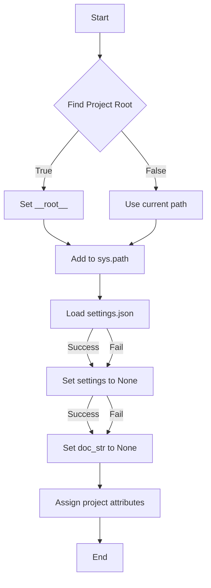

```python
## \file hypotez/src/webdriver/edge/header.py
# -*- coding: utf-8 -*-
#! venv/Scripts/python.exe
#! venv/bin/python/python3.12

"""
.. module: src.webdriver.edge 
	:platform: Windows, Unix
	:synopsis:

"""
MODE = 'dev'


import sys
import json
from packaging.version import Version

from pathlib import Path
def set_project_root(marker_files=('pyproject.toml', 'requirements.txt', '.git')) -> Path:
    """
    Finds the root directory of the project starting from the current file's directory,
    searching upwards and stopping at the first directory containing any of the marker files.

    Args:
        marker_files (tuple): Filenames or directory names to identify the project root.
    
    Returns:
        Path: Path to the root directory if found, otherwise the directory where the script is located.
    """
    __root__:Path
    current_path:Path = Path(__file__).resolve().parent
    __root__ = current_path
    for parent in [current_path] + list(current_path.parents):
        if any((parent / marker).exists() for marker in marker_files):
            __root__ = parent
            break
    if __root__ not in sys.path:
        sys.path.insert(0, str(__root__))
    return __root__


# Get the root directory of the project
__root__ = set_project_root()
"""__root__ (Path): Path to the root directory of the project"""

from src import gs

settings:dict = None
try:
    with open(gs.path.root / 'src' /  'settings.json', 'r') as settings_file:
        settings = json.load(settings_file)
except (FileNotFoundError, json.JSONDecodeError):
    ...

doc_str:str = None
try:
    with open(gs.path.root / 'src' /  'README.MD', 'r') as settings_file:
        doc_str = settings_file.read()
except (FileNotFoundError, json.JSONDecodeError):
    ...


__project_name__ = settings.get("project_name", 'hypotez') if settings  else 'hypotez'
__version__: str = settings.get("version", '')  if settings  else ''
__doc__: str = doc_str if doc_str else ''
__details__: str = ''
__author__: str = settings.get("author", '')  if settings  else ''
__copyright__: str = settings.get("copyrihgnt", '')  if settings  else ''
__cofee__: str = settings.get("cofee", "Treat the developer to a cup of coffee for boosting enthusiasm in development: https://boosty.to/hypo69")  if settings  else "Treat the developer to a cup of coffee for boosting enthusiasm in development: https://boosty.to/hypo69"
```

2. <algorithm>



* **Find Project Root (B):** Iterates through parent directories from the current file's path. Checks if any of the specified marker files (`pyproject.toml`, `requirements.txt`, `.git`) exist in each parent directory. If found, sets `__root__` to that parent directory.

* **Set __root__ (C):** Updates the `__root__` variable with the determined project root directory.

* **Use current path (D):** If no marker file is found, use the current directory as `__root__`.

* **Add to sys.path (E):** Adds the `__root__` to `sys.path` if it's not already present. This ensures that modules in the project can be imported.

* **Load settings.json (F):** Attempts to open and parse `settings.json` located in the `src` directory within the project root.
   * **Success:** Loads the JSON data into the `settings` variable.
   * **Fail:** Leaves `settings` as `None`.

* **Load README.MD (G):** Attempts to open and read `README.MD` from the project root.
    * **Success:** Stores the content in `doc_str`.
    * **Fail:** Sets `doc_str` to `None`.

* **Extract project info (H):** Extracts `project_name`, `version`, `author`, `copyright`, `cofee` from the `settings` dictionary.

* **Assign project attributes (I):** Assigns values to global variables: `__project_name__`, `__version__`, `__doc__`, `__details__`, `__author__`, `__copyright__`, `__cofee__` using `.get()` for safe retrieval.

* **End (J):** Marks the end of the execution.


3. <explanation>

* **Imports:**
    * `sys`: Provides access to system-specific parameters and functions, such as the Python path (`sys.path`). This is used to add the project root directory to the Python path, so it can find modules in your project.
    * `json`: For working with JSON data.  Used to load project configuration from `settings.json`.
    * `packaging.version`: For handling and comparing software versions.
    * `pathlib`: For path manipulation in a more object-oriented manner.  It's used for handling file paths and checking the existence of files.
* **Classes:** No classes are defined.  The `Path` class is imported from `pathlib`, a standard library class.
* **Functions:**
    * `set_project_root(marker_files)`: Finds the project root directory by iterating up from the current file's directory.  It takes a tuple of files/directories as marker files to identify the root directory (like `pyproject.toml`). This ensures correct module resolution. Returns the `Path` object to the root directory.  Error handling is performed within the try-except block for file loading.
* **Variables:**
    * `__root__`: Stores the Path object to the project's root directory.  A critical variable for the code's operation.
    * `settings`: A dictionary that holds project settings from `settings.json`.
    * `doc_str`: A string containing the contents of `README.MD`.
    * `__project_name__`, `__version__`, `__doc__`, `__details__`, `__author__`, `__copyright__`, `__cofee__`: Global variables that hold project information retrieved from `settings.json`. They use `.get()` to handle the case when a key isn't found in `settings` to prevent exceptions.
* **Potential Errors and Improvements:**
    * **Robust Error Handling:** The `try...except` blocks for file loading are good, but could be improved by logging errors to aid in debugging.
    * **File existence check:** Checking file existence (e.g., if `settings.json` or `README.MD` exists) *before* trying to open it would be more robust.
    * **Configuration structure:** Using a more structured way of managing configuration settings could lead to easier maintenance of the project config.


**Relationship with other parts of the project:**

This file (`header.py`) acts as a foundation for setting up the project environment. It establishes the project root directory (`__root__`) which is a critical variable for accessing other project modules (through `gs.path.root` presumably), configuration data (`settings.json`), and documentation (`README.MD`).  The `src` package (presumably containing the `gs` module) provides utility functions like the `gs.path` object, showcasing dependency on that package. This module relies heavily on `gs` to locate resources within the project.