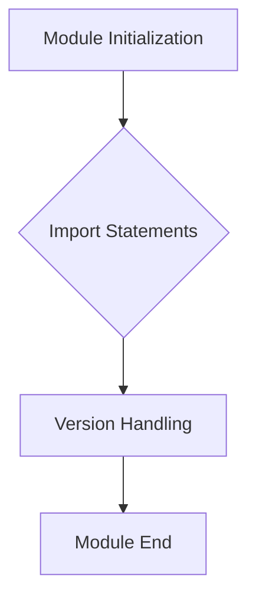

1. **<input code>**

```python
## \file hypotez/src/webdriver/firefox/_examples/__init__.py
# -*- coding: utf-8 -*-\n#! venv/Scripts/python.exe\n#! venv/bin/python/python3.12\n\n"""
.. module: src.webdriver.firefox._examples 
	:platform: Windows, Unix
	:synopsis:

"""
MODE = 'dev'

"""
	:platform: Windows, Unix
	:synopsis:

"""


"""
	:platform: Windows, Unix
	:synopsis:

"""


"""
  :platform: Windows, Unix

"""
"""
  :platform: Windows, Unix
  :platform: Windows, Unix
  :synopsis:
"""MODE = 'dev'
  
""" module: src.webdriver.firefox._examples """


""" Firefox examples """


from packaging.version import Version
from .version import __version__, __doc__, __details__
```

2. **<algorithm>**

This code snippet is a Python module (`__init__.py`) that likely serves as a way to initialize or import components within a larger project related to webdrivers for Firefox. It contains documentation strings, but no significant logic or data processing.





* **Example Data Flow:** The module does not have an explicit data flow to track.  It simply imports external components and defines a constant.

3. **<explanation>**

* **Imports:**
    * `from packaging.version import Version`: Imports the `Version` class from the `packaging` library.  This library is likely used to handle version numbers (e.g., comparing `__version__` from the `version.py` module that is imported subsequently). This import is crucial for package compatibility checks or version management. Its relationship to `src.` packages is indirect as it is a standard Python library.
    * `from .version import __version__, __doc__, __details__`: Imports specific attributes (`__version__`, `__doc__`, `__details__`)  from a file named `version.py` (or similar) within the same directory (`./version.py`). This is likely a standard way of managing version information for a Python package or module within the project structure, potentially to manage or display the Firefox webdriver's version information.


* **Classes:** There are no classes defined in this file.


* **Functions:** No functions are defined.


* **Variables:**
    * `MODE = 'dev'`: A string variable, likely to be used for configuration flags. `dev`  indicates development mode. This variable is used to configure the behaviour of the larger application and may control the webdriver's test mode behavior or how certain modules interact.


* **Potential Errors or Areas for Improvement:**

    * **Missing Logic:** The code does very little. It doesn't seem to actually _do_ anything beyond initializing and importing.  This likely only serves as an interface or import point to other modules in the project.  The `version.py` file is implied to contain more relevant code for the `__version__`, `__doc__`, `__details__` values.


* **Relationship to Other Parts of the Project:**

    * This file relies on the existence of a `version.py` file (or a similar module) in the same directory, for the `__version__`, `__doc__`, and `__details__` variables.  This illustrates a strong relationship.
    * The `packaging` library is an external dependency, not part of the `src` packages.
    *  The overall purpose of the file is to make the Firefox webdriver components accessible within the project, and this initialization and import will likely be called from other parts of the project, such as setup modules, test runner files or testing scripts.


**Overall:** This `__init__.py` file serves as an entry point for using components related to Firefox webdrivers within the `hypotez` project.  Without the `version.py` file, the functionality is incomplete. Further analysis would need to examine the surrounding code to understand the larger system.