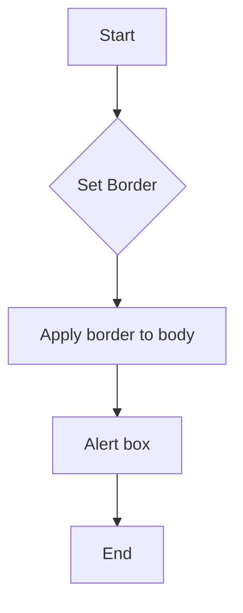

```
1. <input code>

```javascript
document.body.style.border = "5px solid red";
alert();
```
2. <algorithm>



**Example Data Flow:**

* **B (Set Border):**  `border = "5px solid red"`  is the input value.
* **C (Apply border to body):** The CSS style property `border` is applied to the `document.body` element of the HTML document.
* **D (Alert box):** The `alert()` function displays a dialog box with a message on the screen.  No data is directly passed to the `alert()` function for a simple alert.

3. <explanation>

* **Imports:** There are no imports.  This code operates directly within the context of a web page.

* **Classes:** There are no classes defined.  The code uses built-in JavaScript objects and methods.

* **Functions:**
    * `document.body.style.border = "5px solid red";`: This line sets the border style of the `<body>` element in the current HTML document.
        * **Arguments:**  `"5px solid red"` (a string specifying the border style).
        * **Return Value:**  None (it modifies the DOM).
        * **Purpose:**  Visually enhances the webpage by adding a red border around the entire page content.
        * **Example:**  If the current HTML page has a body tag `<body>...</body>`, this line will render a red border around the content enclosed within those tags.


    * `alert();`: This line displays a pop-up alert box to the user.
        * **Arguments:**  None (in this example). A string could be passed as an argument if needed.
        * **Return Value:**  None (it triggers a user interaction).
        * **Purpose:**  Displays a message to the user, usually for informative purposes or to prompt confirmation.
        * **Example:** A message box will pop up, saying 'undefined' because nothing is provided to the alert() function.

* **Variables:** There are no declared variables.

* **Potential Errors/Improvements:**

    * **Lack of User Interaction Handling:** The code only adds a border and displays an alert; it does not handle any user interaction or actions. It would likely be preferable to put these actions into a user action or an event listener.
    * **Specificity and Maintainability:** It could be better to add a style block or use external CSS to control border styling instead of hardcoding the value directly in the script. This makes the code more maintainable.
    * **Potential for Blocking Behavior:** The `alert()` function can halt the execution of the rest of the script until the user interacts with the dialog box.  This might be undesirable in some scenarios where responsiveness is important.

* **Relationship to Other Parts of the Project (if applicable):**  The code snippet does not rely on other parts of the project. It runs autonomously on the page where it is inserted (likely an HTML file that is a part of a larger project).  It's likely a small part of a larger application using browser-based JavaScript for interaction or customization.