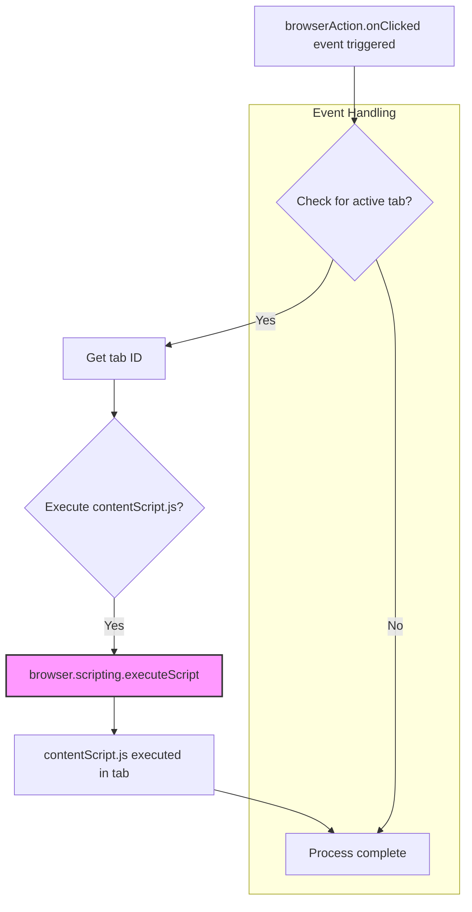

1. **<input code>**

```javascript
// background.js

browser.browserAction.onClicked.addListener((tab) => {
    browser.scripting.executeScript({
        target: { tabId: tab.id },
        files: ["contentScript.js"],
    });
});
```

2. **<algorithm>**



**Example:**

* **A:** User clicks the browser action icon in the browser's toolbar.  This triggers the `browser.browserAction.onClicked` event.
* **C:** The code retrieves the ID of the currently active tab (`tab.id`) associated with the click event.  Let's say the tab ID is `123`.
* **E:**  `browser.scripting.executeScript` is called, instructing the browser to execute the JavaScript code contained within `contentScript.js` within tab `123`.
* **F:** `contentScript.js` runs within the context of the tab. This could involve interacting with the page's DOM, making API calls, or performing other tasks.


3. **<explanation>**

* **Imports:**  There are no explicit imports in this code.  The `browser` object is a global variable within the context of a browser extension. It provides access to various browser APIs. This suggests that the code is intended to be a Firefox extension (due to use of `browser` object) and utilizes browser APIs for managing tabs and scripting.

* **Classes:** There are no classes defined.

* **Functions:**
    * `browser.browserAction.onClicked.addListener((tab) => { ... });`: This function is a listener for the `browser.browserAction.onClicked` event. This event is fired when a user interacts with a browser action (e.g., clicks a button).
    * `tab`: This parameter represents the tab object containing information about the tab, including the tab's ID.


    * `browser.scripting.executeScript({...});`:  This function executes a specified script (in this case, `contentScript.js`) in the context of the given tab.
        * `target: { tabId: tab.id }`: Specifies the target tab for script execution using the tab ID received from the event listener.
        * `files: ["contentScript.js"]`:  Specifies the file (relative path from background.js' location) to execute.


* **Variables:** No significant variables are present outside of the `tab` parameter, which is only locally scoped.

* **Potential Errors/Improvements:**

    * **Error Handling:**  The code lacks error handling. If `browser.scripting.executeScript` fails (e.g., due to a problem accessing the tab or an error in `contentScript.js`), no error is caught or reported. Adding `try...catch` blocks would improve robustness.

    * **contentScript.js dependency:**  The code assumes `contentScript.js` exists in the expected location relative to `background.js`. It's good practice to use absolute paths or a more robust file path mechanism if the location may change.
    * **Security considerations:** The code runs arbitrary JavaScript in the context of the page, it is crucial that `contentScript.js` does not pose a security risk.


* **Relationships with other project parts:**

    * `background.js` is a part of a browser extension's background script, which runs alongside but in a separate context from the user's web pages.
    * `contentScript.js` is another file presumably part of the browser extension, likely executed in the content page of a web page.  `background.js` and `contentScript.js` are connected by the `browser.scripting.executeScript` mechanism that allows `background.js` to control the execution of scripts in `contentScript.js` within a specified tab.

**In Summary:** This code snippet handles a user click on a browser action.  It then executes a `contentScript` JavaScript file within the target tab.  Adding error handling and more robust file path management is recommended for improved code quality and stability.