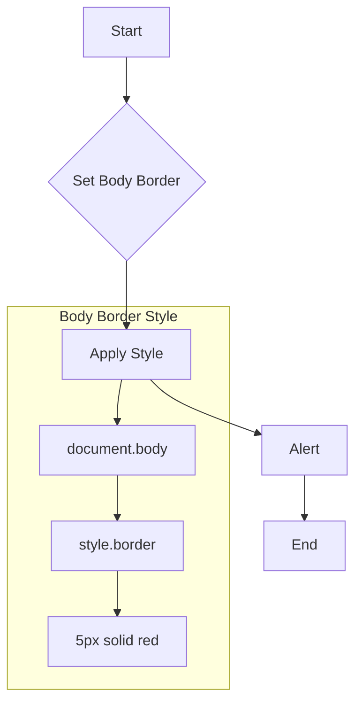

**1. <input code>**

```javascript
document.body.style.border = "5px solid red";
alert()
```

**2. <algorithm>**



* **Start**: The execution begins.
* **Set Body Border**: The code aims to change the border style of the HTML document's body element.
* **Apply Style**: The `document.body.style.border` property is assigned the value "5px solid red". This changes the border of the body element.  Example: If the body element has no border initially, then it now displays a red border.
* **Alert**: The `alert()` function is called. This displays a pop-up alert box in the browser. Example: An alert box with the message 'undefined' would appear. Note that in this context, the alert function is empty, taking no arguments.
* **End**: The execution terminates.

**3. <explanation>**

* **Imports:** There are no imports.  The code is entirely self-contained.

* **Classes:** No classes are defined.

* **Functions:**
    * `alert()`: This built-in JavaScript function displays a pop-up dialog box to the user.  It takes an optional string argument to be displayed as the alert message.  If no argument is passed, it displays an empty alert box. In this specific code, `alert()` has no arguments; therefore, a 'undefined' message might be shown.  It returns `undefined`.

* **Variables:** There are no variables declared in the code.  `document.body`, `document`, and `style` are objects that exist within the browser environment, while `"5px solid red"` is a string literal.


* **Potential Errors/Areas for Improvement:**

    * **Unnecessary Alert:** The `alert()` call in this code is likely not intended behavior. Alerts can be disruptive to the user experience and are generally not ideal for direct manipulation of the DOM.  Consider a different approach if user interaction is needed.
    * **Style String Structure:** The string "5px solid red" follows the common CSS border style format. The exact values will produce different borders.
    * **Potential Conflict:** If other code in the webpage or any external stylesheet is overriding the border style, the desired border might not be visible.


* **Relationships with Other Parts of the Project (if applicable):**  This script is entirely contained within itself and does not interact with other parts of a larger application or project.  It's a simple, direct modification of the current HTML page.  It would only be part of a broader project if this was an initial part of a web application or a test script for the browser.


**In Summary:** This code snippet sets a red border with a 5-pixel width on the body element of the HTML page and then displays an alert box. The alert box's purpose in this context is unclear without further context, and it might be unnecessary or disruptive for the user.