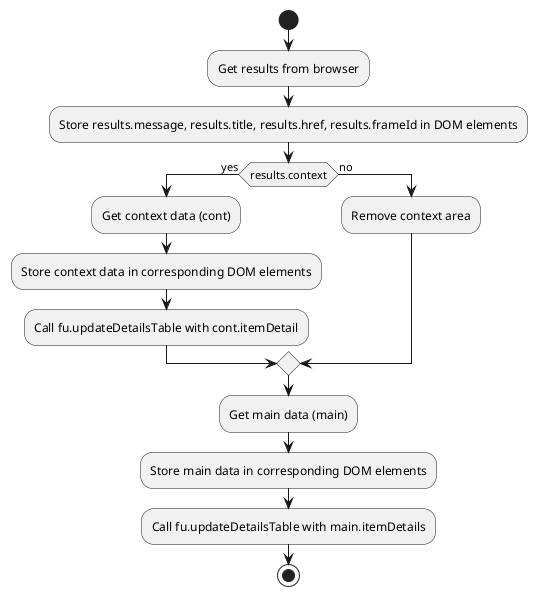

```
/* This Source Code Form is subject to the terms of the Mozilla Public
 * License, v. 2.0. If a copy of the MPL was not distributed with this
 * file, You can obtain one at http://mozilla.org/MPL/2.0/. */

(function (window, undefined) {
    "use strict";

    // alias
    var tx = tryxpath;
    var fu = tryxpath.functions;

    var document = window.document;

    var detailKeys = ["type", "name", "value", "textContent"];
    var headerValues = ["Type", "Name", "Value", "textContent"];
    var relatedTabId;
    var relatedFrameId;
    var executionId;

    function showAllResults(results) {
        document.getElementById("message").textContent = results.message;
        document.getElementById("title").textContent = results.title;
        document.getElementById("url").textContent = results.href;
        document.getElementById("frame-id").textContent = results.frameId;

        if (results.context) {
            let cont = results.context;
            document.getElementById("context-method").textContent
                = cont.method;
            document.getElementById("context-expression").textContent
                = cont.expression;
            document.getElementById("context-specified-result-type")
                .textContent
                = cont.specifiedResultType;
            document.getElementById("context-result-type").textContent
                = cont.resultType;
            document.getElementById("context-resolver").textContent
                = cont.resolver;
            let contTbody = document.getElementById("context-detail")
                .getElementsByTagName("tbody")[0];
            if (cont.itemDetail) {
                fu.updateDetailsTable(contTbody, [cont.itemDetail], {
                    "headerValues": headerValues,
                    "detailKeys": detailKeys
                }).catch(fu.onError);
            }
        } else {
            let area = document.getElementById("context-area");
            area.parentNode.removeChild(area);
        }

        var main = results.main;
        document.getElementById("main-method").textContent = main.method;
        document.getElementById("main-expression").textContent
            = main.expression;
        document.getElementById("main-specified-result-type").textContent
            = main.specifiedResultType;
        document.getElementById("main-result-type").textContent
            = main.resultType;
        document.getElementById("main-resolver").textContent = main.resolver;
        document.getElementById("main-count").textContent
            = main.itemDetails.length;
        var mainTbody = document.getElementById("main-details")
            .getElementsByTagName("tbody")[0];
        fu.updateDetailsTable(mainTbody, main.itemDetails, {
            "headerValues": headerValues,
            "detailKeys": detailKeys
        }).catch(fu.onError);
    };

    function makeTextDownloadUrl(text) {
        return URL.createObjectURL(new Blob([text], { "type": "text/plain"}));
    };

    function makeInfoText(results) {
        // ... (function body)
    };

    function makeConvertedInfoText(results) {
        // ... (function body)
    };

    window.addEventListener("load", function() {
        // ... (function body)
    });

})(window);
```

```
<algorithm>
**Workflow Diagram for showAllResults Function**



```plantuml
@startuml
title Main Workflow (High-Level)

start
:Load Page;
:Send message to browser (loadResults);
if (results) then (yes)
  :Store relatedTabId, relatedFrameId, executionId;
  :Create download links (makeInfoText, makeConvertedInfoText);
  :Call showAllResults(results);
  :Add event listeners to context and main details tables;
endif
else (no)
:Error handling (catch);
endif

stop

@enduml

```

**Detailed Function and Data Flow Examples:**

* **showAllResults(results):**
  * Input: `results` (object containing search results).  Example: `{message: "Result", title: "Test", href: "http://example.com", frameId: 123, context: {...}, main: {...}}`
  * Output: None (updates the DOM).
  * Logic: Extracts data from `results` object and updates elements in the HTML document. Calls `fu.updateDetailsTable` to populate detail tables with extracted data.

* **makeTextDownloadUrl(text):**
  * Input: `text` (string to be downloaded).
  * Output: `URL` object representing download link.
  * Logic: Creates a Blob from the provided text and generates a download URL from that Blob.


* **makeInfoText(results), makeConvertedInfoText(results):**
  * Input: `results` (object containing search results).
  * Output: formatted string suitable for download.
  * Logic: Generates formatted text strings that include structured information about the search results for download.  `makeConvertedInfoText` includes JSON stringified values.

**Explanation**

* **Imports:** The code uses aliases `tx` and `fu` which likely point to the `tryxpath` object and a nested `functions` object.  These imports are critical for using functions from the `tryxpath` library, which presumably handles data parsing, manipulation, and interactions with the extension or browser context. The relationship is indirect, with `tryxpath` likely being a key part of the browser extension's internal structure.

* **Classes:** There are no classes explicitly defined.  Instead, the code uses functions to manage data handling and display.

* **Functions:**
    * `showAllResults`: Takes search results, updates HTML elements with the data, and handles the context and main sections accordingly.
    * `makeTextDownloadUrl`: Creates a download URL from the given string.
    * `makeInfoText`: Formats information about search results for download.  Crucially, it allows for flexible download formats.
    * `makeConvertedInfoText`: Similar to `makeInfoText`, but serializes values to JSON for specific cases.


* **Variables:**
    * `detailKeys`, `headerValues`: Arrays defining the keys for data display and the corresponding column headers.
    * `relatedTabId`, `relatedFrameId`, `executionId`: store IDs necessary for communicating with the browser.
    * `results`: stores search result data.

* **Potential Errors and Improvements:**
    * Error Handling: The code uses `.catch(fu.onError)`. While this is better than no error handling, `fu.onError`'s implementation needs careful consideration for logging or displaying user-friendly error messages.
    * Code Clarity: The logic for generating download links could be slightly improved for readability.
    * Testing: The code is likely used in a browser extension, so proper testing strategies for extension interaction, handling various result sets, and download functionality would be beneficial.


**Relationships with other parts of the project:**

The code heavily relies on `tryxpath` and its `functions` module, which are likely to be defined elsewhere in the project (`src/webdriver/firefox/extentions/try_path_1.3.5`). The code also interacts with the browser via `browser.runtime.sendMessage` and `browser.tabs.sendMessage`, indicating a relationship with the browser extension's internal messaging system.  Finally, the `updateDetailsTable` function likely resides within the `tryxpath.functions` module, further illustrating the integration of this code with the broader project.