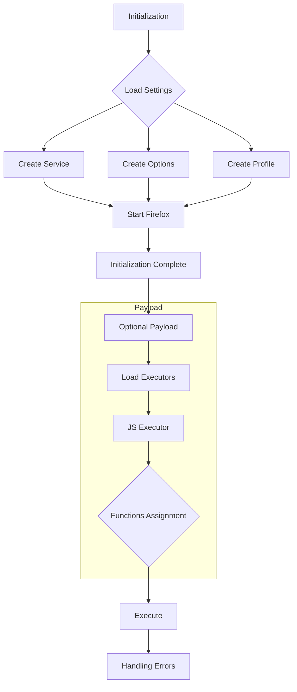

```python
## \file hypotez/src/webdriver/firefox/firefox.py
# -*- coding: utf-8 -*-
#! venv/Scripts/python.exe
#! venv/bin/python/python3.12

"""
.. module:: src.webdriver.firefox
   :platform: Windows, Unix
   :synopsis: Firefox WebDriver

This code defines a subclass of `webdriver.Firefox` called `Firefox`. 
It provides additional functionality such as the ability to launch Firefox 
in kiosk mode and the ability to set up a Firefox profile for the WebDriver.

```python
# Example usage
if __name__ == "__main__":
    profile_name = "custom_profile"
    geckodriver_version = "v0.29.0"
    firefox_version = "78.0"
    
    browser = Firefox(profile_name=profile_name, geckodriver_version=geckodriver_version, firefox_version=firefox_version)
    browser.get("https://www.example.com")
    browser.quit()
```
@image html class_firefox.png

"""

MODE = 'dev'

import os
from pathlib import Path
from typing import Optional
from selenium.webdriver import Firefox as WebDriver
from selenium.webdriver.firefox.options import Options
from selenium.webdriver.firefox.service import Service
from selenium.webdriver.firefox.firefox_profile import FirefoxProfile
from selenium.common.exceptions import WebDriverException
from src.webdriver.executor import ExecuteLocator
from src.webdriver.js import JavaScript
from fake_useragent import UserAgent
from src import gs
from src.utils import j_loads_ns
from src.logger import logger
```

**<algorithm>**



**Examples:**

* **B (Load Settings):** `settings = j_loads_ns(Path(gs.path.src / 'webdriver' / 'firefox' / 'firefox.json'))` loads configuration from a JSON file. Example data: `{ "executable_path": { "geckodriver": "/path/to/geckodriver", "firefox_binary": "/path/to/firefox" }, "profile_directory": { "default": "os", "internal": "/path/to/profile" }}`
* **C (Create Service):** `service = Service(geckodriver_path)` creates a service object for the GeckoDriver.
* **D (Create Options):** `options = Options()` creates options for Firefox. 
* **E (Create Profile):** `profile = FirefoxProfile(profile_directory=profile_directory)` creates a Firefox profile.
* **F (Start Firefox):** `super().__init__(service=service, options=options)` starts the Firefox WebDriver.
* **H (Payload):** Loads and initializes `JavaScript` and `ExecuteLocator` classes to enhance WebDriver functionality.
* **K (Functions Assignment):** Assigns methods from the JS and ExecuteLocator classes to the `Firefox` instance for direct access.
* **M (Handling Errors):** The `try...except` block gracefully handles `WebDriverException` and other exceptions, logging errors for debugging.

**Data Flow:**

1. Initialization reads settings from `firefox.json`.
2. Settings are used to create the service, options, and profile.
3. The Firefox WebDriver is started.
4. Additional functionalities are initialized and assigned.
5. Error handling ensures smooth execution and reporting.

**<explanation>**

* **Imports:**
    * `os`, `pathlib`: Standard Python modules for file system operations.
    * `typing`: Provides type hints for better code readability and maintainability.
    * `selenium.webdriver.*`: Selenium modules for interacting with web browsers.
    * `fake_useragent`: Allows for random user agent selection.
    * `gs`: Likely a custom module for global settings or paths (part of the project).
    * `j_loads_ns`: A custom function from `utils` package, presumably for parsing JSON and resolving namespaces.
    * `logger`: A custom logger from the `src.logger` package for logging events.
    * `ExecuteLocator` and `JavaScript`: Likely custom classes from the `src.webdriver` package for advanced browser automation.


* **Classes:**
    * `Firefox`: A subclass of `selenium.webdriver.Firefox`.  It extends the base class by adding specific functionality for Firefox, allowing customization of the profile, and providing advanced interaction methods using `JavaScript` and `ExecuteLocator`.
        * `driver_name`: A class attribute defining the WebDriver name (helpful for identifying the browser).
        * `__init__`: The constructor takes parameters to customize the browser launch options, profile, and geckodriver/Firefox versions, user agent. The code dynamically builds arguments based on settings in `firefox.json`, offering a configurable launch procedure.
        * `_payload`: Initializes helper classes for interacting with the browser at the javascript level.
* **Functions:**
    * `j_loads_ns`: parses the `firefox.json` file, and it is critical for providing configuration data for the webdriver.
    * `__init__`: Takes several parameters related to the Firefox profile (`profile_name`, `geckodriver_version`, `firefox_version`, `user_agent`) and other options. It sets up the Firefox WebDriver, including configuring the profile, adding arguments, and setting a random user agent.   
* **Variables:**
    * `settings`: Stores the configuration loaded from `firefox.json`.
    * `geckodriver_path`, `firefox_binary_path`:  Paths to the GeckoDriver and Firefox executable, respectively, dynamically constructed from the global settings.
    * `profile_directory`:  Path to the profile used for the WebDriver. Supports user-provided profiles and internal default profiles.
    * `options`, `service`, `profile`: These are objects (from Selenium) that manage Firefox options, the service used to run Firefox (e.g., the geckodriver), and the profile used.

* **Potential Errors/Improvements:**
    * Error handling could be more specific.  The `except Exception as ex` catch-all is not ideal.
    * The `...` after the `except WebDriverException` block is unnecessary. It can be removed.
    * More comprehensive logging about what's happening during initialization and the specific arguments passed to Firefox can enhance debugging.
    * Consider using `os.path.join` instead of concatenating strings in Path constructions for better portability.


**Relationships:**

* This code relies on `src.webdriver`, `src.utils`, and `src.logger` packages. These packages are expected to have specific functionality related to web driver execution, utilities for data processing (parsing json), and logging messages respectively.  
* The use of `gs.path.root` and related `gs` paths suggest a `gs` module or class that contains global settings and path information. This is crucial for maintaining consistent paths across different parts of the project.
* The `Firefox` class depends on `selenium.webdriver`, `selenium.webdriver.firefox.*`, `fake_useragent` and custom classes like `JavaScript` and `ExecuteLocator`.   


This analysis provides a comprehensive overview of the `firefox.py` file, including its functionality, interactions with other parts of the project, and areas for improvement. Remember that a complete understanding of the project's structure and the `gs` module will help in fully grasping the purpose and context.