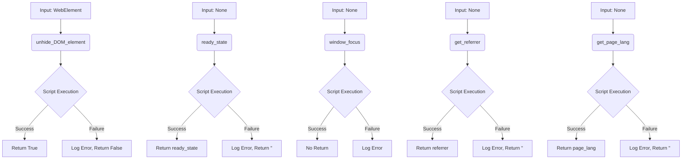

```python
## \file hypotez/src/webdriver/js.py
# -*- coding: utf-8 -*-
#! venv/Scripts/python.exe
#! venv/bin/python/python3.12

"""
.. module:: src.webdriver.js
    :platform: Windows, Unix
    :synopsis: Provides JavaScript utility functions for interacting with a web page.

This module is designed to extend the capabilities of Selenium WebDriver by adding common JavaScript-based
functions for interacting with web pages, including visibility manipulations, retrieving page information,
and managing browser focus.

Key Features:
    1. Make invisible DOM elements visible for interaction.
    2. Retrieve metadata like document ready state, referrer, or page language.
    3. Manage browser window focus programmatically.
"""
MODE = 'dev'

import header
from src import gs
from src.logger import logger
from selenium.webdriver.remote.webdriver import WebDriver
from selenium.webdriver.remote.webelement import WebElement
```

```
<algorithm>
```

```
<explanation>

**1. Imports:**

* `header`: Likely contains project-specific header/configuration information.  Its relationship to other `src.` packages depends on the project structure.  We'd need to see the `header.py` file to know specifics.
* `src.gs`: This import likely refers to a package within the `src` directory related to general functionalities like storing global data, constants, or helper functions. The relationship with the rest of the project is unclear without `gs.py`'s content.
* `src.logger`:  A custom logger module used for handling error reporting and logging messages, likely implementing a more sophisticated logging framework than Python's built-in `logging` module.  Interacts closely with other parts of the project to manage logs.
* `selenium.webdriver.remote.webdriver`:  The base class for interacting with Selenium WebDrivers. The code leverages Selenium for controlling a web browser.
* `selenium.webdriver.remote.webelement`: Represents a web element (like a button or text field) in a webpage, enabling manipulation of elements.  Used in concert with the Selenium WebDriver to interact with web page elements.

**2. Classes:**

* `JavaScript`: This class encapsulates JavaScript-based utilities for interacting with a web page.
    * `__init__(self, driver: WebDriver)`: Initializes the class by accepting a `WebDriver` instance, enabling execution of JavaScript commands on that browser.
        * `self.driver`: Stores the `WebDriver` object for later use in method calls.
    * `unhide_DOM_element(self, element: WebElement) -> bool`: Makes an invisible element visible.
        * `element`: The `WebElement` object needing visibility changes.
        * `script`: Contains a JavaScript code snippet to adjust the element's styling. Crucial, because it alters the DOM, controlling how the browser displays elements.
        * `driver.execute_script()`: Executes the JavaScript code, affecting the element in the browser. The try-except block handles potential errors during script execution.  Good error handling is crucial for reliable WebDriver interactions.
    * `ready_state(self) -> str`: Retrieves the document's ready state.
        * `self.driver.execute_script(...)`: Executes JavaScript to get `document.readyState`. Crucial for understanding if the page is loaded completely.
    * `window_focus(self) -> None`: Attempts to bring the browser window to the foreground.
        * `driver.execute_script('window.focus();')`: This crucial line executes the `window.focus();` command in the browser to bring it to the front.
    * `get_referrer(self) -> str`: Retrieves the referrer URL.
        * `document.referrer`: An important piece of page context.
    * `get_page_lang(self) -> str`: Returns the language of the current page.
        * `document.documentElement.lang`: Returns the lang attribute from the `<html>` tag.

**3. Functions:**

* `unhide_DOM_element`, `ready_state`, `window_focus`, `get_referrer`, `get_page_lang`:  Each method takes appropriate arguments and returns a value, performing the specific tasks described in their docstrings.  The try-except blocks ensure error handling in case of JavaScript execution problems.

**4. Variables:**

* `MODE`: A global string variable likely used to determine the operational mode of the application (e.g., 'dev', 'prod').
* `script`: A string holding JavaScript code passed to `driver.execute_script()`.

**5. Relationships and Potential Errors/Improvements:**

* **Error Handling:** The `try...except` blocks are essential to gracefully handle potential errors during JavaScript execution.  This is important for robustness.  Consider adding more specific exception types to the `except` clause to provide more context during debugging.
* **Clearer Variable Names:**  While the code uses type hints, more descriptive variable names (e.g., `element_style_script` instead of `script`) might improve readability.
* **Logging:**  The use of `logger` is a good practice for maintainability and debugging. Ensure the logger is configured correctly.
* **Dependency Management:**  How does the project manage external dependencies like Selenium?   The use of virtual environments (`venv`) is good practice.
* **Testing:** This file should have unit tests to verify the correctness of JavaScript execution.

**Overall Chain of Relationships:**

This JavaScript module (`hypotez/src/webdriver/js.py`) relies on the `src.logger` module for error reporting and the Selenium WebDriver (`selenium` package) for controlling the browser and executing JavaScript commands. The `gs` module (not detailed) potentially provides global variables or data used by other parts of the project.  The `header` module is project-specific, so its role depends on the project structure. This code operates within the context of a broader project (`hypotez`), handling browser automation tasks for the system.
```