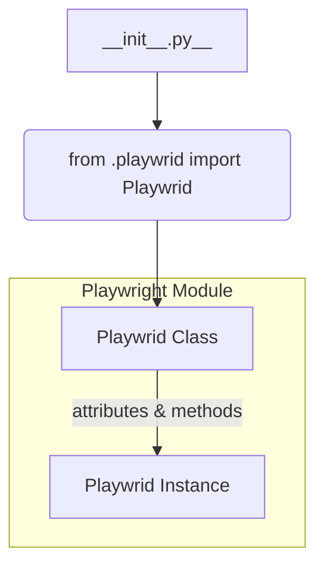

1. **<input code>**:

```python
## \file hypotez/src/webdriver/playwright/__init__.py
# -*- coding: utf-8 -*-\
#! venv/Scripts/python.exe
#! venv/bin/python/python3.12

"""
.. module: src.webdriver.playwright 
	:platform: Windows, Unix
	:synopsis:
https://chatgpt.com/share/67428d3f-6b18-800d-a585-eb414eef60e2
"""
MODE = 'dev'

from .playwrid import Playwrid
```

2. **<algorithm>**:



This is a very basic import statement.  No significant algorithm is present; there's no logic flow or data processing in this file.  It primarily establishes the namespace for the `Playwrid` class, making it accessible within the `webdriver.playwright` package.

3. **<explanation>**:

* **Imports**:
    * `from .playwrid import Playwrid`: This line imports the `Playwrid` class from a module named `playwrid` within the same directory (`./playwrid`).  The `.` in front of the module path indicates a relative import, a crucial aspect of Python's modular organization.  This strongly implies that a file named `playwrid.py` (or a similar file with a different name) must exist within the `hypotez/src/webdriver/playwright` directory.  The `Playwrid` class likely defines methods and attributes related to interacting with a web browser using the Playwright library. The relationships are:
        * `hypotez/src/webdriver/playwright/__init__.py`  -> `hypotez/src/webdriver/playwright/playwrid.py`

* **Variables**:
    * `MODE = 'dev'`: This global variable likely defines the operating mode of the program (e.g., development, testing, production).  Its value can be used by other parts of the project to tailor behavior.  Note that this variable is unused in the snippet provided.

* **Classes**:
    * `Playwrid`:  The presence of a `Playwrid` class implies the `playwrid.py` file contains the full definition of this class. Without seeing the contents of `playwrid.py`, it's impossible to precisely detail its attributes and methods.  However, the name suggests it's likely a custom wrapper class for the Playwright library, providing a tailored interface for interacting with Playwright functionalities.


* **Functions**:  There are no functions explicitly defined within this file.

* **Potential Errors or Improvements**:
    * **Missing documentation:** While the docstring provides a link, it doesn't contain any useful information related to the module.  Adding more informative docstrings to the `Playwrid` class and the functions within it would greatly improve the code's maintainability and clarity.
    * **Unused `MODE` variable:** The `MODE` variable is defined but not used.  Consider removing or using it if needed within the `Playwrid` class.
    * **Relative imports**:  `playwrid` is assumed to be present due to the relative import. If `playwrid.py` is not present or the path is wrong, this could result in a `ModuleNotFoundError`.


**Chain of Relationships:**

`hypotez/src/webdriver/playwright/__init__.py` imports and uses the `Playwrid` class from `hypotez/src/webdriver/playwright/playwrid.py`.  This `Playwrid` class is likely designed to simplify or enhance the use of the Playwright library within the broader `hypotez` project.  The `hypotez` project is using a Playwright-based webdriver for web automation.  Further analysis of `playwrid.py` and other `hypotez` files would reveal the complete picture of how this module integrates into the overall application.