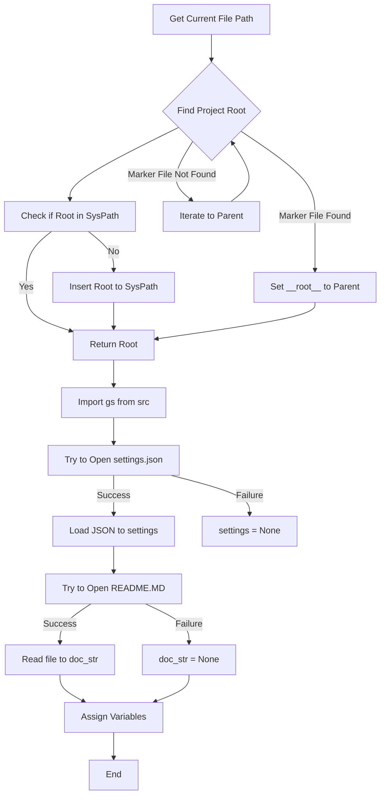

```
## File hypotez/src/webdriver/playwright/header.py
# -*- coding: utf-8 -*-\n#! venv/Scripts/python.exe\n#! venv/bin/python/python3.12\n\n"""\n.. module: src.webdriver.playwright \n\t:platform: Windows, Unix\n\t:synopsis:\n\n"""\nMODE = 'dev'\n\nimport sys\nimport json\nfrom packaging.version import Version\n\nfrom pathlib import Path\ndef set_project_root(marker_files=('pyproject.toml', 'requirements.txt', '.git')) -> Path:\n    """\n    Finds the root directory of the project starting from the current file\'s directory,\n    searching upwards and stopping at the first directory containing any of the marker files.\n\n    Args:\n        marker_files (tuple): Filenames or directory names to identify the project root.\n    \n    Returns:\n        Path: Path to the root directory if found, otherwise the directory where the script is located.\n    """\n    __root__:Path\n    current_path:Path = Path(__file__).resolve().parent\n    __root__ = current_path\n    for parent in [current_path] + list(current_path.parents):\n        if any((parent / marker).exists() for marker in marker_files):\n            __root__ = parent\n            break\n    if __root__ not in sys.path:\n        sys.path.insert(0, str(__root__))\n    return __root__\n\n\n# Get the root directory of the project\n__root__ = set_project_root()\n"""__root__ (Path): Path to the root directory of the project"""\n\nfrom src import gs\n\nsettings:dict = None\ntry:\n    with open(gs.path.root / 'src' / 'settings.json', 'r') as settings_file:\n        settings = json.load(settings_file)\nexcept (FileNotFoundError, json.JSONDecodeError):\n    ...\n\n\ndoc_str:str = None\ntry:\n    with open(gs.path.root / 'src' / 'README.MD', 'r') as settings_file:\n        doc_str = settings_file.read()\nexcept (FileNotFoundError, json.JSONDecodeError):\n    ...\n\n \n\n__project_name__ = settings.get("project_name", 'hypotez') if settings  else 'hypotez'\n__version__: str = settings.get("version", '')  if settings  else ''\n__doc__: str = doc_str if doc_str else ''\n__details__: str = ''\n__author__: str = settings.get("author", '')  if settings  else ''\n__copyright__: str = settings.get("copyrihgnt", '')  if settings  else ''\n__cofee__: str = settings.get("cofee", "Treat the developer to a cup of coffee for boosting enthusiasm in development: https://boosty.to/hypo69")  if settings  else "Treat the developer to a cup of coffee for boosting enthusiasm in development: https://boosty.to/hypo69"
```

2. **<algorithm>**



**Example:**

* **A:** `__file__` points to `header.py`
* **B:** Searches up the directory tree looking for `pyproject.toml`, `requirements.txt`, or `.git`.
* **F:** If `pyproject.toml` is found in `/path/to/project`, `__root__` is set to `/path/to/project`.
* **D/P:** The function returns `/path/to/project` and it's added to `sys.path`.

3. **<explanation>**

* **Imports:**
    * `sys`: Used for manipulating the Python path (`sys.path`).
    * `json`: Used for working with JSON files (loading `settings.json`).
    * `packaging.version`: Likely for handling version strings (although not used in this example).
    * `pathlib`: Used for working with file paths in an object-oriented way. This makes the code more robust and readable than using string manipulation.
    * `src.gs`: Imports a module (likely) from the `src` package, probably containing functions related to file paths within the project.  This is critical for relative file path navigation.  The lack of a more descriptive `gs` import is a potential area for improvement.

* **Classes:** There are no classes defined in the provided code.

* **Functions:**
    * `set_project_root(marker_files)`:
        * **Arguments:** `marker_files`: A tuple of filenames or directory names to search for when finding the project root. Defaults to `('pyproject.toml', 'requirements.txt', '.git')`.
        * **Return Value:** `Path`: The path to the root directory.
        * **Functionality:** This function locates the project root directory by recursively traversing up the directory tree from the current file (`__file__`) until it finds a directory containing any of the specified marker files. It adds the root to `sys.path` if it's not already there, making modules in that project importable.


* **Variables:**
    * `MODE`: A string variable set to 'dev'.
    * `__root__`: A `Path` object that stores the path to the project root.  The use of a leading underscore signifies its internal scope and use.
    * `settings`, `doc_str`: Dictionary and string variables to hold project settings and documentation, respectively.  They are initialized to `None`.
    * `__project_name__`, `__version__`, `__doc__`, etc.: Variables holding various project metadata (e.g., name, version, author).  These variables are dynamically loaded from `settings.json` if available, or have defaults assigned.


* **Potential Errors/Improvements:**
    * **Error Handling:** The `try...except` blocks for loading `settings.json` and `README.MD` handle potential `FileNotFoundError` and `json.JSONDecodeError`. This is good practice, but consider logging errors for debugging.
    * **`gs` Module:** The `gs` module is imported but not fully analyzed without its content.  The `gs.path.root`  usage is unclear without more context.
    * **Data Integrity:**  If `settings.json` is malformed, it will create an empty `settings` dict.  Consider handling the case of a `settings` object not containing the expected keys.
    * **`__root__`:** Using a variable name like `__root__` often suggests it has a global scope, but in this case, the function has scope.
    * **`MODE` Variable**: Its role and use are unclear.

* **Relationship Chain:**
    * This script is likely part of a larger project (`hypotez`).
    * The `gs` module from `src` appears to provide functionality for interacting with the project's filesystem (e.g., retrieving root paths). This is a key component for ensuring that various parts of the project can access and operate on files and folders in a consistent manner.

The script initializes essential metadata (`__project_name__`, `__version__`, etc.) by loading it from a settings file (`settings.json`) and (optionally) a documentation file (`README.MD`) using the `gs` module for path resolution. This kind of setup is common in larger projects to centralize configuration and metadata.