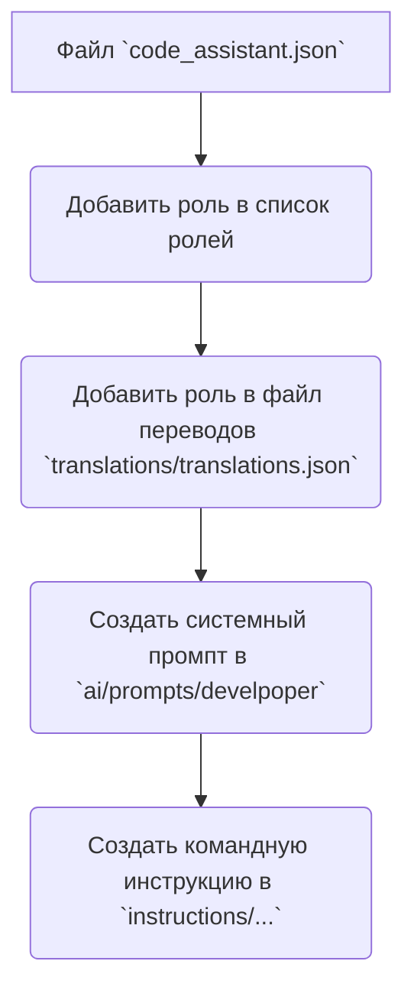

# Порядок действий для создания новой роли

Этот код описывает порядок действий для создания новой роли в системе.  Он представлен в виде графа, облегчающего визуальное понимание последовательности операций.

**Описание шагов:**

* **A[Файл `code_assistant.json`]**:  Предположительно, этот файл содержит основную конфигурацию системы, включая список доступных ролей.  Добавление новой роли в этот файл является первым шагом, чтобы система знала о существовании новой роли.

* **B(Добавить роль в список ролей)**:  На данном этапе в файл `code_assistant.json` добавляется информация о новой роли.  Это может включать уникальный идентификатор роли, название, описание, и другие необходимые атрибуты.

* **C(Добавить роль в файл переводов `translations/translations.json`)**:  Это необходимый шаг для локализации системы.  В файл `translations/translations.json` добавляются переводы описания роли, команд и других связанных текстовых фрагментов для разных языков.

* **D(Создать системный промпт в `ai/prompts/develpoper`)**:  Здесь создается системный промпт (запрос к ИИ) для роли.  Этот промпт задаёт контекст и правила поведения ИИ в этой роли.  Расположение в `ai/prompts/develpoper` предполагает, что этот файл предназначен для разработки и тестирования.

* **E(Создать командную инструкцию в `instructions/...`)**: Этот шаг предполагает создание документации или руководства для пользователя, объясняющего, как взаимодействовать с ИИ в новой роли. Файлы с инструкциями могут быть организованы в папке `instructions/`.

**Важно:**

Код предоставляет лишь *схему* процесса.  Необходимо уточнить, что именно должно быть добавлено в каждый файл (`code_assistant.json`, `translations/translations.json`, `ai/prompts/develpoper`, `instructions/...`) для корректной работы системы.  Детали реализации могут отличаться в зависимости от конкретной архитектуры.