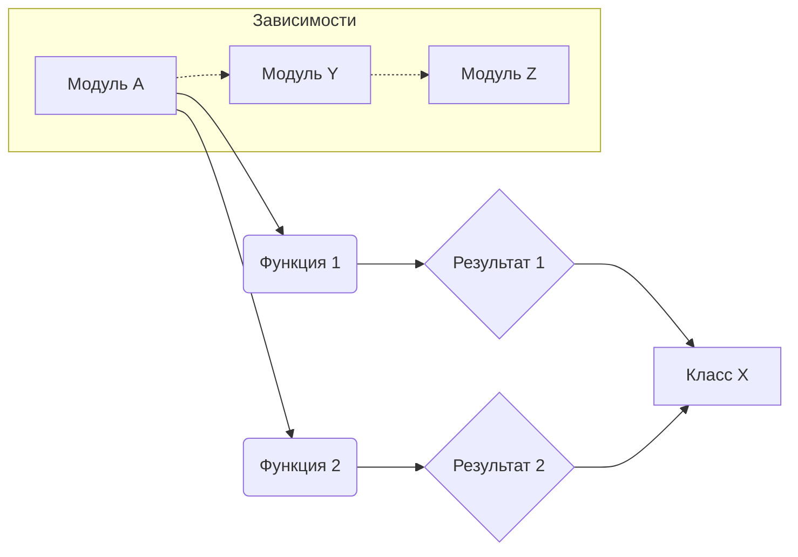

# Анализ кода

**INSTRUCTION**:  

Проанализируйте предоставленный код подробно и объясните его функциональность. Ответ должен включать три раздела:

1. **<код>**: Представьте предоставленный код без изменений.
2. **<алгоритм>**: Опишите рабочий процесс в виде пошаговой блок-схемы, включите примеры для каждого логического блока и проиллюстрируйте поток данных между функциями, классами или методами.
3. **<mermaid>**: Постройте диаграмму кода в формате mermaid, проанализируйте и объясните все импортируемые зависимости при построении диаграммы.
4. **<объяснение>**: Предоставьте подробные объяснения:
   - **Импорты**: Их назначение и отношение к другим пакетам `src.`.
   - **Классы**: Их роль, атрибуты, методы и взаимодействие с другими компонентами проекта.
   - **Функции**: Их аргументы, возвращаемые значения, назначение и примеры.
   - **Переменные**: Их типы и использование.
   - Выделите потенциальные ошибки или области для улучшения.

Кроме того, постройте цепочку взаимосвязей с другими частями проекта (если применимо).

Это гарантирует всесторонний и структурированный анализ кода.


**<код>**

```python
# (Здесь должен быть вставлен код)
```

**<алгоритм>**

```
(Здесь должна быть блок-схема)
```

**<mermaid>**



**<объяснение>**

(Здесь должно быть подробное объяснение импортов, классов, функций, переменных и т.д. на основе вставленного кода.  Например:)

**Импорты:**

* `import module1`:  Этот импорт необходим для доступа к функциям и классам из модуля `module1`. Он, вероятно, содержит вспомогательные функции или данные, используемые в данном коде.  Описание его связи с другими модулями должно быть указано в комментариях к импорту или в документации.

**Классы:**

* `class MyClass:`:  Этот класс отвечает за [описание функциональности]. Его атрибуты [перечислить атрибуты] хранят [описание назначения атрибутов]. Методы `method1()`, `method2()` отвечают за [описания функциональности методов].

**Функции:**

* `def my_function(arg1, arg2):`:  Эта функция принимает на вход [описание аргументов] и возвращает [описание возвращаемого значения].  Её назначение – [описание назначения].  Пример использования: `result = my_function(value1, value2)`.


**Переменные:**

* `variable1 = value`: Переменная `variable1` типа [тип переменной] хранит [назначение переменной].

**Возможные ошибки и улучшения:**

* [Список потенциальных ошибок и способов их исправления]. Например:  Возможно, не хватает обработки исключений, или функция может быть переписана для большей эффективности.

**Взаимосвязи с другими частями проекта:**

* Этот код взаимодействует с [модули проекта, с которыми он связан].  Например, он использует данные из [модуль], результат обработки передаётся в [модуль].
```
**ВАЖНО**:  Для создания корректного ответа необходимо предоставить код.  Пустой код не позволяет сгенерировать содержательный ответ.