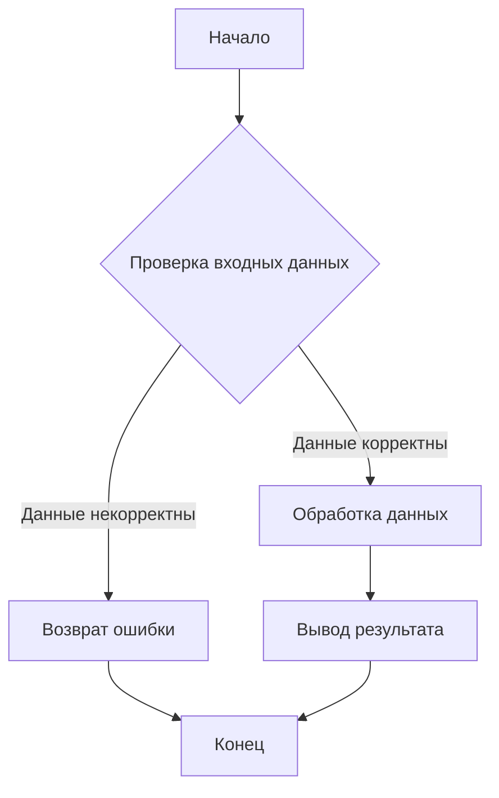
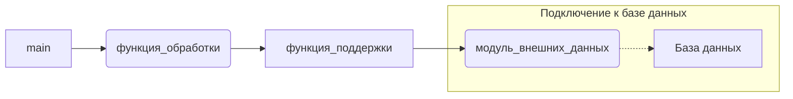

# Анализ кода

**Инструкция:** Проанализировать предоставленный код и объяснить его функциональность.

**1. <input code>**

```python
# (Здесь должен быть предоставлен код для анализа)
```

**2. <algorithm>**

*(Здесь должна быть блок-схема алгоритма, примеры и описание перемещения данных.)*

**Пример блок-схемы (предполагаемый алгоритм):**



* **Блок B (Проверка входных данных):** Проверяется, что входные данные соответствуют ожидаемому формату. Пример: проверка типа данных, диапазона значений, наличия обязательных полей.
* **Блок C (Обработка данных):** Описывается выполнение вычислений или преобразований над данными. Пример: вычисление суммы, сортировка массива, преобразование формата.
* **Блок D (Возврат ошибки):**  Определяется, что делать, если входные данные некорректны. Пример: возврат специального значения, исключение.
* **Блок E (Вывод результата):** Описание того, как результат обработки данных передается дальше в программе. Пример: печать результата на консоль, запись в файл, передача в другую функцию.


**3. <mermaid>**

```mermaid
(Здесь должна быть диаграмма в формате mermaid, описывающая зависимости)
```

**Пример диаграммы (предполагаемый код):**




**4. <explanation>**

*(Здесь должен быть подробный анализ кода, включая импорты, классы, функции, переменные и ошибки.)*

* **Импорты:**  Анализ импортируемых модулей и их роли.  Например:
    * `from src.utils import data_loader`: Импортирует функцию `data_loader` из модуля `data_loader` в пакете `src.utils`.
    * `import src.database.db_connector`: Импортирует модуль `db_connector` из пакета `src.database`, отвечающий за подключение к базе данных.

* **Классы:** Описание ролей, атрибутов и методов классов.

* **Функции:**  Подробное описание функций, их аргументов, возвращаемых значений и примеров использования. Например:
    * `def функция_обработки(данные):` - описание входных данных, что функция делает с данными и возвращаемое значение.

* **Переменные:** Типы и назначение переменных. Например:
    * `данные = [1, 2, 3]`: Тип данных - список чисел, используется для передачи данных в функцию.

* **Возможные ошибки или области для улучшений:**  Анализ потенциальных проблем в коде и рекомендации по улучшению. Например:
    * Недостаточная валидация входных данных может приводить к ошибкам.

* **Взаимосвязи с другими частями проекта:** Описание того, как данный код интегрирован с другими частями проекта, как данные перемещаются между разными модулями и классами.  Например:
    * Функция `функция_обработки` получает данные от модуля `utils`, обрабатывает их и сохраняет результат в базе данных, подключение к которой осуществляется через модуль `db_connector`.


**Примечание:**  Для корректного анализа кода **необходимо предоставить сам код**.  Этот шаблон демонстрирует формат ответа, заполненный предполагаемыми элементами.