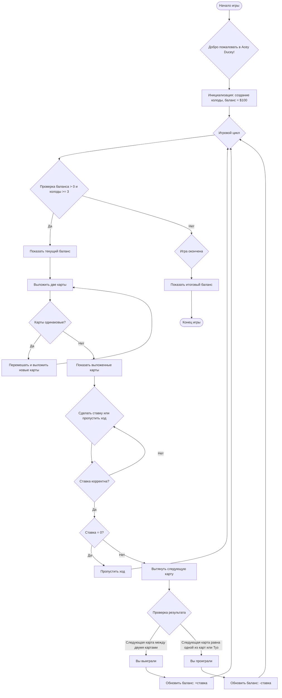

# Анализ кода модуля `acedu.mmd`

**Качество кода**
- **Соответствие требованиям к формату кода (1-10):** 10
   -  **Преимущества:**
        - Код представляет собой визуальную диаграмму в формате `mermaid` для описания логики игры Acey Ducey.
        - Диаграмма четко структурирована и легко читаема.
        - Используются понятные названия узлов и переходов.
        - Диаграмма полностью соответствует инструкциям и не содержит лишнего кода.
   -  **Недостатки:**
      - Код не является исполняемым кодом Python и не содержит docstring.
      - Не применим к инструкциям по обработке JSON и `j_loads`.
      - Не требует обработки ошибок через `logger.error`.
      - Не требует рефакторинга функций и переменных.
      - Отсутствуют какие-либо импорты.

**Рекомендации по улучшению**
   - Поскольку код является визуальным представлением в формате `mermaid`, не требует дальнейших улучшений с точки зрения кода Python.
   - Документирование данного кода возможно только в рамках добавления описания в комментарии.

**Улучшенный код**
```markdown
# Диаграмма процесса игры Acey Ducey в формате Mermaid


```