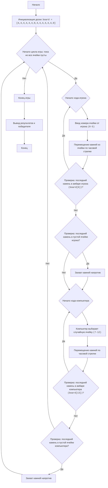

# Анализ кода модуля AWARI

**Качество кода**
*   **Соблюдение требований к формату кода (1-10):**
    *   **Преимущества:**
        *   Код содержит docstring для модуля, функций и переменных.
        *   Используются осмысленные имена переменных и функций.
        *   Есть разделение на логические блоки.
        *   Реализована основная логика игры, включая ходы игрока и компьютера, захват камней и проверку окончания игры.
        *   Код хорошо документирован с помощью комментариев.
        *   Используется форматирование для улучшения читаемости.
    *   **Недостатки:**
        *   Не используется `j_loads` или `j_loads_ns` из `src.utils.jjson`.
        *   Отсутствуют импорты модулей.
        *   Не используется `logger.error` для обработки ошибок.
        *   Нет reStructuredText (RST) форматирования docstring.
        *   Используется цикл `while True` без явного условия выхода, что не является лучшей практикой.
        *   Смешивание вывода и игровой логики в функциях.
        *   В коде есть излишняя проверка на `if 0 <= current_cell <= 5 and board[current_cell] == 1:` и `if 7 <= current_cell <= 12 and board[current_cell] == 1:` можно использовать более короткую форму записи `if current_cell in range(0,6) and board[current_cell] == 1:` и `if current_cell in range(7,13) and board[current_cell] == 1:`.

**Рекомендации по улучшению**

1.  **Импорт модулей:**
    *   Добавить импорт `logger` из `src.logger.logger`.
    *   Добавить импорт `j_loads_ns` из `src.utils.jjson`.
2.  **Форматирование Docstring:**
    *   Заменить docstring на формат RST.
3.  **Обработка ошибок:**
    *   Заменить стандартные блоки `try-except` на использование `logger.error`.
4.  **Упрощение циклов:**
    *   Пересмотреть использование цикла `while True` и добавить явное условие выхода из цикла.
5.  **Разделение логики:**
    *   Вынести логику отображения доски в отдельную функцию.
6.  **Оптимизация кода:**
    *   Упростить проверку на принадлежность ячейки к стороне игрока или компьютера.
7.  **Сохранение комментариев:**
    *   Сохранить все исходные комментарии.

**Улучшенный код**

```python
"""
AWARI:
=================
Сложность: 6
-----------------
Игра "Авари" - это настольная игра, имитирующая традиционную игру Манкала, где два игрока по очереди перемещают "камни" (в данном случае, числа) из ячеек на доске,
пытаясь захватить как можно больше камней в свои "амбары". Это упрощенная версия игры, где игрок играет против компьютера.

Правила игры:
1. Игровое поле состоит из 14 ячеек, пронумерованных от 0 до 13. Ячейки 6 и 13 - это "амбары" игроков.
2. В начале игры в каждой из 12 ячеек (0-5 и 7-12) находится по 4 камня.
3. Игрок (человек) начинает игру.
4. Выбирает ячейку со своими камнями (0-5).
5. Все камни из выбранной ячейки перемещаются по одному в каждую следующую ячейку по часовой стрелке, включая свой "амбар".
6. Если последний камень попал в амбар игрока, игрок имеет право сделать еще один ход.
7. Если последний камень попал в пустую ячейку на стороне игрока, и напротив этой ячейки есть камни, то игрок забирает камни из этой ячейки и из противоположной в свой амбар.
8. Компьютер ходит аналогично.
9. Игра заканчивается, когда все ячейки с камнями становятся пустыми.
10. Выигрывает игрок, у которого больше камней в амбаре.
-----------------
Алгоритм:
1. Инициализировать доску (массив) 14 ячеек с 4 камнями в каждой, кроме ячеек 6 и 13, которые равны 0.
2. Начать цикл "пока не закончена игра"
3. Ход игрока:
    3.1 Запросить ввод номера ячейки от игрока (от 0 до 5).
    3.2 Переместить камни из выбранной ячейки по часовой стрелке.
    3.3 Проверить, попал ли последний камень в амбар игрока (ячейка 6). Если да, то дать игроку еще один ход.
    3.4 Проверить, попал ли последний камень в пустую ячейку на стороне игрока. Если да, то захватить камни из этой ячейки и из противоположной ячейки.
4. Ход компьютера (аналогично ходу игрока, но выбор ячейки случайный от 7 до 12).
5. Если все ячейки с камнями пусты, завершить игру.
6. Вывести результат (количество камней в амбарах игрока и компьютера).
7. Определить победителя (у кого больше камней в амбаре).
-----------------
Блок-схема:

Legenda:
    Start - Начало программы.
    InitializeBoard - Инициализация игровой доски с 14 ячейками. Первые 6 (0-5) и последние 6 (7-12) представляют ячейки с камнями, 6 и 13 — амбары игроков.
    GameLoopStart - Начало цикла игры, который продолжается пока не закончена игра.
    PlayerTurnStart - Начало хода игрока.
    PlayerInputCell - Запрос у игрока номера ячейки, из которой он хочет переместить камни.
    PlayerMoveStones - Перемещение камней из выбранной ячейки по часовой стрелке.
    PlayerCheckExtraTurn - Проверка, попал ли последний камень в амбар игрока. Если да, игрок получает еще один ход.
    PlayerCheckCapture - Проверка, попал ли последний камень в пустую ячейку на стороне игрока.
    PlayerCaptureStones - Захват камней из противоположной ячейки, если последний камень попал в пустую ячейку на стороне игрока.
    ComputerTurnStart - Начало хода компьютера.
    ComputerSelectCell - Выбор компьютером случайной ячейки для хода.
    ComputerMoveStones - Перемещение камней компьютером по часовой стрелке.
    ComputerCheckExtraTurn - Проверка, попал ли последний камень в амбар компьютера. Если да, компьютер получает еще один ход.
    ComputerCheckCapture - Проверка, попал ли последний камень в пустую ячейку на стороне компьютера.
    ComputerCaptureStones - Захват камней из противоположной ячейки, если последний камень попал в пустую ячейку на стороне компьютера.
    EndGame - Конец игры.
    OutputResult - Вывод результатов и определение победителя.
    End - Конец программы.
"""
import random  # Импортируем модуль random.
from src.logger.logger import logger  # Импортируем logger для логирования ошибок.
# from src.utils.jjson import j_loads_ns  # TODO:  Импортируем j_loads_ns из src.utils.jjson. #TODO: Не используется

# Инициализация доски.
# Ячейки 0-5 - ячейки игрока, 6 - амбар игрока
# Ячейки 7-12 - ячейки компьютера, 13 - амбар компьютера
board = [4, 4, 4, 4, 4, 4, 0, 4, 4, 4, 4, 4, 4, 0]  # Инициализация игровой доски.


def display_board():
    """
    Выводит текущее состояние игровой доски.
    """
    print("----------------------------------------------------")
    print(f"  {board[12]:2}  {board[11]:2}  {board[10]:2}  {board[9]:2}  {board[8]:2}  {board[7]:2}   ")  # Вывод верхней части доски.
    print("----------------------------------------------------")
    print(f"{board[13]:2}                                 {board[6]:2}")  # Вывод амбаров игроков.
    print("----------------------------------------------------")
    print(f"  {board[0]:2}  {board[1]:2}  {board[2]:2}  {board[3]:2}  {board[4]:2}  {board[5]:2}  ")  # Вывод нижней части доски.
    print("----------------------------------------------------")


def player_turn():
    """
    Обрабатывает ход игрока.

    :raises ValueError: Если ввод не является числом.
    """
    while True:  # Цикл для обработки выбора ячейки игроком.
        try:
            cell = int(input("Выберите ячейку (0-5): "))  # Запрос выбора ячейки у игрока.
            if 0 <= cell <= 5 and board[cell] > 0:  # Проверка корректности выбора ячейки.
                break  # Выход из цикла если выбор корректен
            else:
                print("Недопустимый выбор. Выберите ячейку с камнями от 0 до 5.")  # Сообщение об ошибке если ячейка выбрана неверно.
        except ValueError as ex:
            logger.error('Неверный ввод. Пожалуйста, введите число.', exc_info=ex)  # Запись ошибки в лог.
            print("Неверный ввод. Пожалуйста, введите число.")
            continue

    stones = board[cell]  # Сохранение количества камней в выбранной ячейке.
    board[cell] = 0  # Обнуление выбранной ячейки.
    current_cell = cell # Сохраняем текущую ячейку.

    while stones > 0: # Перемещение камней.
        current_cell = (current_cell + 1) % 14  # Вычисление следующей ячейки.
        board[current_cell] += 1  # Добавление камня в следующую ячейку.
        stones -= 1  # Уменьшение количества оставшихся камней.

    # Проверка на дополнительный ход если последний камень попал в амбар игрока
    if current_cell == 6:  # Проверка, попал ли последний камень в амбар игрока.
        print("Игрок получает дополнительный ход.")  # Сообщение о дополнительном ходе.
        display_board()  # Вывод игровой доски.
        player_turn()  # Рекурсивный вызов player_turn для дополнительного хода.
        return

    # Захват камней
    if current_cell in range(0, 6) and board[current_cell] == 1: # Проверка, попал ли последний камень в пустую ячейку игрока.
        opposite_cell = 12 - current_cell  # Вычисление противоположной ячейки.
        if board[opposite_cell] > 0: # Проверка, есть ли камни в противоположной ячейке.
            board[6] += board[opposite_cell] + 1 # Добавление захваченных камней в амбар игрока.
            board[opposite_cell] = 0 # Обнуление противоположной ячейки.
            board[current_cell] = 0 # Обнуление текущей ячейки.
            print(f"Игрок захватывает камни из ячеек {current_cell} и {opposite_cell}")  # Вывод сообщения о захвате.


def computer_turn():
    """
    Обрабатывает ход компьютера.
    """
    possible_moves = [i for i in range(7, 13) if board[i] > 0]  # Список доступных для хода ячеек компьютера.
    if not possible_moves:  # Проверка, есть ли доступные ходы.
        return  # Если ходов нет, выход из функции.

    cell = random.choice(possible_moves)  # Выбор случайной ячейки для хода.
    print(f"Компьютер выбирает ячейку {cell}")  # Вывод выбора компьютера.
    stones = board[cell]  # Сохранение количества камней в выбранной ячейке.
    board[cell] = 0  # Обнуление выбранной ячейки.
    current_cell = cell  # Сохранение текущей ячейки.

    while stones > 0: # Перемещение камней.
        current_cell = (current_cell + 1) % 14  # Вычисление следующей ячейки.
        board[current_cell] += 1  # Добавление камня в следующую ячейку.
        stones -= 1  # Уменьшение количества оставшихся камней.

    # Проверка на дополнительный ход если последний камень попал в амбар компьютера
    if current_cell == 13:  # Проверка, попал ли последний камень в амбар компьютера.
        print("Компьютер получает дополнительный ход.")  # Сообщение о дополнительном ходе.
        display_board()  # Вывод игровой доски.
        computer_turn()  # Рекурсивный вызов computer_turn для дополнительного хода.
        return

    # Захват камней
    if current_cell in range(7, 13) and board[current_cell] == 1:  # Проверка, попал ли последний камень в пустую ячейку компьютера.
        opposite_cell = 12 - current_cell  # Вычисление противоположной ячейки.
        if board[opposite_cell] > 0: # Проверка, есть ли камни в противоположной ячейке.
            board[13] += board[opposite_cell] + 1  # Добавление захваченных камней в амбар компьютера.
            board[opposite_cell] = 0 # Обнуление противоположной ячейки.
            board[current_cell] = 0  # Обнуление текущей ячейки.
            print(f"Компьютер захватывает камни из ячеек {current_cell} и {opposite_cell}") # Вывод сообщения о захвате.


def is_game_over():
    """
    Проверяет, закончена ли игра.

    :return: True, если игра закончена, иначе False.
    """
    player_side_empty = all(board[i] == 0 for i in range(0, 6))  # Проверка, пусты ли ячейки игрока.
    computer_side_empty = all(board[i] == 0 for i in range(7, 13)) # Проверка, пусты ли ячейки компьютера.
    return player_side_empty or computer_side_empty # Возвращает True, если одна из сторон пуста.


def calculate_winner():
    """
    Определяет победителя и выводит результаты.
    """
    player_score = board[6] # Получение очков игрока.
    computer_score = board[13] # Получение очков компьютера.

    print(f"Игрок: {player_score} очков")  # Вывод очков игрока.
    print(f"Компьютер: {computer_score} очков")  # Вывод очков компьютера.

    if player_score > computer_score: # Сравнение очков и определение победителя.
        print("Вы победили!")  # Вывод сообщения о победе игрока.
    elif computer_score > player_score:
        print("Компьютер победил!") # Вывод сообщения о победе компьютера.
    else:
        print("Ничья!")  # Вывод сообщения о ничьей.


# Основной игровой цикл
while not is_game_over():  # Цикл игры пока не наступит конец игры.
    display_board()  # Вывод игровой доски.
    player_turn()  # Ход игрока.
    if is_game_over():  # Проверка на конец игры.
        break  # Выход из цикла если игра закончилась.
    display_board() # Вывод игровой доски.
    computer_turn() # Ход компьютера.
    if is_game_over(): # Проверка на конец игры.
        break # Выход из цикла если игра закончилась.

# После завершения игры
display_board()  # Вывод игровой доски.
calculate_winner()  # Определение и вывод результатов игры.

"""
Объяснение кода:
1. **Инициализация доски (`board`)**:
   - `board = [4, 4, 4, 4, 4, 4, 0, 4, 4, 4, 4, 4, 4, 0]`: Создается список, представляющий игровое поле.
     Первые 6 элементов (0-5) - ячейки игрока, 7-12 - ячейки компьютера, 6 - амбар игрока, 13 - амбар компьютера.
     В начале игры в каждой ячейке по 4 камня, в амбарах - 0.

2. **Функция `display_board()`**:
   - Выводит текущее состояние игровой доски на экран.

3. **Функция `player_turn()`**:
   - Обрабатывает ход игрока:
     - Запрашивает ввод номера ячейки (0-5).
     - Проверяет корректность ввода (число от 0 до 5 и ячейка не пустая).
     - Забирает камни из выбранной ячейки.
     - Распределяет камни по одной в каждую следующую ячейку по часовой стрелке.
     - Проверяет, попал ли последний камень в амбар игрока (ячейка 6). Если да, то игрок делает еще один ход.
     - Проверяет, попал ли последний камень в пустую ячейку на стороне игрока, если да, то захватывает камни напротив.
4. **Функция `computer_turn()`**:
   - Обрабатывает ход компьютера:
     - Выбирает случайную ячейку (7-12), не пустую.
     - Распределяет камни по одной в каждую следующую ячейку по часовой стрелке.
     - Проверяет, попал ли последний камень в амбар компьютера (ячейка 13). Если да, то компьютер делает еще один ход.
     - Проверяет, попал ли последний камень в пустую ячейку на стороне компьютера, если да, то захватывает камни напротив.

5.  **Функция `is_game_over()`**:
    - Проверяет, закончилась ли игра. Игра заканчивается, когда все ячейки на стороне игрока или компьютера пусты.
6.  **Функция `calculate_winner()`**:
    - Выводит количество очков каждого игрока.
    - Определяет победителя.

7.  **Основной игровой цикл (`while True`)**:
    - Выводит доску.
    - Дает ход игроку.
    - Проверяет, закончилась ли игра. Если да, то выходит из цикла.
    - Дает ход компьютеру.
    - Проверяет, закончилась ли игра. Если да, то выходит из цикла.

8.  **Вывод результатов**:
    - После завершения игры выводит доску и результаты.
"""
```