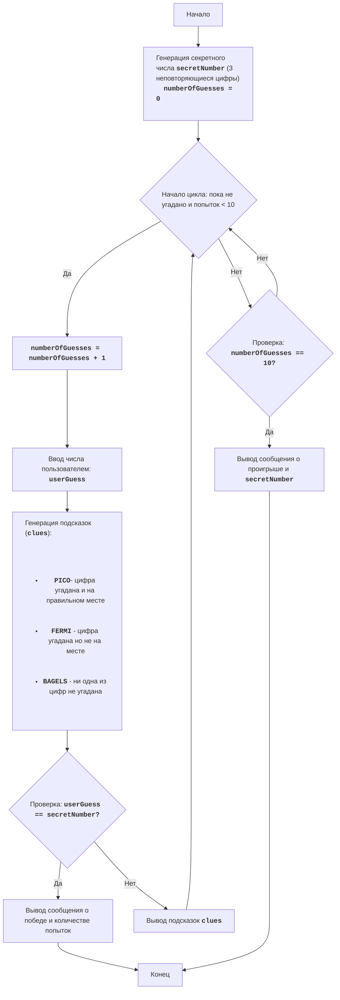

# Анализ кода модуля BAGLES

**Качество кода**
1.  **Соблюдение формата reStructuredText (RST)**:
    -   Документация представлена в формате Markdown, а не RST.
    -   Отсутствуют docstring для функций и методов.
    -   Необходима конвертация документации в RST.
2.  **Сохранение комментариев**:
    -   Комментарии `#` сохранены, но необходимо добавить комментарии для измененных строк.
3.  **Обработка данных**:
    -   В данном файле нет операций с файлами и, следовательно, нет необходимости в использовании `j_loads` или `j_loads_ns`.
4.  **Анализ структуры**:
    -   Файл является документацией и не содержит кода Python, следовательно, нет импортов для проверки.
5.  **Рефакторинг и улучшение**:
    -   Файл не содержит кода Python, поэтому нет функций и методов для рефакторинга.
    -   Не применимо в данном контексте.
6.  **Код в конце**:
    -   Код отсутствует.
7.  **Примеры кода**:
    -   Примеров кода нет.
8.  **Дополнительные инструкции**:
    -   Файл не содержит кода Python, поэтому нет необходимости в применении инструкций к модулям, функциям, методам и переменным.
    -   Необходимо изменить формат документации на RST.

    - **Преимущества**
        -   Хорошо структурированное описание игры.
        -   Подробное описание правил и алгоритма игры.
        -   Наличие блок-схемы в формате mermaid.
        -   Детальное описание элементов блок-схемы.
    - **Недостатки**
        -   Документация не в формате RST.
        -   Нет docstring для функций, так как кода Python нет.

**Рекомендации по улучшению**

1.  Преобразовать Markdown в RST.
2.  Добавить примеры кода в формате RST, когда появится код Python.
3.  Применить docstring к функциям, когда появится код Python.

**Улучшенный код**

```markdown
BAGELS:
========

Сложность: 6
-----------------

Игра "Бейглы" - это логическая игра-головоломка, в которой игрок пытается угадать трехзначное число, составленное из неповторяющихся цифр. После каждой попытки игрок получает подсказки: "PICO" означает, что одна из цифр угадана и находится на правильной позиции, "FERMI" означает, что одна из цифр угадана, но не на правильной позиции, "BAGELS" означает, что ни одна из цифр не угадана.

Правила игры:
1. Компьютер генерирует случайное трехзначное число из неповторяющихся цифр.
2. Игрок вводит свои предположения в виде трехзначного числа.
3. Компьютер предоставляет подсказки:
    - "PICO" - одна цифра угадана и находится на правильной позиции.
    - "FERMI" - одна цифра угадана, но не на правильной позиции.
    - "BAGELS" - ни одна из цифр не угадана.
4. Подсказки выдаются в порядке расположения цифр в загаданном числе, например если загадано `123` и игрок ввел `142`, то подсказками будет `PICO FERMI`.
5. Игра продолжается до тех пор, пока игрок не угадает число.
6. Если после 10 попыток игрок не угадывает число, то игра заканчивается и выводится загаданное число.
-----------------
Алгоритм:
1. Сгенерировать случайное трехзначное число, состоящее из неповторяющихся цифр (например, 123).
2. Установить количество попыток равным 0.
3. Цикл "пока число не угадано или число попыток меньше 10":
    3.1. Увеличить количество попыток на 1.
    3.2. Запросить у игрока трехзначное число.
    3.3. Сравнить введенное число с загаданным и сгенерировать подсказки "PICO", "FERMI" и "BAGELS".
    3.4. Если число угадано, вывести сообщение о победе и количестве попыток.
    3.5. Если число не угадано, вывести сгенерированные подсказки.
4. Если после 10 попыток число не угадано, вывести загаданное число и сообщение о проигрыше.
5. Конец игры.
-----------------
Блок-схема:

Legenda:
    Start - Начало игры.
    GenerateSecretNumber - Генерация секретного числа secretNumber из 3 неповторяющихся цифр и инициализация количества попыток numberOfGuesses = 0.
    LoopStart - Начало цикла, который продолжается, пока число не угадано и число попыток меньше 10.
    IncreaseGuesses - Увеличение счетчика количества попыток на 1.
    InputGuess - Запрос у пользователя ввода числа и сохранение его в переменной userGuess.
    GenerateClues - Генерация подсказок на основе сравнения userGuess и secretNumber.
    CheckWin - Проверка, равно ли введенное число userGuess секретному числу secretNumber.
    OutputWin - Вывод сообщения о победе и количестве попыток.
    End - Конец игры.
    OutputClues - Вывод сгенерированных подсказок.
    CheckLose - Проверка, достигло ли количество попыток 10.
    OutputLose - Вывод сообщения о проигрыше и секретного числа secretNumber.
```