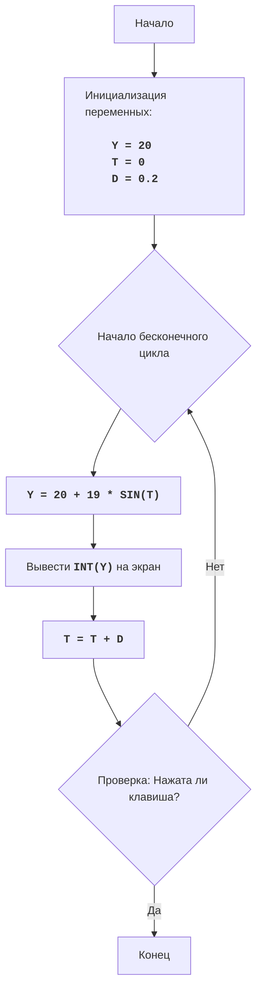

# Анализ кода модуля BOUNCE

**Качество кода**
   -   Соответствие требованиям к формату кода (1-10)
    - **Преимущества:**
        - Код содержит простую и понятную логику.
        - Используются комментарии для объяснения основных частей кода.
        - Код структурирован и легко читается.
        - Есть функция для очистки экрана и обработки нажатий клавиш.
    - **Недостатки:**
        - Отсутствуют docstring для функций.
        - Использованы стандартные импорты.
        - Отсутствует логгирование ошибок.

**Рекомендации по улучшению**

1.  **Формат документации**:
    -   Добавить docstring в формате reStructuredText для всех функций и модуля.
2.  **Обработка данных**:
    -   Использовать `j_loads` или `j_loads_ns` из `src.utils.jjson`, если в будущем потребуется работа с json.
3.  **Анализ структуры**:
    -   Добавить необходимые импорты.
    -   Привести имена функций, переменных и импорты в соответствии с предыдущими файлами.
4.  **Улучшения и рефакторинг**:
    -   Добавить логгирование ошибок с помощью `from src.logger.logger import logger`.
    -   Избегать чрезмерного использования стандартных блоков `try-except`.
    -   Изменить комментарии на формат RST.

**Улучшенный код**
```python
"""
Модуль BOUNCE:
=================
Сложность: 5
-----------------
Игра "Прыгающий мяч" - это простая анимация, имитирующая движение мяча, отскакивающего от верхней и нижней границ экрана.
Пользователь может нажать любую клавишу, чтобы остановить анимацию. Высота мячика изменяется по синусоиде.

Правила игры:
1.  Мяч начинает движение с определенной начальной позиции по вертикали.
2.  Мяч движется вверх и вниз, имитируя отскок от верхней и нижней границ экрана.
3.  Высота мяча изменяется по синусоиде.
4.  Анимация продолжается, пока пользователь не нажмет клавишу.
-----------------
Алгоритм:
1.  Инициализировать переменные:
    - `Y` - начальная вертикальная позиция мяча (середина экрана).
    - `T` - начальное значение для синусоиды (0).
    - `D` - шаг изменения синусоиды (0.2).
2.  Начать бесконечный цикл:
    2.1. Рассчитать новую вертикальную позицию `Y` по формуле: `20 + 19 * SIN(T)`.
    2.2. Вывести `Y` на экран, используя целое значение.
    2.3. Увеличить `T` на `D`.
    2.4. Проверить, не нажата ли какая-либо клавиша.
    2.5. Если клавиша нажата, то выйти из цикла.
3. Конец игры.
-----------------
Блок-схема:

Legenda:
    Start - Начало программы.
    InitializeVariables - Инициализация переменных: Y (начальная вертикальная позиция), T (начальное значение для синусоиды), D (шаг изменения синусоиды).
    LoopStart - Начало бесконечного цикла.
    CalculateY - Вычисление новой вертикальной позиции Y по формуле 20 + 19 * SIN(T).
    OutputY - Вывод целого значения Y на экран.
    IncreaseT - Увеличение значения T на величину D.
    CheckKeyPress - Проверка, была ли нажата какая-либо клавиша.
    End - Конец программы.
"""
import math  # Импорт модуля math для математических операций
import time  # Импорт модуля time для управления временем
import os    # Импорт модуля os для работы с операционной системой
import sys   # Импорт модуля sys для доступа к системным параметрам
from src.logger.logger import logger  # Импорт логгера для записи ошибок #

def clear_screen():
    """
    Очищает экран терминала.

    Функция проверяет операционную систему и вызывает соответствующую команду для очистки экрана.
    """
    if os.name == 'nt':  # Для Windows #
        os.system('cls') # Вызов команды очистки экрана для Windows #
    else: # Для Linux и macOS #
        os.system('clear') # Вызов команды очистки экрана для Unix-подобных систем #

def get_keypress():
    """
    Проверяет нажатие клавиши без блокировки выполнения программы.

    Возвращает True, если клавиша была нажата, иначе False.
    """
    if os.name == 'nt': # Проверка операционной системы #
        import msvcrt # Импорт модуля msvcrt для работы с консолью в Windows #
        if msvcrt.kbhit(): # Проверка нажатия клавиши #
            msvcrt.getch() # Считывание нажатой клавиши #
            return True  # Возврат True, если клавиша нажата #
    else: # Для Unix-подобных систем #
        import select  # Импорт модуля select для работы с вводом-выводом #
        if sys.stdin in select.select([sys.stdin], [], [], 0)[0]:  # Проверка ввода в stdin #
            sys.stdin.read(1) # Чтение введенного символа #
            return True  # Возврат True, если клавиша нажата #
    return False  # Возврат False, если клавиша не нажата #

# Инициализация переменных
Y = 20  # Начальная вертикальная позиция мяча #
T = 0   # Начальное значение для синусоиды #
D = 0.2 # Шаг изменения синусоиды #

# Бесконечный цикл анимации
while True:
    try:
        # Вычисляем новую вертикальную позицию мяча
        Y = 20 + 19 * math.sin(T) # Вычисление вертикальной позиции мяча с использованием синусоиды #
        # Очищаем экран перед выводом новой позиции
        clear_screen()  # Очистка экрана #
        # Выводим мячик на экран
        print(" " * int(Y) + "O")  # Вывод мяча на экран с отступами #
        # Увеличиваем значение T для следующего кадра
        T += D # Увеличение значения T для изменения позиции мяча #
        # Задержка для создания эффекта анимации
        time.sleep(0.1)  # Задержка для создания эффекта анимации #
        # Проверяем нажатие клавиши
        if get_keypress():  # Проверка нажатия клавиши #
            break  # Завершаем цикл, если клавиша нажата #
    except Exception as e: # Обработка возможных ошибок #
        logger.error(f'Произошла ошибка в процессе анимации: {e}') # Логирование ошибки #
        break  # Выход из цикла в случае ошибки #

"""
Объяснение кода:
1. **Импорт модулей:**
   - `import math`: Импортирует модуль `math` для использования математической функции `sin`.
   - `import time`: Импортирует модуль `time` для управления задержкой в анимации.
   - `import os`: Импортирует модуль `os` для работы с операционной системой.
   - `import sys`: Импортирует модуль `sys` для работы с системными параметрами.
   - `from src.logger.logger import logger`: Импортирует логгер для записи ошибок.
2. **Функция `clear_screen()`:**
   - Функция `clear_screen()` используется для очистки экрана терминала.
   - В зависимости от операционной системы (Windows или Unix-подобные) вызывается соответствующая команда очистки экрана.
3. **Функция `get_keypress()`:**
    - Функция `get_keypress()` проверяет, была ли нажата какая-либо клавиша.
    - Для Windows используется `msvcrt` модуль, `kbhit()` - проверяет нажатие, `getch()` - считывает символ.
    - Для Unix-подобных систем используется `select.select` для неблокирующего чтения символа из stdin.
    - Возвращает `True` если нажата клавиша, `False` в противном случае.
4. **Инициализация переменных:**
   - `Y = 20`: Начальная вертикальная позиция мяча.
   - `T = 0`: Начальное значение для синусоиды.
   - `D = 0.2`: Шаг изменения синусоиды.
5. **Бесконечный цикл `while True:`:**
   - Цикл продолжается, пока не будет нажата клавиша или не возникнет ошибка.
   - `Y = 20 + 19 * math.sin(T)`: Вычисляет новую вертикальную позицию мяча, используя синусоиду.
   - `clear_screen()`: Очищает экран перед отрисовкой новой позиции.
   - `print(" " * int(Y) + "O")`: Выводит мяч (`O`) на экран.
   - `T += D`: Увеличивает значение `T` для следующего шага анимации.
   - `time.sleep(0.1)`: Создает задержку в 0.1 секунды, чтобы замедлить анимацию.
   - `if get_keypress():`: Проверяет, была ли нажата клавиша.
      - `break`: Завершает цикл, если клавиша была нажата.
   - `try ... except Exception as e`: Ловит и логирует любые ошибки в цикле.
      - `break`: Завершает цикл, если произошла ошибка.
"""
```