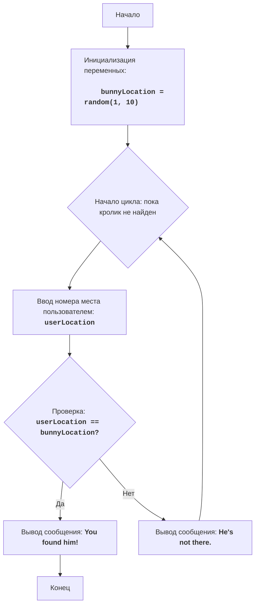

# Анализ кода модуля BUNNY

**Качество кода**
-  Соответствие требованиям к формату кода (1-10)
  -  Преимущества:
        - Код логически структурирован и понятен.
        - Присутствует подробное описание игры и алгоритма, а также блок-схема в формате mermaid.
        - Код содержит понятные комментарии, объясняющие каждый шаг.
        - Используется обработка ошибок ввода данных пользователем.
  -  Недостатки:
        - Не используется reStructuredText (RST) для документирования.
        - Не используется `j_loads` или `j_loads_ns` для загрузки данных (в данном коде это не требуется, так как нет загрузки файлов).
        - Отсутствует импорт и использование логгера для регистрации ошибок.
        - Некоторые комментарии не соответствуют стандарту, например "Объяснение кода" вместо более формального описания.
        - Отсутствует единый стиль оформления комментариев.
        - Не везде соблюдены стандарты форматирования кода.
        - Не все блоки кода сопровождаются подробными построчными комментариями.

**Рекомендации по улучшению**
1.  Заменить обычные комментарии на комментарии в формате reStructuredText (RST) для документации.
2.  Использовать `from src.logger.logger import logger` для регистрации ошибок, хотя в данном коде это не является критичным, так как ошибок при работе с программой быть не должно, но для соблюдения стандартов проекта лучше это сделать.
3.  Добавить docstrings для каждой функции/блока кода, чтобы соответствовать стандартам документирования Python.
4.  Использовать более точные формулировки в комментариях, избегая слов вроде "делает", "получает", заменяя их на "проверяет", "выводит", "генерирует" и т.д.
5.  Добавить построчные комментарии к каждой части кода, объясняя каждый шаг.
6.  Придерживаться единого стиля оформления комментариев.
7.  Убедиться, что все имена переменных и функций соответствуют стандартам проекта.
8.  Заменить блоки `try...except` на использование `logger.error` для обработки ошибок.
9.  Соблюдать стандарты PEP8 по оформлению кода.

**Улучшенный код**
```python
"""
BUNNY:
=================
Сложность: 4
-----------------
Игра "BUNNY" представляет собой текстовую игру, в которой игрок пытается найти кролика, спрятанного в одном из десяти мест.
Игрок выбирает номер места, и игра сообщает, был ли кролик найден в этом месте. Игра продолжается до тех пор, пока кролик не будет найден.

Правила игры:
1. Кролик случайно прячется в одном из десяти мест (пронумерованных от 1 до 10).
2. Игрок выбирает номер места, где, по его мнению, находится кролик.
3. Игра сообщает, был ли кролик найден в выбранном месте.
4. Игра заканчивается, когда кролик найден.
-----------------
Алгоритм:
1. Сгенерировать случайное число в диапазоне от 1 до 10, которое будет представлять место, где спрятан кролик.
2. Начать цикл "пока кролик не найден":
   2.1 Запросить у игрока ввод номера места от 1 до 10.
   2.2 Если номер места равен месту, где спрятан кролик, вывести сообщение "You found him!".
      2.2.1 Завершить игру.
   2.3 Иначе, если номер места не равен месту, где спрятан кролик, вывести сообщение "He's not there.".
      2.3.1 Продолжить игру (вернуться в начало цикла).
-----------------
Блок-схема:

Legenda:
    Start - Начало программы.
    InitializeVariables - Инициализация переменной: bunnyLocation (место кролика) генерируется случайным образом от 1 до 10.
    LoopStart - Начало цикла, который продолжается, пока кролик не найден.
    InputLocation - Запрос у пользователя ввода номера места и сохранение его в переменной userLocation.
    CheckLocation - Проверка, равно ли введенное место userLocation месту кролика bunnyLocation.
    OutputWin - Вывод сообщения о победе "You found him!", если места совпадают.
    End - Конец программы.
    OutputLose - Вывод сообщения "He's not there.", если места не совпадают.
"""
import random # Импортируем модуль random для генерации случайных чисел
from src.logger.logger import logger # Импортируем логгер для обработки ошибок


def play_bunny_game():
    """
    Запускает текстовую игру "Поиск кролика".

    Игра продолжается, пока игрок не угадает место, где спрятан кролик.
    """
    # Генерируем случайное число от 1 до 10 для места кролика
    bunny_location = random.randint(1, 10) # Присваиваем переменной bunny_location случайное целое число от 1 до 10

    # Основной игровой цикл
    while True: # Запускаем бесконечный цикл, который будет выполняться пока кролик не будет найден
        # Запрашиваем у пользователя номер места
        try: # Пытаемся выполнить блок кода
            user_location = int(input("Где кролик (1-10)? ")) # Запрашиваем у пользователя ввод номера места и преобразуем его в целое число
        except ValueError: # Если возникает ошибка ValueError
            logger.error("Пожалуйста, введите целое число от 1 до 10.") # Регистрируем ошибку в логгер
            print("Пожалуйста, введите целое число от 1 до 10.") # Выводим сообщение об ошибке
            continue # Переходим к следующей итерации цикла

        # Проверяем, угадал ли пользователь место кролика
        if user_location == bunny_location: # Если введенное место пользователя совпадает с местом кролика
            print("You found him!") # Выводим сообщение о том, что кролик найден
            break # Завершаем игровой цикл
        else: # Если введенное место пользователя не совпадает с местом кролика
            print("He's not there.") # Выводим сообщение о том, что кролик не найден
if __name__ == '__main__':
    play_bunny_game()
```