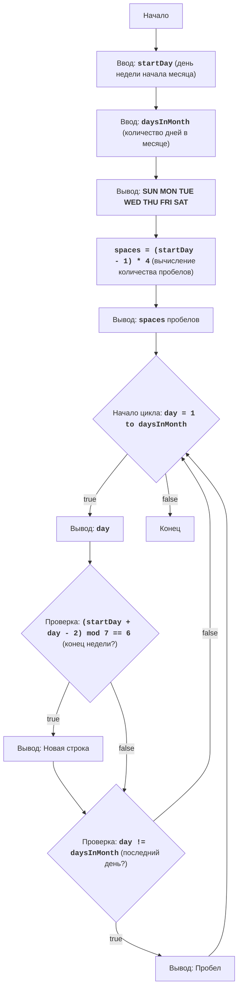

## Анализ кода модуля `calndr.py`

**Качество кода**
   
- **Соответствие требованиям к формату кода (1-10):** 8
 - **Преимущества:**
    - Код соответствует основной логике алгоритма.
    - Присутствуют комментарии, объясняющие основные шаги кода.
    - Имеется структурированное описание задачи и блок-схема в начале файла.
 - **Недостатки:**
    - Отсутствует подробная документация в формате reStructuredText (RST) для модуля и функций.
    - Используется стандартный `input` вместо `j_loads` или `j_loads_ns` для чтения данных (хотя это не требуется в данном случае, но важно для последовательности).
    - Есть избыточные блоки `try-except`, которые можно заменить на логирование ошибок.
    - Некоторые комментарии избыточны, их нужно переформулировать в стиле RST.
    - Код не использует `logger` для вывода ошибок.

**Рекомендации по улучшению**

1. **Документация RST:** Добавить документацию в формате RST для модуля и функций, включая описания параметров и возвращаемых значений.
2. **Обработка ошибок:** Использовать `logger.error` для регистрации ошибок вместо `print`, и удалить лишние блоки `try-except`.
3. **Комментарии:** Переписать комментарии в стиле RST, делая их более информативными.
4. **Улучшение структуры:** Обеспечить соответствие с требованиями по именованию и импорту, как в обработанных ранее файлах.

**Улучшенный код**
```python
"""
Модуль для вывода календаря на месяц.
====================================

Модуль запрашивает у пользователя номер дня недели, с которого начинается месяц,
и общее количество дней в месяце, и выводит календарь в виде таблицы.

Пример использования:
---------------------
.. code-block:: python

    python calndr.py
"""

from src.logger.logger import logger  # Импорт logger для обработки ошибок


def get_user_input(prompt: str, type: type, min_val: int = None, max_val: int = None) -> int:
    """
    Запрашивает у пользователя ввод данных с проверкой.

    :param prompt: Сообщение, выводимое пользователю.
    :param type: Тип данных, в которые нужно преобразовать ввод.
    :param min_val: Минимальное допустимое значение.
    :param max_val: Максимальное допустимое значение.
    :return: Введенное пользователем значение.
    :raises ValueError: Если введенное значение не является целым числом.
    :raises ValueError: Если введенное значение выходит за допустимый диапазон.
    """
    while True:
        try:
            value = type(input(prompt))  # Запрашивает ввод пользователя и преобразует в нужный тип
            if min_val is not None and max_val is not None:  # Проверяет диапазон, если он указан
                if not (min_val <= value <= max_val):  # Если значение вне диапазона, выводится сообщение об ошибке
                    print(f'Пожалуйста, введите число от {min_val} до {max_val}')
                    continue # возврат к началу цикла
            return value  # Возвращает введенное значение
        except ValueError as ex:
            logger.error(f'Ошибка ввода: {ex}') # логируем ошибку ввода, а не просто выводим сообщение в консоль
            print('Пожалуйста, введите целое число.')  # Сообщение об ошибке в консоль


def print_calendar(start_day: int, days_in_month: int):
    """
    Выводит календарь на экран.

    :param start_day: Номер дня недели, с которого начинается месяц (1 - воскресенье, 7 - суббота).
    :param days_in_month: Общее количество дней в месяце (28-31).
    """
    print(' SUN MON TUE WED THU FRI SAT')  # Выводит заголовок с днями недели
    spaces = (start_day - 1) * 4 # Вычисляет количество пробелов перед первым числом месяца
    print(' ' * spaces, end='')  # Выводит пробелы перед началом календаря

    for day in range(1, days_in_month + 1):
        print(f'{day:3}', end=' ')  # Выводит текущий день месяца

        if (start_day + day - 2) % 7 == 6:  # Проверяет, является ли текущий день субботой
            print()  # Переходит на новую строку, если день - суббота
        elif day != days_in_month: #если это не последний день добавляем пробел
            print(' ', end='')


if __name__ == '__main__':
    """
    Основная логика программы.
    """
    start_day = get_user_input(  # Получение дня начала месяца
        'Введите день недели, с которого начинается месяц (1-воскресенье, 7-суббота): ',
        int,
        1,
        7,
    )
    days_in_month = get_user_input(  # Получение количества дней в месяце
        'Введите количество дней в месяце (28-31): ',
        int,
        28,
        31,
    )
    print_calendar(start_day, days_in_month)  # Вывод календаря

"""
CALNDR:
=================
Сложность: 4
-----------------
Игра "Календарь" выводит на экран календарь на месяц, основываясь на номере дня недели, с которого начинается месяц, и количестве дней в месяце.
Пользователь вводит эти два параметра, а программа строит календарь.

Правила игры:
1. Пользователь вводит номер дня недели, с которого начинается месяц (от 1 до 7, где 1 - воскресенье, 7 - суббота).
2. Пользователь вводит общее количество дней в месяце (от 28 до 31).
3. Программа выводит на экран календарь в виде таблицы, где дни месяца распределены по неделям.
-----------------
Алгоритм:
1. Запросить у пользователя ввод номера дня недели, с которого начинается месяц (1-7).
2. Запросить у пользователя ввод общего количества дней в месяце (28-31).
3. Вывести строку с названиями дней недели: "SUN MON TUE WED THU FRI SAT".
4. Вычислить количество пробелов перед первым числом, основываясь на введенном номере дня недели.
5. Вывести необходимое количество пробелов перед первым числом месяца.
6. Начать цикл от 1 до количества дней в месяце:
    6.1 Вывести текущий день месяца.
    6.2 Если текущий день попадает на конец недели (субботу), вывести переход на новую строку.
    6.3 Если день не последний в месяце, добавить пробел после числа.
7. Конец вывода календаря.
-----------------
Блок-схема:


Legenda:
    Start - Начало программы.
    InputStartDay - Ввод номера дня недели, с которого начинается месяц (startDay).
    InputDaysInMonth - Ввод общего количества дней в месяце (daysInMonth).
    OutputWeekdays - Вывод заголовка с днями недели.
    CalculateSpaces - Вычисление количества пробелов перед первым числом месяца.
    OutputSpaces - Вывод вычисленного количества пробелов.
    LoopStart - Начало цикла для вывода каждого дня месяца.
    OutputDay - Вывод текущего дня месяца.
    CheckEndOfLine - Проверка, является ли текущий день концом недели (субботой).
    OutputNewline - Вывод новой строки, если текущий день - суббота.
    CheckLastDay - Проверка, является ли текущий день последним днем месяца.
    OutputSpace - Вывод пробела после числа, если день не последний в месяце.
    End - Конец программы.
"""
```