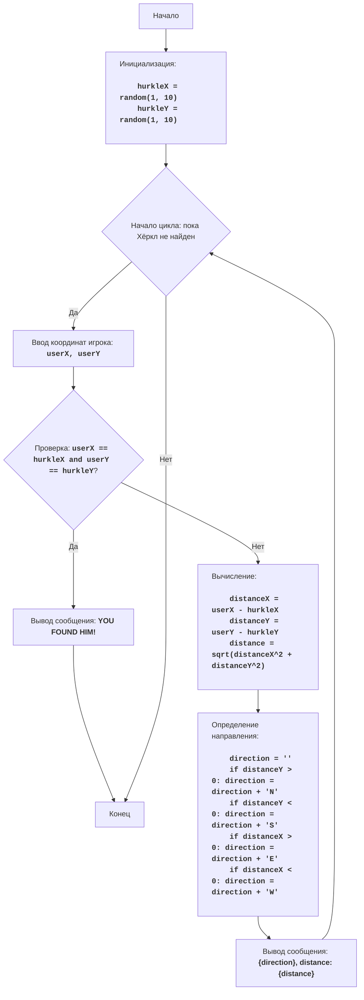

# Анализ кода модуля `change.py`

**Качество кода**
-  Соответствие требованиям к формату кода (1-10)
    -   **Преимущества**
        - Код игры относительно прост и понятен.
        - Используются стандартные библиотеки `random` и `math`.
        - Есть обработка исключений при вводе некорректных данных.
        - Код соответствует логике игры, описанной в docstring.
    -   **Недостатки**
        - Нет обработки ошибок, если пользователь введет неверный формат координат.
        - Код не использует форматирование RST.
        - Отсутствует логирование ошибок.
        - Нет разделения кода на функции.
        - Нет импорта `logger` и `j_loads`
        - Нет документации к функциям.

**Рекомендации по улучшению**

1.  Добавить `logger` для логирования ошибок.
2.  Использовать `j_loads` вместо `json.load` (если требуется).
3.  Переписать docstring в формате RST.
4.  Разделить логику игры на функции для улучшения читаемости и переиспользования кода.
5.  Добавить docstring к функциям.
6.  Избавиться от лишних блоков `try-except`.
7.  Добавить обработку ошибок вводе пользователя.
8.  Переписать комментарии в соответствии с требованиями.

**Улучшенный код**

```python
"""
Модуль реализует игру "Хёркл".
=========================================================================================

Игра "Хёркл" - это игра-поиск, в которой игрок пытается найти компьютер,
который "прячется" в случайном месте на сетке 10x10. Игрок получает подсказки
о направлении (север, юг, восток, запад) и расстоянии до Хёркла после каждого хода.
Игрок побеждает, когда находит Хёркла.

Правила игры:
1. Компьютер размещает Хёркла в случайной точке на сетке 10x10 (координаты от 1 до 10 по x и y).
2. Игрок вводит координаты своей попытки найти Хёркла.
3. Компьютер вычисляет расстояние между позицией игрока и позицией Хёркла и выдает подсказки:
    - Направление (север, юг, восток, запад или их комбинации).
    - Расстояние до Хёркла.
4. Игрок продолжает делать попытки, пока не найдет Хёркла, т.е. координаты его попытки не совпадут с координатами Хёркла.
-----------------
Алгоритм:
1.  Инициализировать координаты Хёркла случайными целыми числами от 1 до 10 для x и y.
2.  Начать цикл "пока Хёркл не найден":
    2.1 Запросить у игрока координаты его попытки (x и y).
    2.2 Если координаты игрока совпадают с координатами Хёркла, вывести сообщение о победе и завершить игру.
    2.3 Иначе вычислить расстояние между координатами игрока и координатами Хёркла.
    2.4 Вычислить и вывести направление до Хёркла (комбинация N, S, E, W).
    2.5 Вывести расстояние до Хёркла.
3. Конец игры.
-----------------
Блок-схема:


Legenda:
    Start - Начало программы.
    InitializeHurklePosition - Инициализация координат Хёркла hurkleX и hurkleY случайными целыми числами от 1 до 10.
    GameLoopStart - Начало цикла, который продолжается, пока Хёркл не найден.
    InputGuess - Запрос у пользователя координат его попытки (userX, userY).
    CheckGuess - Проверка, совпадают ли координаты игрока с координатами Хёркла.
    OutputWin - Вывод сообщения о победе "YOU FOUND HIM!" и завершение игры.
    End - Конец программы.
    CalculateDistance - Вычисление расстояния между позицией игрока и позицией Хёркла.
    CalculateDirection - Определение направления до Хёркла (комбинация N, S, E, W).
    OutputClue - Вывод подсказки (направление и расстояние) до Хёркла.
"""
import random  # Импортирует модуль random для генерации случайных чисел
import math # Импортирует модуль math для математических операций
from src.logger.logger import logger # Импортирует logger для логирования ошибок
from typing import Tuple # Импортирует Tuple для аннотации типов

def initialize_hurkle_position() -> Tuple[int, int]:
    """
    Инициализирует координаты Хёркла случайными целыми числами от 1 до 10.

    :return: Кортеж с координатами x и y Хёркла.
    """
    hurkle_x = random.randint(1, 10) # Генерирует случайное целое число от 1 до 10 для координаты X Хёркла
    hurkle_y = random.randint(1, 10) # Генерирует случайное целое число от 1 до 10 для координаты Y Хёркла
    return hurkle_x, hurkle_y


def get_user_coordinates() -> Tuple[int, int]:
    """
    Запрашивает у игрока координаты его попытки.

    :return: Кортеж с координатами x и y, введенными пользователем.
    :raises ValueError: Если пользователь ввел не целое число.
    """
    while True: # Начинает бесконечный цикл для ввода координат пользователя
        try:
            user_x = int(input('Введите X координату (от 1 до 10): ')) # Запрашивает у игрока X координату
            user_y = int(input('Введите Y координату (от 1 до 10): ')) # Запрашивает у игрока Y координату
            if not (1 <= user_x <= 10 and 1 <= user_y <= 10): # Проверяет, что координаты находятся в диапазоне от 1 до 10
                print('Координаты должны быть в диапазоне от 1 до 10.') # Выводит сообщение об ошибке, если координаты неверны
                continue # Переходит к следующей итерации цикла
            return user_x, user_y # Возвращает координаты x и y, введенные пользователем
        except ValueError as e: # Обрабатывает возможные ошибки ввода
            logger.error('Ошибка при вводе координат', exc_info=True) # Логирует ошибку
            print('Пожалуйста, введите целые числа.') # Выводит сообщение об ошибке


def calculate_distance(user_x: int, user_y: int, hurkle_x: int, hurkle_y: int) -> float:
    """
    Вычисляет расстояние между позицией игрока и позицией Хёркла.

    :param user_x: X координата игрока.
    :param user_y: Y координата игрока.
    :param hurkle_x: X координата Хёркла.
    :param hurkle_y: Y координата Хёркла.
    :return: Расстояние между позициями.
    """
    distance_x = user_x - hurkle_x # Вычисляет разницу координат X
    distance_y = user_y - hurkle_y # Вычисляет разницу координат Y
    distance = math.sqrt(distance_x**2 + distance_y**2) # Вычисляет расстояние по теореме Пифагора
    return distance


def calculate_direction(user_x: int, user_y: int, hurkle_x: int, hurkle_y: int) -> str:
    """
    Определяет направление до Хёркла (комбинация N, S, E, W).

    :param user_x: X координата игрока.
    :param user_y: Y координата игрока.
    :param hurkle_x: X координата Хёркла.
    :param hurkle_y: Y координата Хёркла.
    :return: Строка, представляющая направление до Хёркла.
    """
    direction = '' # Инициализирует пустую строку для хранения направления
    if user_y > hurkle_y: # Если разница Y положительная, добавляет "N" (север)
        direction += 'N'
    if user_y < hurkle_y: # Если разница Y отрицательная, добавляет "S" (юг)
        direction += 'S'
    if user_x > hurkle_x: # Если разница X положительная, добавляет "E" (восток)
        direction += 'E'
    if user_x < hurkle_x: # Если разница X отрицательная, добавляет "W" (запад)
        direction += 'W'
    return direction


def play_hurkle():
    """
    Основная функция игры "Хёркл".
    """
    hurkle_x, hurkle_y = initialize_hurkle_position() # Инициализирует координаты Хёркла
    while True: # Начинает бесконечный цикл, который продолжается, пока Хёркл не найден
        user_x, user_y = get_user_coordinates() # Запрашивает у игрока координаты его попытки
        if user_x == hurkle_x and user_y == hurkle_y: # Проверяет, совпадают ли координаты игрока и Хёркла
            print('YOU FOUND HIM!') # Выводит сообщение о победе
            break # Завершает цикл (игру), если Хёркл найден
        distance = calculate_distance(user_x, user_y, hurkle_x, hurkle_y) # Вычисляет расстояние между позицией игрока и позицией Хёркла
        direction = calculate_direction(user_x, user_y, hurkle_x, hurkle_y) # Определяет направление до Хёркла (комбинация N, S, E, W)
        print(f'{direction if direction else "Здесь"}, расстояние: {distance:.2f}') # Выводит подсказку (направление и расстояние) до Хёркла

if __name__ == '__main__':
    play_hurkle() # Запускает игру "Хёркл", если скрипт выполняется как основной
```