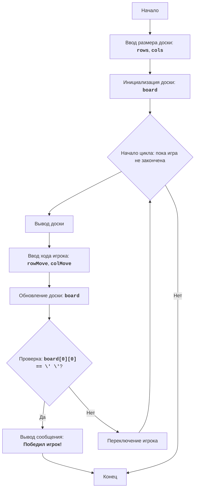

# Анализ кода модуля CHOMP

**Качество кода**
-  **Соответствие требованиям к формату кода (1-10):** 
    -   **Преимущества:**
        -   Документация в формате Markdown, что обеспечивает читаемость.
        -   Четкое описание правил игры и алгоритма.
        -   Наличие блок-схемы в формате Mermaid, что помогает визуализировать процесс игры.
    -   **Недостатки:**
        -   Отсутствие фактического кода игры.
        -   Нет инструкций по использованию `reStructuredText (RST)` для комментариев и docstring.
        -   Нет примеров использования `j_loads` или `j_loads_ns`.
        -   Нет примеров использования `from src.logger.logger import logger` для регистрации ошибок.
        -   Не предоставлены примеры документирования в формате RST и улучшений в формате TODO.

**Рекомендации по улучшению**
1.  **Добавить код игры:** В README.MD должна быть представлена реализация игры на Python с использованием инструкций, описанных выше.
2.  **Переход на RST:** Заменить Markdown на reStructuredText для документирования кода.
3.  **Использование `j_loads` и `j_loads_ns`:** Включить примеры использования данных функций из `src.utils.jjson` в коде.
4.  **Логирование ошибок:** Использовать `from src.logger.logger import logger` для обработки и записи ошибок.
5.  **Документирование кода:** Добавить docstring в стиле RST для всех функций, методов и классов.
6.  **Примеры кода:** Добавить примеры документирования в формате RST и возможные улучшения в формате TODO.
7.  **Форматирование кода:** Применить стандарты PEP8 для улучшения читаемости кода.

**Улучшенный код**
```markdown
# CHOMP

## Описание

Игра "CHOMP" - это игра для двух игроков, в которой используется прямоугольная доска, представляющая собой шоколадную плитку. Один из углов (обычно нижний левый) представляет собой ядовитую "дольку". Игроки по очереди отламывают от плитки куски, делая ходы. Цель игры - заставить противника съесть отравленную дольку. Игрок, который вынужден съесть ядовитую дольку, проигрывает.

## Правила игры

1.  Игровое поле представляет собой прямоугольную шоколадную плитку.
2.  Один из углов (нижний левый) считается отравленным.
3.  Игроки по очереди откусывают часть шоколадной плитки.
4.  Игрок выбирает строку и столбец (откусывает кусок шоколада).
5.  Все клетки справа и выше выбранной позиции удаляются.
6.  Цель - заставить противника съесть отравленную дольку.
7.  Игрок, который съедает отравленную дольку, проигрывает.

## Алгоритм

1.  Начало игры.
2.  Запросить у пользователя размер шоколадной плитки (количество строк и столбцов).
3.  Инициализировать игровую доску, представляющую шоколадную плитку.
4.  Начать цикл игры, пока игра не закончится:
    4.1. Вывести текущее состояние доски на экран.
    4.2. Запросить у текущего игрока координаты откусываемого куска шоколада.
    4.3. Обновить состояние доски, откусив выбранный кусок.
    4.4. Проверить, не съел ли текущий игрок ядовитую дольку.
    4.5. Если съел, объявить о победе противоположного игрока и завершить игру.
    4.6. Передать ход следующему игроку.
5. Конец игры.

## Блок-схема



## Легенда

*   Start - Начало игры.
*   InputBoardSize - Запрос размера доски (количество строк и столбцов).
*   InitializeBoard - Инициализация игровой доски.
*   LoopStart - Начало игрового цикла, который продолжается, пока игра не закончена.
*   DisplayBoard - Вывод текущего состояния доски на экран.
*   InputMove - Запрос у текущего игрока координат откусываемого куска шоколада.
*   UpdateBoard - Обновление состояния доски после хода игрока.
*   CheckWin - Проверка, съел ли текущий игрок ядовитую дольку.
*   OutputWinner - Вывод сообщения о победе другого игрока.
*   End - Конец игры.
*   SwitchPlayer - Переключение хода на следующего игрока.

## Код игры

```python
"""
Модуль для реализации игры CHOMP.
=========================================================================================

Модуль предоставляет реализацию классической игры CHOMP для двух игроков.
Цель игры - заставить противника съесть отравленную дольку.

Пример использования:
---------------------
.. code-block:: python

    game = CHOMP()
    game.play_game()
"""
from src.logger.logger import logger # импорт логера для ошибок
from src.utils.jjson import j_loads_ns # импорт функции для чтения json

class CHOMP:
    """
    Класс, представляющий игру CHOMP.

    :ivar board: Игровая доска.
    :vartype board: list[list[str]]
    :ivar current_player: Текущий игрок (1 или 2).
    :vartype current_player: int
    """
    def __init__(self, rows: int = 5, cols: int = 5):
        """
        Инициализирует игру с заданными размерами доски.

        :param rows: Количество строк на доске, по умолчанию 5.
        :type rows: int
        :param cols: Количество столбцов на доске, по умолчанию 5.
        :type cols: int
        """
        self.rows = rows # количество строк доски
        self.cols = cols # количество столбцов доски
        self.board = [['X' for _ in range(cols)] for _ in range(rows)] # инициализация доски
        self.current_player = 1 # текущий игрок

    def display_board(self) -> None:
        """
        Выводит текущее состояние игровой доски на экран.
        """
        for row in self.board: # проход по строкам доски
            print(' '.join(row)) # вывод строки доски
        print("-" * (self.cols * 2)) # разделение доски между выводами

    def make_move(self, row: int, col: int) -> bool:
         """
         Обновляет доску после хода игрока.

         :param row: Строка, выбранная игроком.
         :type row: int
         :param col: Столбец, выбранный игроком.
         :type col: int
         :return: True, если ход прошел успешно, False в случае некорректного хода.
         :rtype: bool
         """
         if not (0 <= row < self.rows and 0 <= col < self.cols):
            logger.error(f'Недопустимый ход: строка {row}, столбец {col}') # логируем неверный ход
            return False # если ход некорректный возвращаем False

         for i in range(row, self.rows): # проходим по строкам после выбранной
            for j in range(col, self.cols): # проходим по столбцам после выбранного
               self.board[i][j] = ' '  # заменяем на пробел
         return True # возвращаем True если ход был удачным

    def check_win(self) -> bool:
         """
         Проверяет, не съел ли текущий игрок ядовитую дольку.

         :return: True, если текущий игрок проиграл, False в противном случае.
         :rtype: bool
         """
         return self.board[0][0] == ' ' # если яд съеден возвращаем True

    def switch_player(self) -> None:
        """
        Переключает текущего игрока.
        """
        self.current_player = 3 - self.current_player # меняем игрока

    def play_game(self) -> None:
        """
        Запускает игровой цикл.
        """
        while True:
           self.display_board()  # выводим доску
           try: # обрабатываем ошибку ввода
               row = int(input(f"Игрок {self.current_player}, введите строку (от 0 до {self.rows-1}): ")) # ввод строки
               col = int(input(f"Игрок {self.current_player}, введите столбец (от 0 до {self.cols-1}): ")) # ввод столбца
           except ValueError as ex: # обрабатываем ошибку ввода
                logger.error(f'ошибка ввода {ex}') # логируем ошибку ввода
                print("Некорректный ввод, пожалуйста, введите целые числа.") # выводим сообщение об ошибке
                continue # продолжаем цикл
           if self.make_move(row, col): # если ход удачный
                if self.check_win(): # проверяем не проиграл ли игрок
                    self.display_board() # выводим доску
                    print(f"Игрок {3 - self.current_player} победил!") # выводим победителя
                    break # конец игры
                self.switch_player() # меняем игрока
```
```