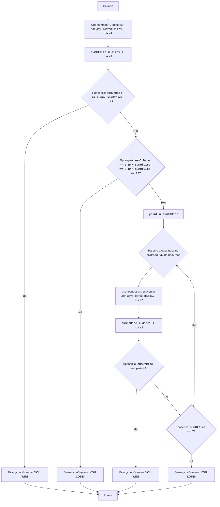

# Анализ кода модуля CRAPS

**Качество кода**

-   **Соответствие требованиям к формату кода (1-10):**
    -   **Преимущества:**
        -   Присутствует подробное описание игры, правил, алгоритма и блок-схемы.
        -   Блок-схема в формате Mermaid дает наглядное представление о логике игры.
        -   Легенда к блок-схеме содержит детальное описание каждого блока.
    -   **Недостатки:**
        -   Отсутствует программный код игры.
        -   В документе используется смесь форматов (`markdown` и `mermaid`).
        -   Не соблюдается требование использовать reStructuredText (RST) для документирования.

**Рекомендации по улучшению**

1.  **Добавить программный код игры:** Реализовать игру "Крэпс" на Python, следуя описанному алгоритму.
2.  **Перевести документацию в RST:** Переписать документацию, включая описание игры, правил, алгоритма и легенду к блок-схеме, используя reStructuredText (RST).
3.  **Использовать аннотации типов:** Добавить аннотации типов к параметрам и возвращаемым значениям функций для повышения читаемости и надежности кода.
4.  **Создать docstring для функций:** Добавить docstring в формате reStructuredText для каждой функции.
5.  **Добавить логирование:** Использовать `logger.error` для регистрации ошибок и `logger.debug` для отладки.

**Улучшенный код**

```markdown
"""
Модуль реализует игру в кости "Крэпс".
=========================================================================================

Модуль содержит функции для имитации броска костей и проверки условий выигрыша/проигрыша.

Пример использования
--------------------

Пример использования функций:

.. code-block:: python

    from random import randint
    def roll_dice() -> int:
        '''
        Имитирует бросок двух игральных костей.
        
        :return: Сумма очков на двух костях.
        '''
        dice1 = randint(1, 6)
        dice2 = randint(1, 6)
        return dice1 + dice2
    
    def play_craps():
        '''
        Запускает игру в Крэпс.
        
        Игра продолжается, пока игрок не выиграет или не проиграет.
        '''
        first_roll = roll_dice()
        print(f"Первый бросок: {first_roll}")
        if first_roll in (7, 11):
            print("YOU WIN!")
            return
        elif first_roll in (2, 3, 12):
            print("YOU LOSE!")
            return
        else:
            point = first_roll
            print(f"Целевое число: {point}")
            while True:
                roll = roll_dice()
                print(f"Следующий бросок: {roll}")
                if roll == point:
                    print("YOU WIN!")
                    return
                elif roll == 7:
                    print("YOU LOSE!")
                    return
    play_craps()
"""

CRAPS:
=================
Сложность: 7
-----------------
Игра "Крэпс" - это азартная игра в кости, в которой игрок делает ставку на результат броска двух игральных костей. В первом раунде игрок выигрывает, если сумма очков на костях равна 7 или 11, и проигрывает, если сумма равна 2, 3 или 12. Если сумма очков равна 4, 5, 6, 8, 9 или 10, то это становится "целевым числом" игрока, и он продолжает бросать кости, пока не выпадет это число снова (в этом случае игрок выигрывает) или не выпадет 7 (в этом случае игрок проигрывает).

Правила игры:
1. В начале игры игрок бросает две кости.
2. Если сумма очков на костях равна 7 или 11, игрок выигрывает.
3. Если сумма очков равна 2, 3 или 12, игрок проигрывает.
4. Если сумма очков равна 4, 5, 6, 8, 9 или 10, то это число становится "целевым числом" (point).
5. После установления "целевого числа", игрок продолжает бросать кости, пока:
   -  не выпадет "целевое число", тогда игрок выигрывает.
   -  не выпадет 7, тогда игрок проигрывает.
-----------------
Алгоритм:
1. Сгенерировать случайные значения для двух костей (от 1 до 6).
2. Вычислить сумму выпавших значений.
3. Если сумма равна 7 или 11, вывести сообщение о выигрыше и перейти к шагу 7.
4. Если сумма равна 2, 3 или 12, вывести сообщение о проигрыше и перейти к шагу 7.
5. Сохранить сумму как "целевое число" (point).
6.  Начать цикл:
    6.1 Сгенерировать случайные значения для двух костей.
    6.2 Вычислить сумму выпавших значений.
    6.3 Если сумма равна "целевому числу", вывести сообщение о выигрыше и перейти к шагу 7.
    6.4 Если сумма равна 7, вывести сообщение о проигрыше и перейти к шагу 7.
    6.5 Иначе, повторить цикл с шага 6.
7. Конец игры.
-----------------
Блок-схема:


Legenda:
    Start - Начало игры.
    RollDice1 - Генерация случайных значений для двух игральных костей (dice1, dice2) в первом броске.
    CalculateSum1 - Вычисление суммы значений костей dice1 и dice2 и сохранение результата в переменной sumOfDice.
    CheckWin1 - Проверка, равна ли сумма sumOfDice 7 или 11. Если да, то игрок выиграл.
    OutputWin1 - Вывод сообщения "YOU WIN!" и завершение игры.
    CheckLose1 - Проверка, равна ли сумма sumOfDice 2, 3 или 12. Если да, то игрок проиграл.
    OutputLose1 - Вывод сообщения "YOU LOSE!" и завершение игры.
    SetPoint - Если не выиграл и не проиграл в первом броске, то сумма sumOfDice сохраняется в переменной point, которая становится "целевым числом".
    LoopStart - Начало цикла, который продолжается пока игрок не выиграет или не проиграет.
    RollDice2 - Генерация случайных значений для двух игральных костей (dice1, dice2) в последующих бросках.
    CalculateSum2 - Вычисление суммы значений костей dice1 и dice2 и сохранение результата в переменной sumOfDice.
    CheckWin2 - Проверка, равна ли сумма sumOfDice "целевому числу" point. Если да, то игрок выиграл.
    OutputWin2 - Вывод сообщения "YOU WIN!" и завершение игры.
    CheckLose2 - Проверка, равна ли сумма sumOfDice 7. Если да, то игрок проиграл.
    OutputLose2 - Вывод сообщения "YOU LOSE!" и завершение игры.
    End - Конец игры.
```