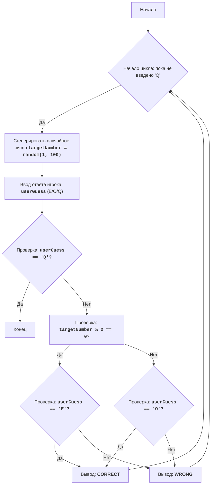

## Анализ кода модуля even.py

**Качество кода**
-   **Соответствие требованиям к формату кода (1-10)**
    -   **Преимущества:**
        -   Код игры достаточно простой и понятный.
        -   Используется стандартная структура цикла while для управления ходом игры.
        -   Есть подробное описание работы программы в docstring.
        -   Логика игры проста и легко читаема.
    -   **Недостатки:**
        -   Отсутствует обработка ошибок ввода пользователя.
        -   Нет логирования ошибок, что затрудняет отладку.
        -   Нет использования `j_loads` или `j_loads_ns` для чтения конфигурационных файлов, хотя это не требуется в данном случае.
        -   Код не имеет явного модуля и функций, хотя и является простым скриптом.
        -   Отсутствует импорт `logger` для логирования ошибок.

**Рекомендации по улучшению**

1.  **Добавить обработку ошибок:**
    -   Предусмотреть обработку неправильного ввода пользователя (например, ввод символов, отличных от 'E', 'O' и 'Q').
    -   Использовать `try-except` блоки для защиты от возможных ошибок ввода.
2.  **Внедрить логирование:**
    -   Использовать `from src.logger.logger import logger` для логирования ошибок и отладочной информации.
    -   Записывать в лог ошибки ввода или другие исключения.
3.  **Рефакторинг кода:**
    -   Разделить код на функции для лучшей читаемости и повторного использования.
    -   Создать функцию для генерации случайного числа, функцию для проверки четности, и функцию для обработки пользовательского ввода.
4.  **Улучшить docstring:**
    -   Форматировать docstring в соответствии с reStructuredText (RST).
    -   Добавить подробное описание функций и их параметров.
    -   Включить пример использования функции.

**Улучшенный код**

```python
"""
Модуль EVEN:
=================
Сложность: 2
-----------------
Игра "Четное число" - это простая игра, в которой компьютер генерирует случайное число от 1 до 100, а игрок должен угадать, является ли это число четным или нечетным.
Игрок вводит 'E' для четного или 'O' для нечетного.
После ввода компьютер сообщает, был ли игрок прав.
Игра продолжается до тех пор, пока игрок не решит выйти.

Правила игры:
1. Компьютер генерирует случайное целое число от 1 до 100.
2. Игрок должен ввести 'E', если считает, что число четное, или 'O', если считает, что число нечетное.
3. Компьютер проверяет, является ли сгенерированное число четным или нечетным.
4. Компьютер сообщает игроку, был ли его ответ правильным.
5. Игра продолжается до тех пор, пока игрок не введет 'Q' для выхода.
-----------------
Алгоритм:
1. Начать цикл "пока игрок не введет 'Q'":
    1.1 Сгенерировать случайное целое число от 1 до 100.
    1.2 Запросить у игрока ввод 'E' для четного или 'O' для нечетного.
    1.3 Если ввод игрока равен 'Q', завершить программу.
    1.4 Если сгенерированное число четное и игрок ввел 'E', или если сгенерированное число нечетное и игрок ввел 'O', то вывести "CORRECT".
    1.5 Иначе, вывести "WRONG".
    1.6 Перейти к началу цикла.
-----------------
Блок-схема:

**Legenda**:
    Start - Начало программы.
    LoopStart - Начало цикла, который продолжается, пока пользователь не введет 'Q'.
    GenerateNumber - Генерация случайного целого числа в диапазоне от 1 до 100.
    InputGuess - Запрос у пользователя ввода 'E' (четное), 'O' (нечетное) или 'Q' (выход).
    CheckQuit - Проверка, ввел ли пользователь 'Q' для выхода из игры.
    End - Конец программы.
    CheckEven - Проверка, является ли сгенерированное число четным.
    CheckUserEven - Проверка, ввел ли пользователь 'E' (четное) при четном числе.
    CheckUserOdd - Проверка, ввел ли пользователь 'O' (нечетное) при нечетном числе.
    OutputCorrect - Вывод сообщения "CORRECT", если пользователь угадал четность числа.
    OutputWrong - Вывод сообщения "WRONG", если пользователь не угадал четность числа.
"""
import random # Импортируем модуль random для генерации случайных чисел
from src.logger.logger import logger # Импортируем logger для логирования ошибок

def generate_target_number() -> int:
    """
    Генерирует случайное целое число от 1 до 100.

    :return: Случайное целое число.
    :rtype: int
    """
    return random.randint(1, 100) # Генерируем случайное число

def get_user_guess() -> str:
    """
    Запрашивает у пользователя ввод: 'E' для четного, 'O' для нечетного, 'Q' для выхода.
    
    :return: Введенный пользователем символ в верхнем регистре.
    :rtype: str
    """
    while True: # Бесконечный цикл для обработки пользовательского ввода
        user_input = input("Введите 'E' для четного, 'O' для нечетного, 'Q' для выхода: ").upper() # Запрашиваем ввод
        if user_input in ['E', 'O', 'Q']: # Проверяем, что ввод корректный
            return user_input # Возвращаем ввод
        else:
            logger.error(f"Некорректный ввод: {user_input}. Пожалуйста, введите 'E', 'O' или 'Q'.") # Логируем ошибку
            print("Некорректный ввод. Пожалуйста, введите 'E', 'O' или 'Q'.")  # Сообщаем пользователю о некорректном вводе

def check_guess(target_number: int, user_guess: str) -> bool:
    """
    Проверяет, угадал ли пользователь четность числа.

    :param target_number: Сгенерированное случайное число.
    :type target_number: int
    :param user_guess: Ввод пользователя ('E' или 'O').
    :type user_guess: str
    :return: True, если пользователь угадал, False, если не угадал.
    :rtype: bool
    """
    if (target_number % 2 == 0 and user_guess == 'E') or (target_number % 2 != 0 and user_guess == 'O'): # Проверяем условие
        return True  # Пользователь угадал
    return False  # Пользователь не угадал

# Основной цикл игры
while True:
    target_number = generate_target_number() # Генерируем случайное число
    user_guess = get_user_guess() # Получаем ввод пользователя

    if user_guess == 'Q': # Проверяем, хочет ли пользователь выйти
        print("Выход из игры.")
        break  # Выходим из цикла
    
    if check_guess(target_number, user_guess): # Проверяем, угадал ли пользователь
        print("CORRECT") # Выводим сообщение, если пользователь угадал
    else:
        print("WRONG") # Выводим сообщение, если пользователь не угадал

"""
Объяснение кода:
1.  **Импорт модуля `random` и `logger`**:
    -   `import random`: Импортирует модуль `random`, который используется для генерации случайного числа.
    -   `from src.logger.logger import logger`: Импортирует logger для логирования ошибок.
2.  **Функция `generate_target_number()`**:
    -   Генерирует случайное целое число от 1 до 100 и возвращает его.
3.  **Функция `get_user_guess()`**:
    -   Запрашивает у пользователя ввод символа (E, O или Q).
    -   Проверяет корректность ввода (только 'E', 'O' или 'Q').
    -   Возвращает ввод в верхнем регистре.
    -   В случае некорректного ввода, выводит сообщение об ошибке и записывает ее в лог.
4. **Функция `check_guess(target_number: int, user_guess: str) -> bool`**:
    - Проверяет угадал ли пользователь четность числа, сравнивая ввод пользователя с четностью сгенерированного числа.
    - Возвращает True, если угадал, иначе False.
5.  **Основной цикл `while True:`**:
    -   `while True:`: Бесконечный цикл, который продолжается до тех пор, пока игрок не решит выйти.
    -   `target_number = generate_target_number()`: Вызывает функцию для генерации случайного числа.
    -   `user_guess = get_user_guess()`: Вызывает функцию для получения ввода пользователя.
    -   `if user_guess == 'Q':`: Проверяет, ввел ли пользователь 'Q' для выхода из игры.
    -   `print("Выход из игры.")`: Выводит сообщение о выходе.
    -   `break`: Завершает цикл, если пользователь хочет выйти.
    -   `if check_guess(target_number, user_guess)`: Проверяет, угадал ли пользователь четность числа.
    -   `print("CORRECT")`: Выводит сообщение, что пользователь угадал, если условие истинно.
    -   `else:`: В противном случае, пользователь не угадал четность числа.
    -   `print("WRONG")`: Выводит сообщение, что пользователь не угадал.
"""