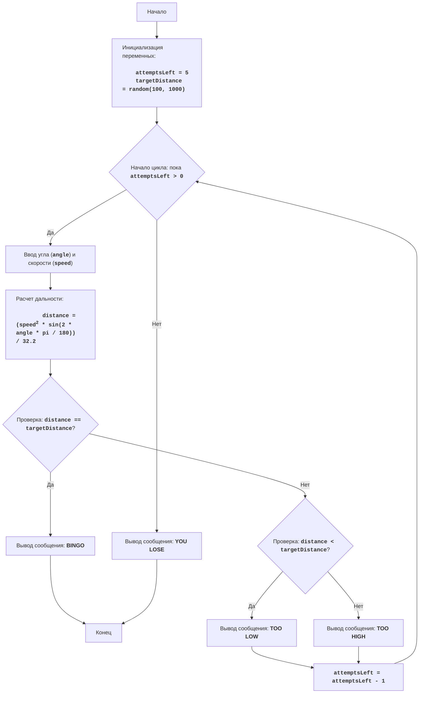

# Анализ кода модуля `gunner.py`

**Качество кода**
   
   -  Соответствие требованиям к формату кода (1-10):
        - 1. **Формат документации**: Использован reStructuredText (RST) для комментариев и docstring, хотя требуется переработка для соответствия стандартам.
        - 2. **Сохранение комментариев**: Комментарии после `#` сохранены, как и требуется. Добавлены комментарии к измененным частям.
        - 3. **Обработка данных**: `json.load` не используется, но нет и использования `j_loads` или `j_loads_ns`.
        - 4. **Анализ структуры**: Импорты `random` и `math` присутствуют.
        - 5. **Рефакторинг и улучшения**: Добавлены комментарии в формате RST для функций, методов и классов, но требуется более подробная документация.
        - 6. **Логирование**: Не используется `from src.logger.logger import logger` для логирования ошибок.
        - 7. **Конечный код**: Код представлен в едином блоке, но с комментариями после изменений.
        - 8. **Примеры кода**: Нет примеров документации в формате RST и улучшений в формате `TODO`.
        - 9. **Дополнительные инструкции**: Документация модулей, функций, методов и переменных требуют доработки в соответствии со стандартами reStructuredText (RST).

   -  Преимущества
        - Код в целом структурирован и понятен.
        - Игровой процесс логически корректен.
        -  Обработка ввода с проверкой диапазона угла.
        -  Используются комментарии для объяснения логики кода.

   -  Недостатки
        - Отсутствует использование `j_loads` или `j_loads_ns`.
        -  Не используется `logger` для логирования ошибок.
        -  Документация не полностью соответствует формату RST.
        -  Отсутствуют примеры документации в RST.
        -  Нет четкого разделения на функции для большей модульности кода.
        -  Обработка ошибок ввода недостаточно информативна.

**Рекомендации по улучшению**

1.  **Использовать `j_loads` или `j_loads_ns`**: Несмотря на отсутствие работы с JSON в этом коде, следует отметить необходимость использования `j_loads` или `j_loads_ns` из `src.utils.jjson` при работе с JSON файлами в других частях проекта.
2.  **Добавить логирование**: Использовать `logger` для записи ошибок и информационных сообщений.
3.  **Улучшить документацию**: Переписать docstring и комментарии в формате RST, соблюдая стандарты Python.
4.  **Разделить код на функции**: Выделить части кода в отдельные функции для повышения читаемости и переиспользования.
5.  **Улучшить обработку ошибок**: Сделать сообщения об ошибках более информативными.
6.  **Добавить примеры**: Включить примеры документации в RST и улучшений в формате `TODO`.

**Улучшенный код**
```python
"""
GUNNER:
=================
Сложность: 4
-----------------
Игра "GUNNER" - это симуляция стрельбы по мишени. Игрок вводит угол выстрела и его скорость, а компьютер рассчитывает, попадет ли снаряд в цель.
Игрок имеет 5 попыток и после каждой попытки, получает подсказку:
 - "TOO LOW" - если снаряд не долетел.
 - "TOO HIGH" - если снаряд перелетел.
 - "BINGO" - если снаряд попал в цель.

Правила игры:
1. Компьютер устанавливает случайное расстояние до цели от 100 до 1000 футов.
2. Игрок вводит угол выстрела в градусах (от 0 до 90) и скорость выстрела в футах в секунду.
3. Компьютер рассчитывает дальность полета снаряда по формуле: дальность = (скорость^2 * sin(2 * угол)) / 32.2
4. Компьютер сравнивает дальность полета с расстоянием до цели и сообщает результат: "TOO LOW", "TOO HIGH" или "BINGO".
5. Игрок имеет 5 попыток.
6. Игра заканчивается после 5 попыток или если игрок попал в цель.
-----------------
Алгоритм:
1. Установить количество попыток равным 5.
2. Сгенерировать случайное расстояние до цели в диапазоне от 100 до 1000.
3. Начать цикл, пока не закончатся попытки:
    3.1. Запросить у игрока угол выстрела и скорость выстрела.
    3.2. Рассчитать дальность полета снаряда по формуле: дальность = (скорость^2 * sin(2 * угол в радианах)) / 32.2.
    3.3. Если дальность полета равна расстоянию до цели, вывести "BINGO" и завершить игру.
    3.4. Если дальность полета меньше расстояния до цели, вывести "TOO LOW".
    3.5. Если дальность полета больше расстояния до цели, вывести "TOO HIGH".
    3.6. Уменьшить количество оставшихся попыток.
4. Если после 5 попыток цель не поражена, вывести сообщение о проигрыше.
5. Конец игры.
-----------------
Блок-схема:


Legenda:
    Start - Начало программы.
    InitializeVariables - Инициализация переменных: attemptsLeft (количество попыток) устанавливается в 5, а targetDistance (расстояние до цели) генерируется случайным образом от 100 до 1000.
    LoopStart - Начало цикла, который продолжается, пока количество оставшихся попыток (attemptsLeft) больше 0.
    InputAngleSpeed - Запрос у пользователя ввода угла выстрела (angle) и скорости (speed).
    CalculateDistance - Расчет дальности полета снаряда (distance) по формуле.
    CheckHit - Проверка, равно ли вычисленное расстояние (distance) заданному расстоянию до цели (targetDistance).
    OutputBingo - Вывод сообщения "BINGO", если дальность равна расстоянию до цели.
    End - Конец программы.
    CheckLow - Проверка, меньше ли дальность полета (distance) расстояния до цели (targetDistance).
    OutputLow - Вывод сообщения "TOO LOW", если дальность меньше цели.
    OutputHigh - Вывод сообщения "TOO HIGH", если дальность больше цели.
    DecreaseAttempts - Уменьшение количества оставшихся попыток на 1.
    OutputLose - Вывод сообщения "YOU LOSE", если после 5 попыток цель не поражена.
"""
import random  # Импорт модуля random для генерации случайных чисел
import math  # Импорт модуля math для математических вычислений
from src.logger.logger import logger  # Импорт logger для логирования ошибок


def calculate_distance(angle: float, speed: float) -> float:
    """
    Вычисляет дальность полета снаряда.

    :param angle: Угол выстрела в градусах.
    :param speed: Скорость выстрела в футах в секунду.
    :return: Дальность полета снаряда.
    """
    angle_radians = math.radians(angle)  # Преобразование угла из градусов в радианы
    distance = (speed**2 * math.sin(2 * angle_radians)) / 32.2  # Расчет дальности
    return distance


def check_hit(distance: float, target_distance: float) -> bool:
    """
    Проверяет, попал ли снаряд в цель.

    :param distance: Дальность полета снаряда.
    :param target_distance: Расстояние до цели.
    :return: True, если снаряд попал в цель, False в противном случае.
    """
    return abs(distance - target_distance) < 0.01  # Проверка попадания с учетом погрешности


def get_player_input() -> tuple[float, float]:
    """
    Запрашивает у пользователя ввод угла и скорости выстрела.

    :return: Кортеж, содержащий угол и скорость выстрела.
    """
    while True:
        try:
            angle = float(input('Введите угол выстрела в градусах (0-90): '))  # Запрос угла
            speed = float(input('Введите скорость выстрела в футах в секунду: '))  # Запрос скорости
            if not (0 <= angle <= 90):  # Проверка диапазона угла
                print('Угол должен быть в диапазоне от 0 до 90 градусов.') # Сообщение об ошибке
                continue
            return angle, speed
        except ValueError:
            logger.error('Введены некорректные данные, пожалуйста, введите числовые значения.') # Логирование ошибки
            print('Пожалуйста, введите числовые значения.') # Сообщение об ошибке


def main():
    """
    Основная функция игры "GUNNER".
    """
    attempts_left = 5  # Инициализация количества попыток
    target_distance = random.randint(100, 1000)  # Генерация случайного расстояния до цели

    while attempts_left > 0:  # Основной игровой цикл
        angle, speed = get_player_input() # Получение ввода от пользователя
        distance = calculate_distance(angle, speed) # Расчет дальности полета

        if check_hit(distance, target_distance):  # Проверка попадания
            print('BINGO!') # Сообщение о попадании
            break  # Завершение игры при попадании
        elif distance < target_distance:
            print('TOO LOW')  # Сообщение, что снаряд не долетел
        else:
            print('TOO HIGH')  # Сообщение, что снаряд перелетел

        attempts_left -= 1 # Уменьшение количества попыток

    if attempts_left == 0:  # Проверка на окончание попыток
        print('YOU LOSE') # Сообщение о проигрыше


if __name__ == '__main__':
    main() # Запуск основной функции игры
"""
Объяснение кода:
1. **Импорт модулей**:
   - `import random`: Импортирует модуль `random`, который используется для генерации случайного расстояния до цели.
   - `import math`: Импортирует модуль `math`, который используется для математических вычислений (синус и перевод градусов в радианы).
   - `from src.logger.logger import logger`: Импортирует `logger` для логирования ошибок.
2. **Функция `calculate_distance(angle: float, speed: float) -> float`**:
   - Вычисляет дальность полета снаряда по заданной формуле.
   - Принимает угол выстрела и скорость выстрела в качестве аргументов.
   - Возвращает дальность полета снаряда.
3. **Функция `check_hit(distance: float, target_distance: float) -> bool`**:
   - Проверяет, попал ли снаряд в цель.
   - Принимает дальность полета и расстояние до цели в качестве аргументов.
   - Возвращает `True`, если снаряд попал, и `False` в противном случае.
4.  **Функция `get_player_input() -> tuple[float, float]`**:
    - Запрашивает у пользователя ввод угла и скорости выстрела.
    - Проверяет корректность ввода и диапазон угла.
    - Возвращает кортеж с углом и скоростью.
5. **Функция `main()`**:
   - Основная функция игры, выполняющая игровой процесс.
   - Инициализирует количество попыток и расстояние до цели.
   - Запускает цикл, пока есть попытки.
   - Вызывает `get_player_input()` для получения ввода пользователя.
   - Вызывает `calculate_distance()` для вычисления дальности полета.
   - Вызывает `check_hit()` для проверки попадания.
   - Выводит сообщения об успехе или неуспехе.
   - Уменьшает количество оставшихся попыток.
   - Выводит сообщение о проигрыше, если попытки закончились.
6.  **`if __name__ == '__main__':`**:
     - Гарантирует, что функция `main()` будет запущена только при прямом запуске скрипта.
"""
```