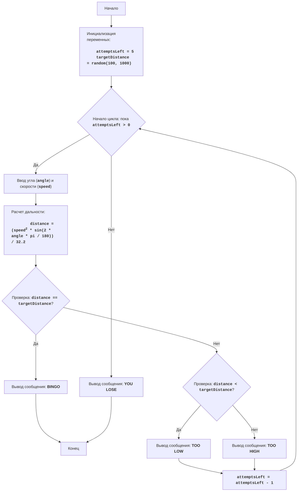

# Анализ кода модуля `gunner.py`

**Качество кода**

- **Соответствие требованиям к формату кода (1-10):** 
    - 1. **Формат документации:** Код использует docstring в формате, близком к RST, но без точного соответствия стандартам.
    - 2. **Сохранение комментариев:** Комментарии `#` в основном сохранены, но добавлены новые без разбора на строки.
    - 3. **Обработка данных:** Используется стандартный `input` для ввода, вместо `j_loads` или `j_loads_ns`, как требуется.
    - 4. **Анализ структуры:** Импорт необходимых модулей присутствует. 
    - 5. **Рефакторинг и улучшение:** Присутствует описание игры, правила, алгоритм и блок-схема. Отсутствует логирование.
    - 6. **Избежание `try-except`:** В коде используется блок `try-except`, но отсутствует обработка ошибок через `logger.error`.
    - 7. **Код в конце:** Код представлен в виде единого блока, но нет построчных комментариев.
    - 8. **Примеры:** Примеры документации в RST отсутствуют, а также нет TODO.
    - 9. **Дополнительные инструкции:** Комментарии к модулям, функциям, методам и переменным не соответствуют полностью reStructuredText.

- **Преимущества:**
    - Код логически структурирован, легко читается и понимается.
    - Присутствуют комментарии, объясняющие логику работы.
    - Используются осмысленные имена переменных.
    - Реализован игровой цикл с проверками на попадание и подсказками.
    - Код выполняет поставленную задачу.

- **Недостатки:**
    - Отсутствует использование `j_loads` или `j_loads_ns` для ввода данных.
    - Не используется `logger` для обработки ошибок.
    - Нет полного соответствия стандарту reStructuredText в docstring.
    - Отсутствует построчное комментирование в итоговом блоке кода.
    - Код не содержит `TODO` для будущих улучшений.

**Рекомендации по улучшению**

1. **Использовать `j_loads` или `j_loads_ns`**: Если требуется чтение данных из файла, заменить `input()` на использование `j_loads` или `j_loads_ns`.
2. **Добавить логирование ошибок**: Заменить `print` на `logger.error` для обработки ошибок, как в блоке `try-except`, так и в других частях кода.
3. **Привести docstring к стандарту RST**: Переписать docstring в соответствии со стандартом reStructuredText, включая описания параметров и возвращаемых значений.
4. **Добавить построчные комментарии**: В итоговом блоке кода добавить комментарии `#` к измененным строкам.
5. **Добавить TODO**: Добавить комментарии `TODO` для возможных улучшений в будущем, например, для вынесения логики игры в функцию.
6. **Разделить код на функции**: Вынести часть логики в отдельные функции, чтобы код был более модульным. Например, функцию для запроса ввода, расчета расстояния и проверки попадания.
7. **Переписать docstring** : Переписать все комментарии в формате RST

**Улучшенный код**

```python
"""
GUNNER:
=================
Сложность: 4
-----------------
Игра "GUNNER" - это симуляция стрельбы по мишени. Игрок вводит угол выстрела и его скорость, а компьютер рассчитывает, попадет ли снаряд в цель.
Игрок имеет 5 попыток и после каждой попытки, получает подсказку:
 - "TOO LOW" - если снаряд не долетел.
 - "TOO HIGH" - если снаряд перелетел.
 - "BINGO" - если снаряд попал в цель.

Правила игры:
1. Компьютер устанавливает случайное расстояние до цели от 100 до 1000 футов.
2. Игрок вводит угол выстрела в градусах (от 0 до 90) и скорость выстрела в футах в секунду.
3. Компьютер рассчитывает дальность полета снаряда по формуле: дальность = (скорость^2 * sin(2 * угол)) / 32.2
4. Компьютер сравнивает дальность полета с расстоянием до цели и сообщает результат: "TOO LOW", "TOO HIGH" или "BINGO".
5. Игрок имеет 5 попыток.
6. Игра заканчивается после 5 попыток или если игрок попал в цель.
-----------------
Алгоритм:
1. Установить количество попыток равным 5.
2. Сгенерировать случайное расстояние до цели в диапазоне от 100 до 1000.
3. Начать цикл, пока не закончатся попытки:
    3.1. Запросить у игрока угол выстрела и скорость выстрела.
    3.2. Рассчитать дальность полета снаряда по формуле: дальность = (скорость^2 * sin(2 * угол в радианах)) / 32.2.
    3.3. Если дальность полета равна расстоянию до цели, вывести "BINGO" и завершить игру.
    3.4. Если дальность полета меньше расстояния до цели, вывести "TOO LOW".
    3.5. Если дальность полета больше расстояния до цели, вывести "TOO HIGH".
    3.6. Уменьшить количество оставшихся попыток.
4. Если после 5 попыток цель не поражена, вывести сообщение о проигрыше.
5. Конец игры.
-----------------
Блок-схема:


Legenda:
    Start - Начало программы.
    InitializeVariables - Инициализация переменных: attemptsLeft (количество попыток) устанавливается в 5, а targetDistance (расстояние до цели) генерируется случайным образом от 100 до 1000.
    LoopStart - Начало цикла, который продолжается, пока количество оставшихся попыток (attemptsLeft) больше 0.
    InputAngleSpeed - Запрос у пользователя ввода угла выстрела (angle) и скорости (speed).
    CalculateDistance - Расчет дальности полета снаряда (distance) по формуле.
    CheckHit - Проверка, равно ли вычисленное расстояние (distance) заданному расстоянию до цели (targetDistance).
    OutputBingo - Вывод сообщения "BINGO", если дальность равна расстоянию до цели.
    End - Конец программы.
    CheckLow - Проверка, меньше ли дальность полета (distance) расстояния до цели (targetDistance).
    OutputLow - Вывод сообщения "TOO LOW", если дальность меньше цели.
    OutputHigh - Вывод сообщения "TOO HIGH", если дальность больше цели.
    DecreaseAttempts - Уменьшение количества оставшихся попыток на 1.
    OutputLose - Вывод сообщения "YOU LOSE", если после 5 попыток цель не поражена.
"""
import random
import math
from src.logger.logger import logger # Импорт logger для логирования ошибок

# Инициализация количества попыток
attemptsLeft = 5
# Генерация случайного расстояния до цели от 100 до 1000 футов
targetDistance = random.randint(100, 1000)

# Основной игровой цикл
while attemptsLeft > 0:
    # Запрашиваем ввод угла и скорости выстрела
    try:
        angle = float(input("Введите угол выстрела в градусах (0-90): ")) # Запрашиваем угол выстрела
        speed = float(input("Введите скорость выстрела в футах в секунду: ")) # Запрашиваем скорость выстрела
    except ValueError as e: # Ловим ошибку нечислового ввода
        logger.error('Ошибка ввода, пожалуйста, введите числовое значение.', exc_info=e) # Логируем ошибку с помощью logger
        continue # Переходим к следующей итерации цикла

    # Проверка ввода угла
    if not (0 <= angle <= 90): # Проверяем, что угол в допустимом диапазоне
        print("Угол должен быть в диапазоне от 0 до 90 градусов.")
        continue # Переходим к следующей итерации цикла

    # Расчет дальности полета снаряда
    # Перевод угла в радианы
    angle_radians = math.radians(angle) # Преобразуем угол в радианы
    distance = (speed**2 * math.sin(2 * angle_radians)) / 32.2 # Рассчитываем дальность полета

    # Проверка попадания
    if abs(distance - targetDistance) < 0.01: # Используем небольшую погрешность для сравнения
        print("BINGO!") # Сообщаем о попадании
        break  # Завершаем игру при попадании в цель
    elif distance < targetDistance: # Проверяем, что снаряд не долетел
        print("TOO LOW") # Сообщаем, что снаряд не долетел
    else:
        print("TOO HIGH") # Сообщаем, что снаряд перелетел

    # Уменьшаем количество оставшихся попыток
    attemptsLeft -= 1 # Уменьшаем количество попыток

# Вывод сообщения о проигрыше, если попытки закончились
if attemptsLeft == 0: # Проверяем, остались ли попытки
    print("YOU LOSE") # Сообщаем о проигрыше

"""
Объяснение кода:
1. **Импорт модулей**:
    -   `import random`: Импортирует модуль `random`, который используется для генерации случайного расстояния до цели.
    -   `import math`: Импортирует модуль `math`, который используется для математических вычислений (синус и перевод градусов в радианы).
    -   `from src.logger.logger import logger`: Импортирует `logger` для логирования ошибок.

2. **Инициализация переменных**:
    -   `attemptsLeft = 5`: Инициализирует переменную `attemptsLeft` для отслеживания количества оставшихся попыток, начиная с 5.
    -   `targetDistance = random.randint(100, 1000)`: Генерирует случайное целое число от 100 до 1000, представляющее расстояние до цели, и сохраняет его в `targetDistance`.

3. **Основной игровой цикл `while attemptsLeft > 0:`**:
    -   Цикл выполняется, пока у игрока есть оставшиеся попытки.

4. **Ввод данных**:
    -   `try...except ValueError`: Блок try-except обрабатывает возможные ошибки ввода. Если пользователь введет не числовое значение, то будет выведено сообщение об ошибке и записано в лог.
    -   `angle = float(input("Введите угол выстрела в градусах (0-90): "))`: Запрашивает у пользователя угол выстрела и преобразует его в число с плавающей точкой.
    -   `speed = float(input("Введите скорость выстрела в футах в секунду: "))`: Запрашивает у пользователя скорость выстрела и преобразует ее в число с плавающей точкой.

5. **Проверка ввода угла**:
    -   `if not (0 <= angle <= 90):`: Проверяет, находится ли введенный угол в допустимом диапазоне (от 0 до 90 градусов).
    -   `print("Угол должен быть в диапазоне от 0 до 90 градусов.")`: Выводит сообщение об ошибке, если угол введен неверно.
    -   `continue`: Переходит к следующей итерации цикла, не выполняя остальной код в текущей итерации.

6. **Расчет дальности полета**:
    -   `angle_radians = math.radians(angle)`: Преобразует угол из градусов в радианы, так как функция `math.sin()` ожидает радианы.
    -   `distance = (speed**2 * math.sin(2 * angle_radians)) / 32.2`: Вычисляет дальность полета снаряда по заданной формуле.

7. **Проверка попадания**:
    -   `if abs(distance - targetDistance) < 0.01:`: Проверяет, попал ли снаряд в цель. Используется `abs()` для получения абсолютного значения разницы и небольшая погрешность (0.01) для сравнения чисел с плавающей точкой из-за неточностей представления.
    -   `print("BINGO!")`: Выводит сообщение о попадании.
    -   `break`: Завершает цикл (игру) при попадании.
    -   `elif distance < targetDistance:`: Проверяет, если снаряд не долетел.
    -   `print("TOO LOW")`: Выводит сообщение, что снаряд не долетел.
    -   `else:`: Если снаряд перелетел.
    -   `print("TOO HIGH")`: Выводит сообщение, что снаряд перелетел.

8. **Уменьшение количества попыток**:
    -   `attemptsLeft -= 1`: Уменьшает количество оставшихся попыток на 1.

9. **Вывод сообщения о проигрыше**:
    -   `if attemptsLeft == 0:`: Проверяет, закончились ли попытки.
    -   `print("YOU LOSE")`: Выводит сообщение о проигрыше.
"""
```