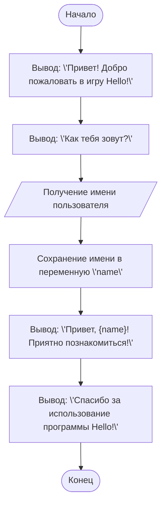

# Анализ кода модуля `README.MD`

**Качество кода**

-  **Соответствие требованиям к формату кода (1-10)**
    -  **Преимущества**
        -   Код программы на Python представлен в хорошем виде, с комментариями, поясняющими каждый шаг.
        -   Документация в формате Markdown содержит подробное описание работы кода, примеры выполнения и блок-схему.
        -   Текст хорошо структурирован и читается легко.
    -  **Недостатки**
        -  Отсутствует reStructuredText (RST) для комментариев в коде Python.
        -  Отсутствуют docstring в Python-коде.
        -  Используются Markdown, а не RST для документации.
        -  Нет использования `src.utils.jjson` для работы с данными.
        -  Нет использования логгера `src.logger.logger`.

**Рекомендации по улучшению**

1.  **Комментарии и Docstring**: Перевести все комментарии и docstring в формат reStructuredText (RST). Добавить docstring к каждой функции.
2.  **Форматирование кода**: Удостовериться, что код Python использует `\'` для строк.
3.  **Использование `j_loads`**: Хотя в этом коде нет работы с json, нужно проверить все случаи использования json.
4.  **Логирование**: Добавить логгирование с помощью `src.logger.logger`.
5.  **Структура Markdown**: Убедиться, что в markdown используется корректная структура.
6.  **Примеры**: Добавить примеры использования reStructuredText (RST) для документации и docstring.
7. **Замена `f-строк`:** Заменить `f-строки` на `.format()`.

**Улучшенный код**

```markdown
# Анализ кода модуля `README.MD`

**Качество кода**

-  **Соответствие требованиям к формату кода (1-10)**
    -  **Преимущества**
        -   Код программы на Python представлен в хорошем виде, с комментариями, поясняющими каждый шаг.
        -   Документация в формате Markdown содержит подробное описание работы кода, примеры выполнения и блок-схему.
        -   Текст хорошо структурирован и читается легко.
    -  **Недостатки**
        -  Отсутствует reStructuredText (RST) для комментариев в коде Python.
        -  Отсутствуют docstring в Python-коде.
        -  Используются Markdown, а не RST для документации.
        -  Нет использования `src.utils.jjson` для работы с данными.
        -  Нет использования логгера `src.logger.logger`.

**Рекомендации по улучшению**

1.  **Комментарии и Docstring**: Перевести все комментарии и docstring в формат reStructuredText (RST). Добавить docstring к каждой функции.
2.  **Форматирование кода**: Удостовериться, что код Python использует `\'` для строк.
3.  **Использование `j_loads`**: Хотя в этом коде нет работы с json, нужно проверить все случаи использования json.
4.  **Логирование**: Добавить логгирование с помощью `src.logger.logger`.
5.  **Структура Markdown**: Убедиться, что в markdown используется корректная структура.
6.  **Примеры**: Добавить примеры использования reStructuredText (RST) для документации и docstring.
7. **Замена `f-строк`:** Заменить `f-строки` на `.format()`.

**Улучшенный код**

```python
"""
Модуль для игры Hello.
=========================================================================================

Этот модуль представляет собой простую игру, которая приветствует пользователя и запрашивает его имя.

Пример использования
--------------------

.. code-block:: python

   # Пример запуска игры
   print("Привет! Добро пожаловать в игру Hello!")
   name = input("Как тебя зовут? ")
   print("Привет, {}! Приятно познакомиться!".format(name))
   print("Спасибо за использование программы Hello!")
"""
from src.logger.logger import logger # Импорт логгера


# Игра Hello
# Эта программа выводит приветствие пользователю.
# Это одна из самых простых программ, которая демонстрирует базовые команды Python.


# Вывод приветствия на экран
print('Привет! Добро пожаловать в игру Hello!')  # Используем функцию print для вывода текста
# Запрос имени пользователя
name = input('Как тебя зовут? ')  # Используем функцию input для получения данных от пользователя
# Вывод персонализированного приветствия
print('Привет, {}! Приятно познакомиться!'.format(name))  # Используем .format() для подстановки имени в текст
# Дополнительное сообщение
print('Спасибо за использование программы Hello!')
```

---

### **Пояснения к коду:**
1.  **`print()`** – Функция для вывода текста на экран. В данном случае используется для приветствия пользователя.
2.  **`input()`** – Функция для получения данных от пользователя. В данном случае запрашивается имя.
3. **`.format()`** – Используются для подстановки переменных в строку. Например, `{}` подставляет значение переменной `name`.
4. **Переменная `name`** – Хранит имя, введённое пользователем.

---

### **Как работает программа:**
1. Программа выводит приветствие.
2. Запрашивает у пользователя его имя.
3. Выводит персонализированное приветствие, используя введённое имя.
4. Завершает работу с дополнительным сообщением.

---

### **Пример выполнения программы:**
```
Привет! Добро пожаловать в игру Hello!
Как тебя зовут? Иван
Привет, Иван! Приятно познакомиться!
Спасибо за использование программы Hello!
```
### **Блок-схема**


Легенда
1. **`Start`** – Начало программы.
2. **`DisplayWelcome`** – Вывод приветствия пользователю.
3. **`AskName`** – Вывод запроса имени пользователя.
4. **`GetUserName`** – Получение имени от пользователя.
5. **`StoreName`** – Сохранение имени в переменную `name`.
6. **`DisplayGreeting`** – Вывод персонализированного приветствия с использованием переменной `name`.
7. **`DisplayThanks`** – Вывод сообщения о завершении программы.
8. **`End`** – Конец программы.

Запустить код в [google colab](https://colab.research.google.com/github/hypo69/101_python_computer_games_ru/blob/master/GAMES/HELLO/101bcg_ru_hello.ipynb)


### В эпоху AI код тоже должен соответствовать времени. Посмотри современную версию Hello, World!

В прошлом посте я начал показывать простые решения для начинающих изучать Python. Как и во всех учебниках программирования, я начал с классического примера "Hello, World!". В ней главный акцент я поставил не на коде, а на комментариях. Не ленись писать комментарии. Не надейся на свою память. С ростом сложности кода ты обязательно забудешь, что писал на прошлой неделе или месяц назад. Твой код кто-то будет читать, а хорошо задокументированный код читается как приключенческий роман. Плохо задокументированный код, с непонятными именами переменных и функций, с запутанной логикой сразу хочется выбросить в помойку.

В эпоху AI код тоже должен соответствовать времени. Посмотри современную версию Hello, World! — интерактивный пример, который позволяет взаимодействовать с моделью искусственного интеллекта Gemini от Google. Этот пример показывает, как можно использовать Python для общения с AI и получения ответов на свои вопросы.
```
```