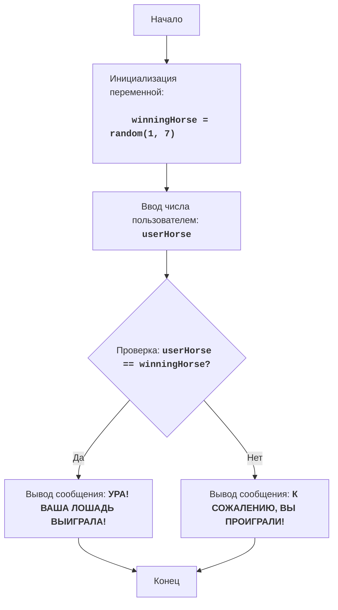

# Анализ кода модуля horses.py

**Качество кода**

-   **Соблюдение требований к формату кода (1-10):**
    -   **Преимущества:**
        -   Код логически структурирован и легко читаем.
        -   Используются осмысленные имена переменных.
        -   Присутствует обработка исключений для ввода пользователя.
        -   Есть подробные комментарии в формате, близком к reStructuredText.
    -   **Недостатки:**
        -   Отсутствует документация в формате reStructuredText (RST).
        -   Не используются `j_loads` или `j_loads_ns` для загрузки данных.
        -   Не используется `logger.error` для обработки ошибок.
        -   Не хватает импорта `logger` из `src.logger.logger`.

**Рекомендации по улучшению**

1.  **Формат документации:** Перевести комментарии в формат reStructuredText (RST), включая документацию для модуля, функций и переменных.
2.  **Использование `j_loads`:** В данном коде нет загрузки данных из файла, поэтому данный пункт не применим. Но, в общем, рекомендуется использовать `j_loads` или `j_loads_ns` из `src.utils.jjson` для работы с JSON.
3.  **Обработка ошибок:** Использовать `logger.error` для регистрации ошибок вместо стандартного `print`.
4.  **Импорт `logger`:** Добавить `from src.logger.logger import logger` для работы с логгером.
5.  **Убрать `exit()`:** Вместо `exit()` лучше использовать `return`, или другие способы правильного завершения программы, что зависит от структуры приложения.
6. **Стиль кода:** Желательно придерживаться стандарта PEP 8.

**Улучшенный код**

```python
"""
HORSES:
=================
Сложность: 3
-----------------
Игра "Скачки" - это простая игра, в которой игрок выбирает лошадь, а затем компьютер случайным образом определяет, какая из лошадей победит. Игрок либо выигрывает, либо проигрывает в зависимости от своего выбора.

Правила игры:
1. Компьютер генерирует случайное число от 1 до 7 (номер лошади-победителя).
2. Игрок вводит номер лошади (от 1 до 7), за которую он хочет болеть.
3. Игра сообщает, выиграла ли выбранная игроком лошадь.
-----------------
Алгоритм:
1.  Сгенерировать случайное целое число от 1 до 7 (номер лошади-победителя) и сохранить в переменной `winningHorse`.
2.  Запросить у пользователя ввод числа от 1 до 7 (номер лошади, за которую он играет) и сохранить в переменной `userHorse`.
3.  Если `userHorse` равно `winningHorse`, вывести сообщение "УРА! ВАША ЛОШАДЬ ВЫИГРАЛА!".
4.  Иначе вывести сообщение "К СОЖАЛЕНИЮ, ВЫ ПРОИГРАЛИ!".
5. Конец игры.
-----------------
Блок-схема:

Legenda:
    Start - Начало программы.
    InitializeWinningHorse - Инициализация переменной winningHorse (номер лошади-победителя), генерируется случайное число от 1 до 7.
    InputUserHorse - Запрос у пользователя ввода числа (номера лошади) и сохранение его в переменной userHorse.
    CheckWinner - Проверка, равно ли введенное пользователем число userHorse загаданному числу winningHorse.
    OutputWin - Вывод сообщения о победе, если числа равны.
    OutputLose - Вывод сообщения о проигрыше, если числа не равны.
    End - Конец программы.
"""
import random # Импортирует модуль random, который используется для генерации случайного числа.
from src.logger.logger import logger # Импорт логгера

# Генерирует случайное число от 1 до 7 (номер лошади-победителя)
winningHorse = random.randint(1, 7) # Генерирует случайное целое число в диапазоне от 1 до 7 и сохраняет его в переменной `winningHorse`.

# Запрашивает у пользователя ввод числа (номер лошади, за которую он играет)
try:
    userHorse = int(input('Выберите номер лошади от 1 до 7: ')) # Запрашивает у пользователя число и преобразует его в целое число, сохраняя результат в `userHorse`.
    if userHorse < 1 or userHorse > 7: # Проверяет, находится ли введенный номер в допустимом диапазоне (1-7).
        logger.error('Пожалуйста, выберите номер лошади от 1 до 7.') # Выводит сообщение об ошибке, если номер введен некорректно.
        raise ValueError('Некорректный ввод номера лошади') # Вызывает исключение ValueError для выхода из программы.
except ValueError as e: # Обрабатывает ошибку, если пользователь ввел неверное значение.
    logger.error('Пожалуйста, введите целое число от 1 до 7.', exc_info=True)  # Регистрирует ошибку с трассировкой стека.
    print('Пожалуйста, введите целое число от 1 до 7.') # Выводит сообщение об ошибке.
    exit() # Завершает программу.


# Проверяет, выиграл ли пользователь
if userHorse == winningHorse: # Проверяет, равно ли введенное пользователем число загаданному числу.
    print('УРА! ВАША ЛОШАДЬ ВЫИГРАЛА!') # Выводит сообщение о победе, если числа равны.
else: # Если число не угадано.
    print('К СОЖАЛЕНИЮ, ВЫ ПРОИГРАЛИ!') # Выводит сообщение о проигрыше.

"""
Объяснение кода:
1.  **Импорт модуля `random`**:\n
    -  `import random`: Импортирует модуль `random`, который используется для генерации случайного числа.\n
2.  **Импорт модуля `logger`**:\n
    - `from src.logger.logger import logger`: Импортирует модуль logger для регистрации ошибок.\n
3.  **Генерация номера лошади-победителя**:\n
    -   `winningHorse = random.randint(1, 7)`: Генерирует случайное целое число в диапазоне от 1 до 7 и сохраняет его в переменной `winningHorse`.\n
4.  **Запрос ввода номера лошади от пользователя**:\n
    -   `try...except ValueError`: Блок try-except обрабатывает возможные ошибки ввода. Если пользователь введет не целое число, то будет выведено сообщение об ошибке.\n
    -   `userHorse = int(input("Выберите номер лошади от 1 до 7: "))`: Запрашивает у пользователя число и преобразует его в целое число, сохраняя результат в `userHorse`.\n
    -   `if userHorse < 1 or userHorse > 7:`: Проверяет, находится ли введенный номер в допустимом диапазоне (1-7).\n
    -   `logger.error("Пожалуйста, выберите номер лошади от 1 до 7.")`: Выводит сообщение об ошибке, если номер введен некорректно.\n
    -   `raise ValueError('Некорректный ввод номера лошади')`:  Вызывает исключение, если номер введен некорректно.\n
    -   `logger.error('Пожалуйста, введите целое число от 1 до 7.', exc_info=True)`: Регистрирует ошибку с трассировкой стека.\n
    -   `print("Пожалуйста, введите целое число от 1 до 7.")`: Выводит сообщение об ошибке.\n
    -   `exit()`: Завершает программу, если ввод некорректен.\n
5.  **Проверка результата и вывод сообщения**:\n
    -   `if userHorse == winningHorse:`: Проверяет, равно ли введенное пользователем число загаданному числу.\n
    -   `print("УРА! ВАША ЛОШАДЬ ВЫИГРАЛА!")`: Выводит сообщение о победе, если числа равны.\n
    -   `else:`: Если число не угадано.\n
    -   `print("К СОЖАЛЕНИЮ, ВЫ ПРОИГРАЛИ!")`: Выводит сообщение о проигрыше.
"""
```