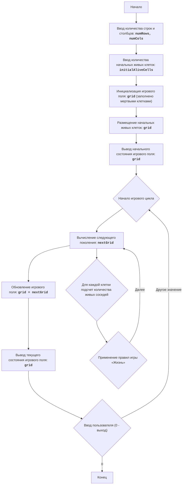

# Анализ кода модуля LIFE 2

**Качество кода**
 -   Соответствие требованиям к формату кода (1-10): 5
 -   Преимущества:
      *   Описание игры и алгоритм представлены в формате markdown.
      *   Блок-схема создана с использованием mermaid.
 -   Недостатки:
      *   Отсутствует код реализации игры.
      *   Нет  docstring  для модуля.
      *   Отсутствуют импорты.
      *   Некоторые формулировки неточны.
      *   Нет примеров кода.

**Рекомендации по улучшению**

1.  Добавить docstring для модуля.
2.  Реализовать код игры согласно описанному алгоритму.
3.  Добавить необходимые импорты.
4.  Формулировки описания и алгоритма сделать более четкими.
5.  Добавить примеры использования кода.

**Улучшенный код**

```markdown
"""
Модуль, реализующий игру "Жизнь 2"
=========================================================================================

Модуль предоставляет симуляцию клеточного автомата, разработанную Джоном Конвеем.
Игра представляет собой поле клеток, каждая из которых может быть либо живой, либо мертвой.
Состояние клетки в следующем поколении зависит от количества живых соседей в текущем поколении.

Правила игры:
    1. Игровое поле представлено в виде сетки, где каждая клетка может быть либо живой (обозначена как '*'), либо мертвой (обозначена как пробел ' ').
    2. В начале игры пользователю предлагается ввести количество строк и столбцов для игрового поля, а также количество живых клеток.
    3. После ввода начальных параметров поле заполняется мертвыми клетками, а затем случайным образом размещаются живые клетки, количество которых указал пользователь.
    4. После инициализации поля программа выводит начальное состояние поля.
    5. Итерации продолжаются, пока пользователь не введет "0".
    6. Для каждого нового поколения:
         - Каждая живая клетка с 2 или 3 живыми соседями остается живой в следующем поколении.
        - Каждая живая клетка с менее чем 2 живыми соседями умирает в следующем поколении.
        - Каждая живая клетка с более чем 3 живыми соседями умирает в следующем поколении.
        - Каждая мертвая клетка рождается в следующем поколении, если у нее ровно 3 живых соседа.
    7. Поле отображается после каждой итерации.

Пример использования:
    
.. code-block:: python

    life_game = LifeGame()
    life_game.start_game()

"""

LIFE 2:
=================
Сложность: 5
-----------------
Игра "Жизнь 2" - это симуляция клеточного автомата, разработанная Джоном Конвеем. Она представляет собой поле клеток, каждая из которых может быть либо живой, либо мертвой. Состояние клетки в следующем поколении зависит от количества живых соседей в текущем поколении. Игра демонстрирует, как простые правила могут привести к возникновению сложных и интересных паттернов. Игрок может задавать начальную конфигурацию живых клеток, и наблюдать за эволюцией этой конфигурации с течением времени.
Правила игры:
1. Игровое поле представлено в виде сетки, где каждая клетка может быть либо живой (обозначена как '*'), либо мертвой (обозначена как пробел ' ').
2. В начале игры игроку предлагается ввести количество строк и столбцов для игрового поля, а также количество живых клеток.
3. После ввода начальных параметров поле заполняется мертвыми клетками, а затем случайным образом размещаются живые клетки, количество которых указал игрок.
4. После инициализации поля программа выводит начальное состояние поля.
5. Итерации продолжаются, пока пользователь не введет "0".
6. Для каждого нового поколения:
     - Каждая живая клетка с 2 или 3 живыми соседями остается живой в следующем поколении.
    - Каждая живая клетка с менее чем 2 живыми соседями умирает в следующем поколении.
    - Каждая живая клетка с более чем 3 живыми соседями умирает в следующем поколении.
    - Каждая мертвая клетка рождается в следующем поколении, если у нее ровно 3 живых соседа.
7. Поле отображается после каждой итерации.
-----------------
Алгоритм:
1. Запросить у пользователя количество строк и столбцов для игрового поля.
2. Запросить у пользователя количество начальных живых клеток.
3. Инициализировать игровое поле как матрицу, заполненную мертвыми клетками (' ').
4. Разместить случайным образом указанное пользователем количество живых клеток ('*') на игровом поле.
5. Вывести начальное состояние игрового поля.
6. Запустить бесконечный цикл:
    6.1 Вычислить следующее поколение клеток:
        6.1.1 Создать новое поле, скопировав текущее поле.
        6.1.2 Для каждой клетки в текущем поле:
           6.1.2.1 Подсчитать количество живых соседей.
           6.1.2.2 Применить правила "Жизни", чтобы определить состояние клетки в новом поле.
        6.1.3 Заменить текущее поле новым полем.
    6.2 Вывести текущее состояние игрового поля.
    6.3 Запросить у пользователя ввод. Если введено "0", завершить игру, иначе продолжить.
-----------------
Блок-схема:

Legenda:
    Start - Начало программы.
    InputRowsCols - Запрос у пользователя количества строк и столбцов для игрового поля.
    InputAliveCells - Запрос у пользователя количества начальных живых клеток.
    InitializeGrid - Инициализация игрового поля в виде матрицы, заполненной мертвыми клетками (пробелами).
    PlaceAliveCells - Размещение заданного количества живых клеток (звездочек) на игровом поле в случайных позициях.
    OutputGrid - Вывод начального состояния игрового поля на экран.
    GameLoopStart - Начало основного игрового цикла.
    ComputeNextGeneration - Вычисление следующего поколения клеток на основе текущего состояния поля и правил игры "Жизнь".
     CalculateNeighbors - Для каждой клетки подсчет количества живых соседей.
     ApplyRules - Применение правил игры «Жизнь» для определения состояния клетки в следующем поколении.
    UpdateGrid - Обновление текущего игрового поля, заменяя его новым поколением.
    OutputCurrentGrid - Вывод текущего состояния игрового поля на экран.
    InputUserContinue - Запрос у пользователя на продолжение игры (любое значение, кроме "0") или выход из игры ("0").
    End - Конец программы.
```

```python
"""
Модуль, реализующий игру "Жизнь 2"
=========================================================================================

Модуль предоставляет симуляцию клеточного автомата, разработанную Джоном Конвеем.
Игра представляет собой поле клеток, каждая из которых может быть либо живой, либо мертвой.
Состояние клетки в следующем поколении зависит от количества живых соседей в текущем поколении.

Правила игры:
    1. Игровое поле представлено в виде сетки, где каждая клетка может быть либо живой (обозначена как '*'), либо мертвой (обозначена как пробел ' ').
    2. В начале игры пользователю предлагается ввести количество строк и столбцов для игрового поля, а также количество живых клеток.
    3. После ввода начальных параметров поле заполняется мертвыми клетками, а затем случайным образом размещаются живые клетки, количество которых указал пользователь.
    4. После инициализации поля программа выводит начальное состояние поля.
    5. Итерации продолжаются, пока пользователь не введет "0".
    6. Для каждого нового поколения:
         - Каждая живая клетка с 2 или 3 живыми соседями остается живой в следующем поколении.
        - Каждая живая клетка с менее чем 2 живыми соседями умирает в следующем поколении.
        - Каждая живая клетка с более чем 3 живыми соседями умирает в следующем поколении.
        - Каждая мертвая клетка рождается в следующем поколении, если у нее ровно 3 живых соседа.
    7. Поле отображается после каждой итерации.

Пример использования:
    
.. code-block:: python

    life_game = LifeGame()
    life_game.start_game()

"""
import random # Импорт модуля random для размещения живых клеток
from src.logger.logger import logger # Импорт логгера для обработки ошибок

class LifeGame:
    """
    Представляет игру "Жизнь 2".
    
    :ivar grid: Игровое поле, представленное в виде списка списков, где '*' - живая клетка, ' ' - мертвая клетка.
    :vartype grid: list[list[str]]
    :ivar num_rows: Количество строк игрового поля.
    :vartype num_rows: int
    :ivar num_cols: Количество столбцов игрового поля.
    :vartype num_cols: int
    """
    def __init__(self):
        """
        Инициализирует объект игры "Жизнь 2".
        """
        self.grid = []
        self.num_rows = 0
        self.num_cols = 0

    def _initialize_grid(self, num_rows: int, num_cols: int) -> None:
        """
        Инициализирует игровое поле заданными размерами, заполняя его мертвыми клетками.

        :param num_rows: Количество строк игрового поля.
        :type num_rows: int
        :param num_cols: Количество столбцов игрового поля.
        :type num_cols: int
        """
        self.grid = [[' ' for _ in range(num_cols)] for _ in range(num_rows)]
        self.num_rows = num_rows
        self.num_cols = num_cols
    
    def _place_alive_cells(self, initial_alive_cells: int) -> None:
        """
        Размещает начальное количество живых клеток случайным образом на игровом поле.

        :param initial_alive_cells: Количество живых клеток для размещения.
        :type initial_alive_cells: int
        """
        try:
            for _ in range(initial_alive_cells):
                 row = random.randint(0, self.num_rows - 1)
                 col = random.randint(0, self.num_cols - 1)
                 self.grid[row][col] = '*'
        except Exception as e:
            logger.error(f'Ошибка при размещении живых клеток: {e}') # Логирование ошибок с использованием logger

    def _print_grid(self) -> None:
        """
        Выводит текущее состояние игрового поля на экран.
        """
        for row in self.grid:
            print(' '.join(row))
        print("-" * (self.num_cols * 2)) # Разделитель для наглядности
    
    def _count_neighbors(self, row: int, col: int) -> int:
        """
        Подсчитывает количество живых соседей у клетки.

        :param row: Индекс строки клетки.
        :type row: int
        :param col: Индекс столбца клетки.
        :type col: int
        :return: Количество живых соседей.
        :rtype: int
        """
        count = 0
        for i in range(max(0, row - 1), min(self.num_rows, row + 2)):
            for j in range(max(0, col - 1), min(self.num_cols, col + 2)):
                if (i, j) != (row, col) and self.grid[i][j] == '*':
                    count += 1
        return count
    
    def _compute_next_generation(self) -> list[list[str]]:
        """
        Вычисляет следующее поколение клеток на основе текущего состояния поля и правил игры "Жизнь".

        :return: Новое игровое поле после применения правил.
        :rtype: list[list[str]]
        """
        next_grid = [[' ' for _ in range(self.num_cols)] for _ in range(self.num_rows)]
        for row in range(self.num_rows):
            for col in range(self.num_cols):
                neighbors = self._count_neighbors(row, col)
                if self.grid[row][col] == '*':
                    if neighbors in (2, 3):
                        next_grid[row][col] = '*' # Живая клетка остается живой
                else:
                    if neighbors == 3:
                        next_grid[row][col] = '*' # Мертвая клетка рождается
        return next_grid
    
    def start_game(self) -> None:
        """
        Запускает игру "Жизнь 2".
        """
        try:
            num_rows = int(input("Введите количество строк: "))
            num_cols = int(input("Введите количество столбцов: "))
            initial_alive_cells = int(input("Введите количество начальных живых клеток: "))
            
            self._initialize_grid(num_rows, num_cols) # Инициализация игрового поля
            self._place_alive_cells(initial_alive_cells) # Размещение живых клеток
            self._print_grid()  # Вывод начального состояния поля

            while True:
                user_input = input("Нажмите Enter для продолжения или введите '0' для выхода: ")
                if user_input == '0':
                    break
                self.grid = self._compute_next_generation() # Вычисление следующего поколения
                self._print_grid() # Вывод текущего состояния поля

        except ValueError:
             logger.error('Некорректный ввод данных')# Логирование ошибок с использованием logger
        except Exception as e:
            logger.error(f'Произошла непредвиденная ошибка: {e}')  # Логирование ошибок с использованием logger

if __name__ == '__main__':
    game = LifeGame()
    game.start_game()
```