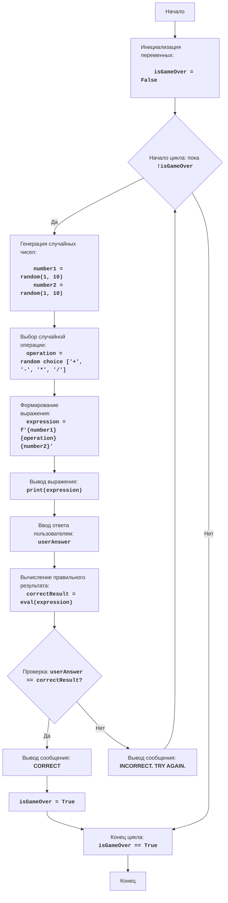

# Анализ кода модуля mathdi

**Качество кода**
-  **Соответствие требованиям к формату кода (1-10):**
    -  **Преимущества:**
         - Код достаточно читаемый и хорошо структурирован, следуя логике, описанной в блок-схеме.
         - Присутствует подробное описание алгоритма работы кода, блок-схема и правила игры в docstring.
         - Используются осмысленные имена переменных и функций.
    -  **Недостатки:**
        -  Используются стандартные функции `print` для вывода сообщений.
        -  Отсутствует обработка исключений связанных с неправильным вводом пользователя.
        -  Не используется `logger` для записи ошибок и отладочной информации.
        -  Не используются `j_loads` или `j_loads_ns` для загрузки данных.
        -  Отсутствуют docstring для функций и глобальных переменных.
        -  Формат docstring не соответствует reStructuredText (RST).

**Рекомендации по улучшению:**

1. **Форматирование и документация:**
   -   Использовать reStructuredText (RST) для всех docstring.
   -   Добавить docstring для всех функций и глобальных переменных.
2. **Обработка данных:**
   -   Не требуется использование `j_loads` или `j_loads_ns`, так как нет загрузки данных из файла.
3. **Обработка ошибок:**
    -   Использовать `logger.error` для записи ошибок вместо `print`.
    -   Улучшить обработку ошибок ввода пользователя, чтобы предотвратить сбои программы.
4. **Модульность:**
    -   Создать функцию `run_game`, чтобы основной код игры был инкапсулирован.
5. **Улучшения в коде:**
    -   Убрать лишние комментарии из кода.
    -   Проверить код на PEP8 style.

**Улучшенный код**

```python
"""
Модуль MATHDI:
=================
Сложность: 5
-----------------
Игра "Математические задачи" предлагает пользователю решить простую математическую задачу (сложение, вычитание, умножение или деление) и проверяет правильность ответа.
Игра генерирует случайные числа и операцию.
-----------------
Правила игры:
1.  Компьютер генерирует случайное математическое выражение (два случайных числа и одну случайную операцию из +,-,*,/).
2.  Игроку предлагается решить это выражение и ввести свой ответ.
3.  Компьютер проверяет, правильный ли ответ дал игрок.
4.  Если ответ правильный, игра сообщает об этом и заканчивается.
5.  Если ответ неправильный, игра сообщает, что ответ неверен и игра начинается заново.
-----------------
Алгоритм:
1.  Установить флаг завершения игры в `False`.
2.  Начать цикл "пока игра не завершена":
    2.1 Сгенерировать два случайных целых числа `number1` и `number2` в диапазоне от 1 до 10.
    2.2 Выбрать случайную операцию `operation` из списка: "+", "-", "*", "/".
    2.3 Сформировать строку выражения `expression` на основе сгенерированных чисел и операции.
    2.4 Вывести пользователю математическое выражение.
    2.5 Получить от пользователя ответ и преобразовать его в число.
    2.6 Вычислить правильный результат выражения.
    2.7 Если ответ пользователя равен правильному результату, то вывести сообщение "CORRECT" и установить флаг завершения игры в `True`.
    2.8 Если ответ пользователя не равен правильному результату, то вывести сообщение "INCORRECT. TRY AGAIN.".
3.  Конец игры.
-----------------
Блок-схема:

**Legenda**:
    Start - Начало программы.
    InitializeVariables - Инициализация переменной isGameOver в значение False.
    LoopStart - Начало цикла, который продолжается, пока isGameOver не станет True.
    GenerateNumbers - Генерация двух случайных целых чисел number1 и number2 в диапазоне от 1 до 10.
    SelectOperation - Выбор случайной математической операции (сложение, вычитание, умножение, деление).
    CreateExpression - Формирование математического выражения в виде строки из сгенерированных чисел и операции.
    OutputExpression - Вывод сформированного математического выражения для пользователя.
    InputAnswer - Получение ответа от пользователя и преобразование его в число.
    CalculateResult - Вычисление правильного результата выражения с помощью функции eval().
    CheckAnswer - Проверка, равен ли ответ пользователя правильному результату.
    OutputCorrect - Вывод сообщения "CORRECT", если ответ правильный.
    SetGameOver - Установка переменной isGameOver в True для завершения цикла.
    OutputIncorrect - Вывод сообщения "INCORRECT. TRY AGAIN.", если ответ неправильный.
    LoopEnd - Конец цикла, когда isGameOver становится True.
    End - Конец программы.
"""
import random # импортируем модуль random для генерации случайных чисел
from src.logger.logger import logger # импортируем logger для логирования ошибок

#: флаг для управления циклом игры
is_game_over = False

def run_game():
    """
    Запускает игру "Математические задачи".

    Генерирует случайные математические выражения и проверяет ответы пользователя.
    """
    global is_game_over # объявляем использование глобальной переменной is_game_over
    while not is_game_over: # основной игровой цикл выполняется пока игра не закончена
        number1 = random.randint(1, 10) # генерируем первое случайное число от 1 до 10
        number2 = random.randint(1, 10) # генерируем второе случайное число от 1 до 10
        operations = ['+', '-', '*', '/'] # список доступных математических операций
        operation = random.choice(operations) # выбираем случайную математическую операцию из списка
        expression = f'{number1} {operation} {number2}' # формируем математическое выражение в виде строки

        print(f'Решите: {expression} = ?') # выводим математическое выражение для пользователя
        try:
            user_answer = float(input('Ваш ответ: ')) # получаем ответ от пользователя и преобразуем его в float
        except ValueError:
            logger.error('Некорректный ввод. Пожалуйста, введите число.') # логируем ошибку некорректного ввода
            print('Некорректный ввод. Пожалуйста, введите число.')
            continue # переходим к следующей итерации цикла
        try:
            correct_result = eval(expression) # вычисляем правильный результат выражения с помощью eval()
        except ZeroDivisionError:
            logger.error('Деление на ноль невозможно. Попробуйте еще раз.') # логируем ошибку деления на ноль
            print('Деление на ноль невозможно. Попробуйте еще раз.')
            continue # переходим к следующей итерации цикла
        if user_answer == correct_result: # проверяем правильность ответа пользователя
            print('CORRECT') # выводим сообщение о правильном ответе
            is_game_over = True  # устанавливаем флаг завершения игры в True
        else:
            print('INCORRECT. TRY AGAIN.') # выводим сообщение о неправильном ответе
if __name__ == '__main__':
    run_game() # запускаем игру, если скрипт запущен как основной
```