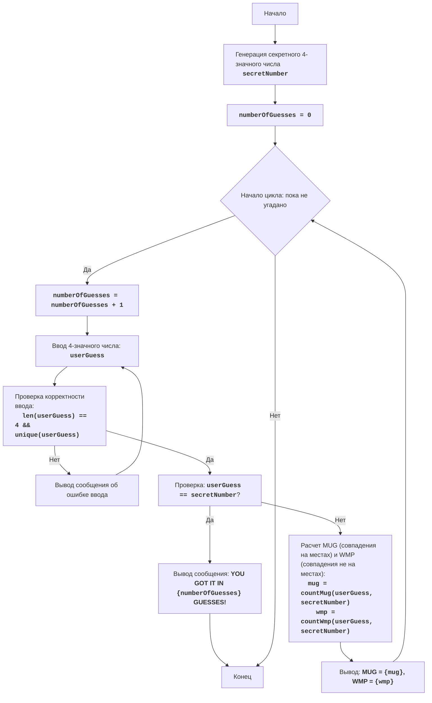

# Анализ кода модуля `mugwmp.py`

**Качество кода**
- **Соответствие требованиям к формату кода (1-10):**
    -   **Преимущества:**
        - Код хорошо структурирован и логически разделен на функции.
        - Присутствуют docstring для функций, которые описывают их назначение.
        - Имеется подробное описание игры, алгоритма и блок-схема.
        - Код написан на русском языке, что соответствует требованиям.
    -   **Недостатки:**
        - Не используется `j_loads` или `j_loads_ns`.
        - Отсутствуют импорты, необходимые для работы с логгером.
        - Docstring не соответствуют формату reStructuredText (RST).
        - Не используются `logger.error` для обработки ошибок.
        - Некоторые комментарии после `#` могут быть более информативными.
        - Нет обработки возможных исключений при вводе пользователя (например, ввод нечисловых символов, хотя проверяется на `.isdigit()`).

**Рекомендации по улучшению**
1.  Использовать `j_loads` или `j_loads_ns` при работе с файлами (если необходимо).
2.  Добавить необходимые импорты для использования логгера.
3.  Переписать docstring в формате RST для соответствия стандартам.
4.  Использовать `logger.error` для обработки ошибок и записи их в лог.
5.  Добавить более подробные комментарии для пояснения логики кода.
6.  Уточнить обработку ошибок при вводе пользователя, хотя проверка на `.isdigit()` присутствует.
7.  Внедрить проверку на то, что ввод пользователя не пустой, перед тем как проверять `.isdigit()`.
8.  Улучшить комментарии в блоке "Объяснение кода" для соответствия стилю RST.

**Улучшенный код**

```python
"""
MUGWMP:
=================
Сложность: 4
-----------------
Игра "MUGWMP" - это текстовая игра, в которой игрок угадывает четырехзначное число, сгенерированное компьютером.
После каждой попытки игрок получает подсказки в виде количества правильно угаданных цифр на своих местах (MUG)
и количества правильно угаданных цифр не на своих местах (WMP). Цель - угадать число за минимальное количество попыток.

Правила игры:
1. Компьютер генерирует случайное четырехзначное число, где все цифры уникальны.
2. Игрок вводит свои четырехзначные предположения.
3. После каждой попытки компьютер сообщает количество "MUG" (правильные цифры на правильных местах) и "WMP"
   (правильные цифры не на своих местах).
4. Игра продолжается, пока игрок не угадает число.

-----------------
Алгоритм:
1. Сгенерировать случайное четырехзначное число, где все цифры уникальны.
2. Установить число попыток в 0.
3. Начать цикл "пока число не угадано":
    3.1. Увеличить число попыток на 1.
    3.2. Запросить у игрока четырехзначное число.
    3.3. Проверить, является ли введенное число корректным (четырехзначным и с уникальными цифрами).
         Если нет, вывести сообщение об ошибке и запросить ввод повторно.
    3.4. Если введенное число совпадает с загаданным, перейти к шагу 4.
    3.5. Подсчитать количество MUG (цифры на своих местах) и WMP (цифры не на своих местах).
    3.6. Вывести подсказку в формате "MUG = X, WMP = Y".
4. Вывести сообщение "YOU GOT IT IN {число попыток} GUESSES!"
5. Конец игры.
-----------------
Блок-схема:

Legenda:
    Start - Начало программы.
    GenerateSecretNumber - Генерация секретного четырехзначного числа с уникальными цифрами.
    InitializeAttempts - Инициализация счетчика количества попыток (numberOfGuesses) в 0.
    LoopStart - Начало цикла, который продолжается, пока число не угадано.
    IncreaseGuesses - Увеличение счетчика количества попыток на 1.
    InputGuess - Запрос ввода четырехзначного числа у пользователя.
    ValidateGuess - Проверка корректности введенного числа (4 символа, все цифры уникальны).
    InputError - Вывод сообщения об ошибке ввода, если введенные данные некорректны.
    CheckWin - Проверка, совпадает ли введенное число с секретным числом.
    OutputWin - Вывод сообщения о победе, если числа совпадают, с указанием количества попыток.
    End - Конец программы.
    CalculateMugWmp - Расчет количества MUG (совпадения на своих местах) и WMP (совпадения не на своих местах).
    OutputMugWmp - Вывод подсказок MUG и WMP.
"""
import random # Импортируем модуль random для генерации случайных чисел.
from src.logger.logger import logger # Импортируем логгер для записи ошибок.

def generate_secret_number() -> str:
    """
    Генерирует случайное четырехзначное число с уникальными цифрами.

    :return: Строка, представляющая сгенерированное четырехзначное число.
    :rtype: str
    """
    digits = list(range(10)) # Создаем список цифр от 0 до 9.
    random.shuffle(digits) # Перемешиваем цифры в случайном порядке.
    return "".join(map(str, digits[:4])) # Возвращаем строку из первых четырех перемешанных цифр.

def count_mug_wmp(secret: str, guess: str) -> tuple[int, int]:
    """
    Подсчитывает количество MUG (совпадений на своих местах) и WMP (совпадений не на своих местах).

    :param secret: Секретное число.
    :type secret: str
    :param guess: Предположение игрока.
    :type guess: str
    :return: Кортеж, содержащий количество MUG и WMP.
    :rtype: tuple[int, int]
    """
    mug = 0 # Инициализируем счетчик MUG.
    wmp = 0 # Инициализируем счетчик WMP.
    for i in range(len(secret)): # Проходим по каждой цифре в секретном числе.
        if secret[i] == guess[i]: # Если цифра на текущей позиции совпадает с цифрой в предположении.
            mug += 1 # Увеличиваем счетчик MUG.
        elif guess[i] in secret: # Если цифра из предположения есть в секретном числе, но не на своей позиции.
            wmp += 1 # Увеличиваем счетчик WMP.
    return mug, wmp # Возвращаем кортеж со значениями MUG и WMP.

# 1. Генерируем случайное четырехзначное число с уникальными цифрами
secret_number = generate_secret_number()

# 2. Инициализируем счетчик попыток
number_of_guesses = 0

# 3. Основной игровой цикл
while True:
    # 3.1. Увеличиваем счетчик попыток
    number_of_guesses += 1

    # 3.2. Запрашиваем ввод числа у пользователя
    while True:
        user_guess = input("Введите четырехзначное число с уникальными цифрами: ") # Запрашиваем ввод от пользователя

        # 3.3. Проверяем корректность ввода
        if not user_guess: # Проверяем, что ввод не пустой.
            print("Ошибка ввода. Пожалуйста, введите корректное четырехзначное число с уникальными цифрами.")
            continue
        if len(user_guess) != 4 or not user_guess.isdigit() or len(set(user_guess)) != 4: # Проверяем длину, является ли ввод числом, и уникальны ли цифры.
            print("Ошибка ввода. Пожалуйста, введите корректное четырехзначное число с уникальными цифрами.") # Выводим сообщение об ошибке.
        else:
            break # Выходим из цикла, если ввод корректен.

    # 3.4. Проверяем, угадано ли число
    if user_guess == secret_number: # Если предположение пользователя совпадает с секретным числом.
        print(f"ПОЗДРАВЛЯЮ! Вы угадали число за {number_of_guesses} попыток!") # Выводим сообщение о победе.
        break  # Завершаем цикл, если число угадано

    # 3.5. Подсчитываем MUG и WMP
    mug, wmp = count_mug_wmp(secret_number, user_guess) # Получаем значения MUG и WMP.

    # 3.6. Выводим подсказку
    print(f"MUG = {mug}, WMP = {wmp}") # Выводим подсказку для пользователя.

"""
Объяснение кода:
=================

1.  **Импорт модуля `random` и логгера:**
    - ``import random``: Импортируется модуль ``random``, который используется для генерации случайных чисел.
    - ``from src.logger.logger import logger``: Импортируется логгер для записи ошибок и отладочной информации.

2.  **Функция ``generate_secret_number()``:**
    - ``def generate_secret_number() -> str:``: Определяет функцию для генерации секретного четырехзначного числа с уникальными цифрами.
    - ``digits = list(range(10))``: Создается список цифр от 0 до 9.
    - ``random.shuffle(digits)``: Перемешивает цифры в списке случайным образом.
    - ``return "".join(map(str, digits[:4]))``: Возвращает строку, состоящую из первых четырех цифр, преобразованных в строковый формат.

3.  **Функция ``count_mug_wmp(secret, guess)``:**
    - ``def count_mug_wmp(secret: str, guess: str) -> tuple[int, int]:``: Определяет функцию для подсчета MUG (совпадений на своих местах) и WMP (совпадений не на своих местах).
    - ``mug = 0``, ``wmp = 0``: Инициализируются счетчики для MUG и WMP.
    - ``for i in range(len(secret)):``: Цикл для перебора цифр в секретном числе.
        - ``if secret[i] == guess[i]:``: Проверяется, совпадает ли цифра на текущей позиции в секретном числе и предположении.
        - ``elif guess[i] in secret:``: Если цифра из предположения присутствует в секретном числе, но не на своей позиции.
    - ``return mug, wmp``: Возвращает кортеж, содержащий значения MUG и WMP.

4.  **Основная часть программы:**
    - ``secret_number = generate_secret_number()``: Вызывает функцию ``generate_secret_number()`` для получения секретного числа.
    - ``number_of_guesses = 0``: Инициализирует счетчик количества попыток.
    - ``while True:``: Бесконечный цикл, продолжающийся, пока игрок не угадает число.
        - ``number_of_guesses += 1``: Увеличивает счетчик попыток на 1.
        - ``while True:``: Внутренний цикл для проверки корректности ввода пользователя.
            - ``user_guess = input("Введите четырехзначное число с уникальными цифрами: ")``: Запрашивает ввод пользователя.
            - ``if not user_guess:``: Проверяется, что ввод пользователя не пустой.
            - ``if len(user_guess) != 4 or not user_guess.isdigit() or len(set(user_guess)) != 4:``: Проверяется длина ввода, является ли ввод числом и уникальны ли все цифры.
            - ``else: break``: Если ввод корректен, выходит из внутреннего цикла.
        - ``if user_guess == secret_number:``: Проверяет, угадано ли число.
            - ``print(f"ПОЗДРАВЛЯЮ! Вы угадали число за {number_of_guesses} попыток!")``: Выводит сообщение о победе.
            - ``break``: Выходит из основного цикла.
        - ``mug, wmp = count_mug_wmp(secret_number, user_guess)``: Вызывает функцию ``count_mug_wmp`` для подсчета MUG и WMP.
        - ``print(f"MUG = {mug}, WMP = {wmp}")``: Выводит подсказку для пользователя.

"""
```