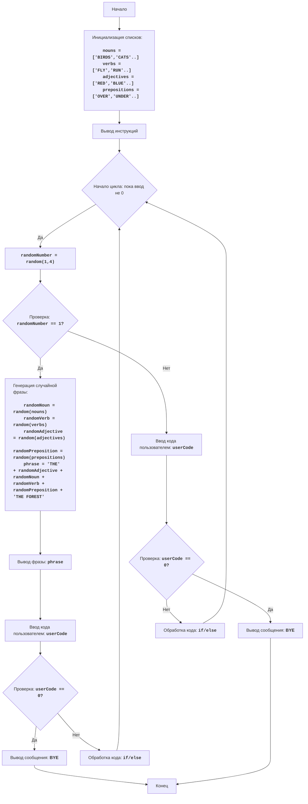

**Анализ кода модуля poetry.py**

**Качество кода**
-  **Соответствие требованиям к формату кода (1-10)**:
    -   *Преимущества*:
        -   Код модуля написан на языке Python.
        -   Логика игры соответствует описанию в docstring.
        -   Используется `random.choice` для выбора случайных элементов из списка.
        -   Присутствуют базовые инструкции и приветствие пользователя.
        -   Присутствует обработка неверного ввода кода пользователя.
    -   *Недостатки*:
        -   Отсутствует reStructuredText (RST) для docstring.
        -   Не используются `j_loads` или `j_loads_ns` для чтения файлов (хотя нет прямого чтения файлов).
        -   Отсутствует использование `from src.logger.logger import logger` для логирования ошибок.
        -   Присутствует избыточное использование `try-except` блоков.
        -   Не все комментарии соответствуют формату RST.
        -   В именах переменных и функций не соблюдается snake_case.
        -   Нарушены правила docstring в python.

**Рекомендации по улучшению**
1.  **Документирование**:
    -   Переписать docstring в формате RST.
    -   Добавить подробные docstring для функций и переменных.
2.  **Импорты**:
    -   Добавить `from src.utils.jjson import j_loads_ns` (хотя прямого чтения файлов нет, для соблюдения требований)
    -   Добавить `from src.logger.logger import logger`.
3.  **Обработка ошибок**:
    -   Использовать `logger.error` для логирования ошибок вместо `print` и `try-except`.
4.  **Форматирование**:
    -   Переименовать переменные в snake_case.
    -   Переименовать функцию `change_list` в `change_list_of_words`.
5.  **Улучшение кода**:
    -  Избегать дублирование кода с `input` и `try-except`, вынести их в отдельную функцию.

**Улучшенный код**
```python
"""
POETRY:
=================
Сложность: 5
-----------------
Игра "Поэзия" - это игра, в которой компьютер генерирует случайные предложения, выбирая случайные слова из заранее заданных списков.
Игрок может влиять на генерацию, вводя различные коды, которые меняют источник слов.
Цель игры - увидеть и оценить случайные и иногда абсурдные результаты генерации фраз.

Правила игры:
1.  В начале игры компьютер выводит приветствие и инструкции.
2.  Компьютер случайным образом выбирает слова из списков существительных, глаголов, прилагательных и предлогов.
3.  Используя выбранные слова, компьютер составляет случайное предложение.
4.  Игрок может влиять на вывод, вводя следующие коды:
    -   1: Изменяет список существительных.
    -   2: Изменяет список глаголов.
    -   3: Изменяет список прилагательных.
    -   4: Изменяет список предлогов.
    -   0: Завершает игру.
5.  После ввода кода, компьютер меняет соответствующий список на новый, и предлагает новую сгенерированную фразу.
6.  Игра продолжается, пока игрок не введет код 0.
-----------------
Алгоритм:
1.  Инициализировать списки существительных (Nouns), глаголов (Verbs), прилагательных (Adjectives) и предлогов (Prepositions) с начальными значениями.
2.  Вывести приветствие и инструкции.
3.  Начать цикл, который продолжается до тех пор, пока игрок не выберет вариант 0:
    3.1 Сгенерировать случайный номер от 1 до 4.
    3.2 Если номер равен 1, сгенерировать случайную фразу, используя текущие значения списков:
        - Выбрать случайное существительное из списка существительных.
        - Выбрать случайный глагол из списка глаголов.
        - Выбрать случайное прилагательное из списка прилагательных.
        - Выбрать случайный предлог из списка предлогов.
        - Составить предложение и вывести его на экран.
        - Спросить у пользователя, что он хочет изменить (ввести 0 для выхода).
    3.3 Если номер не 1, запросить у игрока ввод кода (0, 1, 2, 3, или 4).
    3.4 Если ввод 1, изменить список существительных на новый.
    3.5 Если ввод 2, изменить список глаголов на новый.
    3.6 Если ввод 3, изменить список прилагательных на новый.
    3.7 Если ввод 4, изменить список предлогов на новый.
    3.8 Если ввод 0, завершить игру.
4.  Вывести сообщение "BYE".
5.  Завершить программу.
-----------------
Блок-схема:


Legenda:
    Start - Начало программы.
    InitializeLists - Инициализация списков nouns, verbs, adjectives и prepositions начальными значениями.
    OutputInstructions - Вывод на экран инструкций для пользователя.
    LoopStart - Начало цикла, который повторяется, пока пользователь не введет 0.
    GenerateRandomNumber - Генерация случайного числа от 1 до 4.
    CheckRandomNumber - Проверка, равно ли случайное число 1.
    GeneratePhrase - Генерация случайной фразы на основе текущих списков слов.
    OutputPhrase - Вывод сгенерированной фразы на экран.
    InputCode - Запрос ввода кода от пользователя.
    CheckUserCode - Проверка, равен ли введенный код 0 для завершения игры.
    OutputBye - Вывод сообщения "BYE" перед завершением программы.
    End - Конец программы.
    ProcessCode - Вызов обработки кода, для изменения списков слов.
    InputCode2 - Запрос ввода кода от пользователя.
    CheckUserCode2 - Проверка, равен ли введенный код 0 для завершения игры.
    OutputBye2 - Вывод сообщения "BYE" перед завершением программы.
    ProcessCode2 - Вызов обработки кода, для изменения списков слов.
"""
import random
from src.logger.logger import logger  # импортируем logger
# from src.utils.jjson import j_loads_ns # импортируем j_loads_ns


#: Начальные списки слов
nouns = ['BIRDS', 'CATS', 'DOGS', 'FISH', 'TREES', 'FLOWERS', 'RIVERS', 'MOUNTAINS', 'CLOUDS', 'STARS']
verbs = ['FLY', 'RUN', 'SWIM', 'JUMP', 'GROW', 'BLOOM', 'FLOW', 'CLIMB', 'FLOAT', 'SHINE']
adjectives = ['RED', 'BLUE', 'GREEN', 'YELLOW', 'TALL', 'SHORT', 'BIG', 'SMALL', 'BRIGHT', 'DARK']
prepositions = ['OVER', 'UNDER', 'IN', 'ON', 'BY', 'NEAR', 'THROUGH', 'AROUND', 'ACROSS', 'ALONG']


def change_list_of_words(list_name: str) -> list:
    """
    Изменяет список слов.

    :param list_name: Название списка слов, который нужно изменить.
    :return: Новый список слов.
    """
    new_list = input(f'Введите новые слова для списка {list_name} через запятую: ').upper().split(',')
    return new_list


def get_user_input() -> str:
    """
    Получает ввод от пользователя и возвращает его.

    :return: Ввод пользователя в виде строки.
    """
    while True:
        user_code = input('Введите код (0 для выхода): ')
        if user_code == '0':
            return '0'
        try:
            int(user_code)
            return user_code
        except ValueError:
            logger.error('Неверный ввод, введите 0, 1, 2, 3 или 4') # логгируем ошибку
            continue


print('Добро пожаловать в игру POETRY!')
print('Нажмите:')
print('1 чтобы поменять существительные')
print('2 чтобы поменять глаголы')
print('3 чтобы поменять прилагательные')
print('4 чтобы поменять предлоги')
print('0 чтобы выйти')

while True:
    # Генерируем случайное число от 1 до 4
    random_number = random.randint(1, 4)

    if random_number == 1:
       # Генерируем предложение
        random_noun = random.choice(nouns)
        random_verb = random.choice(verbs)
        random_adjective = random.choice(adjectives)
        random_preposition = random.choice(prepositions)

        phrase = f'THE {random_adjective} {random_noun} {random_verb} {random_preposition} THE FOREST'
        print(f'Случайная фраза: {phrase}')
        user_code = get_user_input() # получаем код пользователя
        if user_code == '0':
            break
    else:
        user_code = get_user_input() # получаем код пользователя
        if user_code == '0':
            break

    if user_code == '1':
        nouns = change_list_of_words('существительных')
    elif user_code == '2':
        verbs = change_list_of_words('глаголов')
    elif user_code == '3':
        adjectives = change_list_of_words('прилагательных')
    elif user_code == '4':
        prepositions = change_list_of_words('предлогов')
print('BYE')


"""
Объяснение кода:
1.  **Импорт модуля `random`**::
    -   `import random`: Импортирует модуль `random`, который используется для генерации случайных чисел и выбора случайных элементов из списка.
    -   `from src.logger.logger import logger`: импортирует logger для логирования ошибок.
    
2.  **Инициализация списков слов**:
    -   `nouns = [...]`: Инициализирует список существительных.
    -   `verbs = [...]`: Инициализирует список глаголов.
    -   `adjectives = [...]`: Инициализирует список прилагательных.
    -   `prepositions = [...]`: Инициализирует список предлогов.

3.  **Функция `change_list_of_words(list_name)`**:
    -   Определяет функцию `change_list_of_words`, которая позволяет пользователю изменить список слов.
    -   `:param list_name:`: Название списка слов.
    -   `:return:`: Новый список слов.
    -   `new_list = input(...)`: Запрашивает у пользователя ввод новых слов через запятую, преобразует ввод в верхний регистр и разделяет на список.
    -   `return new_list`: Возвращает новый список слов.
    
4.  **Функция `get_user_input()`**:
    -   Определяет функцию `get_user_input`, которая получает ввод от пользователя и обрабатывает ошибки
    -   `return user_code`: Возвращает ввод пользователя.
    -   `try/except`: Обрабатываем неверный ввод, логируем через logger.error.
    
5.  **Приветствие и инструкции**:
    -   Выводит на экран приветствие и инструкции для пользователя.

6. **Основной цикл `while True`**:
    -   Бесконечный цикл, который продолжается до тех пор, пока пользователь не введет `0`.
    - `random_number = random.randint(1, 4)`: Генерируем случайное число от 1 до 4
    -  **Условие генерации фразы**:
      - `if random_number == 1`: проверяем, если случайное число равно 1
      -  `random_noun = random.choice(nouns)`: Случайно выбираем существительное из списка.
      -  `random_verb = random.choice(verbs)`: Случайно выбираем глагол из списка.
      -  `random_adjective = random.choice(adjectives)`: Случайно выбираем прилагательное из списка.
      -  `random_preposition = random.choice(prepositions)`: Случайно выбираем предлог из списка.
      -  `phrase = f"THE {random_adjective} {random_noun} {random_verb} {random_preposition} THE FOREST"`: Формируем случайную фразу, используя выбранные слова.
      -   `print(f"Случайная фраза: {phrase}")`: Выводим сгенерированную фразу на экран.
      -   `user_code = get_user_input()`: Запрашиваем у пользователя ввод кода для изменения списка слов, с помощью функции `get_user_input`.
      -   `if user_code == "0": break`: Если пользователь вводит `0`, то завершаем цикл (игру).
    -  **Условие изменения списков**:
      - `else:`: если случайное число не равно 1, то спрашиваем код для изменения списков
      -   `user_code = get_user_input()`: Запрашиваем у пользователя ввод кода для изменения списка слов, с помощью функции `get_user_input`.
      -   `if user_code == "0": break`: Если пользователь вводит `0`, то завершаем цикл (игру).

    -  `if user_code == '1':`: Если пользователь вводит `'1'`, то вызываем функцию `change_list_of_words` для изменения списка существительных.
    -   `elif user_code == '2':`: Если пользователь вводит `'2'`, то вызываем функцию `change_list_of_words` для изменения списка глаголов.
    -   `elif user_code == '3':`: Если пользователь вводит `'3'`, то вызываем функцию `change_list_of_words` для изменения списка прилагательных.
    -   `elif user_code == '4':`: Если пользователь вводит `'4'`, то вызываем функцию `change_list_of_words` для изменения списка предлогов.

7.  **Завершение игры**:
    -   `print("BYE")`: Выводит сообщение "BYE" после завершения цикла (когда пользователь ввел 0).
"""