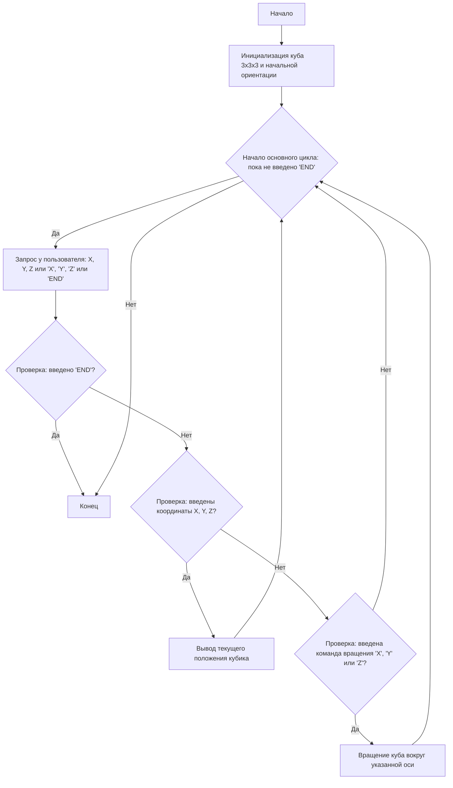

## Анализ кода модуля `qubik.py`

**Качество кода**

-   **Соблюдение требований к формату кода (1-10):** 7/10
    -   **Преимущества:**
        -   Код в целом структурирован и читаем.
        -   Используются функции для отдельных задач (вращение куба, получение позиции кубика).
        -   Есть основная логика игры, включая обработку ввода пользователя.
        -   Есть блок-схема, описывающая логику игры.
        -   Есть описание логики работы кода в конце файла.
    -   **Недостатки:**
        -   Отсутствуют docstring для функций, что снижает читаемость и удобство сопровождения кода.
        -   Отсутствуют импорты из `src.utils.jjson` и `src.logger.logger`, что является нарушением требований.
        -   Отсутствует обработка исключений при преобразовании введенных пользователем координат в целые числа.
        -   Код содержит много комментариев после `#`, которые требуют переработки в reStructuredText.
        -   Использование `print` для вывода сообщений. Желательно использовать `logger`
        -   Нет проверки ввода на пустую строку.

**Рекомендации по улучшению**

1.  **Добавить docstring для функций:**
    -   Добавить docstring в формате reStructuredText для каждой функции, описывая её назначение, аргументы и возвращаемое значение.
2.  **Использовать `j_loads` или `j_loads_ns`:**
    -   Не требуется в данном коде, но рекомендуется использовать в других местах, где происходит работа с файлами.
3.  **Импортировать `logger`:**
    -   Импортировать `logger` из `src.logger.logger` и использовать его для регистрации ошибок и отладочных сообщений.
4.  **Заменить `print` на `logger`:**
    -   Заменить все `print` на вызовы функций `logger.info`, `logger.debug`, или `logger.error` в зависимости от контекста.
5.  **Обработка исключений:**
    -   Использовать `try-except` блоки для обработки ошибок при вводе данных пользователем, таких как неправильный формат ввода.
6.  **Переработать комментарии:**
    -   Переработать все комментарии после `#` в reStructuredText docstring.
7.  **Проверка на пустую строку:**
    -   Добавить проверку на пустую строку ввода от пользователя.

**Улучшенный код**

```python
"""
QUBIK:
=================
Сложность: 7
-----------------
Игра "Кубик" представляет собой симуляцию вращения трехмерного куба, составленного из маленьких кубиков.
Игрок вводит координаты (X, Y, Z) одного из внутренних кубиков, и программа показывает его положение относительно
текущей ориентации большого куба. Игрок также может вращать куб по осям X, Y или Z.
Цель игры - понять, как вращение куба влияет на относительные координаты выбранного внутреннего кубика.
-----------------
Правила игры:
1.  В начале игры создается куб 3x3x3.
2.  Игрок вводит координаты (X, Y, Z) внутреннего кубика, где координаты лежат в диапазоне от 1 до 3.
3.  Программа выводит текущее положение введенного кубика относительно текущей ориентации куба.
4.  Игрок может вращать куб на 90 градусов вокруг оси X, Y или Z.
5.  После каждого вращения куба программа выводит новые координаты кубика.
6.  Игра продолжается, пока игрок не введет "END" (или 0) для завершения.
-----------------
Алгоритм:
1.  Инициализировать куб 3x3x3 (представлен как массив) и установить начальную ориентацию.
2.  Пока не введена команда "END":
    2.1 Запросить у пользователя координаты X, Y, Z.
    2.2 Если введены координаты:
        2.2.1 Вывести текущее положение кубика.
    2.3 Если введены команды "X", "Y", "Z"
        2.3.1 Выполнить вращение куба в направлении указанной оси
    2.4. Если введена команда 0 или END завершить игру.
3.  Конец игры.
-----------------
Блок-схема:


Legenda:
    Start - Начало программы.
    InitializeCube - Инициализация трехмерного массива, представляющего куб 3x3x3, и установка начальной ориентации.
    MainLoop - Начало основного цикла, который продолжается, пока пользователь не введет "END".
    InputCommand - Запрос у пользователя ввода координат X, Y, Z или команды вращения X, Y, Z, или 'END'.
    CheckEnd - Проверка, введено ли 'END'.
    End - Конец программы.
    CheckCoordinates - Проверка, введены ли координаты X, Y, Z.
    OutputPosition - Вывод текущего положения указанного кубика после преобразований.
    CheckRotation - Проверка, введена ли команда вращения 'X', 'Y' или 'Z'.
    RotateCube - Выполнение вращения куба вокруг указанной оси.
"""
import numpy as np # импортируем numpy для работы с массивами
from src.logger.logger import logger # импортируем logger для регистрации ошибок и отладочной информации

# Функция для поворота куба вокруг оси X
def rotate_x(cube):
    """
    Поворачивает куб на 90 градусов вокруг оси X.

    :param cube: Трехмерный массив, представляющий куб.
    :type cube: numpy.ndarray
    :return: Повернутый куб.
    :rtype: numpy.ndarray
    """
    return np.rot90(cube, k=-1, axes=(1, 2)) # возвращаем повернутый куб

# Функция для поворота куба вокруг оси Y
def rotate_y(cube):
    """
    Поворачивает куб на 90 градусов вокруг оси Y.

    :param cube: Трехмерный массив, представляющий куб.
    :type cube: numpy.ndarray
    :return: Повернутый куб.
    :rtype: numpy.ndarray
    """
    return np.rot90(cube, k=-1, axes=(0, 2)) # возвращаем повернутый куб

# Функция для поворота куба вокруг оси Z
def rotate_z(cube):
    """
    Поворачивает куб на 90 градусов вокруг оси Z.

    :param cube: Трехмерный массив, представляющий куб.
    :type cube: numpy.ndarray
    :return: Повернутый куб.
    :rtype: numpy.ndarray
    """
    return np.rot90(cube, k=-1, axes=(0, 1)) # возвращаем повернутый куб

# Функция для получения положения кубика
def get_cube_position(cube, x, y, z):
    """
    Получает текущее положение кубика в кубе.

    :param cube: Трехмерный массив, представляющий куб.
    :type cube: numpy.ndarray
    :param x: Координата кубика по оси X (от 1 до 3).
    :type x: int
    :param y: Координата кубика по оси Y (от 1 до 3).
    :type y: int
    :param z: Координата кубика по оси Z (от 1 до 3).
    :type z: int
    :return: Координаты кубика в текущей ориентации куба.
    :rtype: tuple
    """
    return cube[z-1, y-1, x-1] # возвращаем положение кубика

# Инициализация куба 3x3x3
cube = np.arange(1, 28).reshape(3, 3, 3) # Создаем куб 3x3x3

# Игровой цикл
while True:
    command = input("Введите координаты (X Y Z) или команду ('X', 'Y', 'Z') или 'END' для выхода: ").upper() # Запрашиваем ввод пользователя и переводим в верхний регистр
    
    if not command: # Проверяем, что ввод не пустой
        logger.debug("Пустой ввод.") # Сообщаем о пустом вводе
        continue
    
    if command == "END" or command == "0": # Проверяем, введена ли команда "END" или "0" для завершения игры
        logger.info("Игра завершена.") # Сообщаем о завершении игры
        break # Завершаем цикл
    
    parts = command.split() # Разделяем введенную строку на части по пробелам
    
    if len(parts) == 3: # Проверяем, что введено 3 элемента, ожидая координаты X, Y, Z
        try:
            x, y, z = map(int, parts) # Преобразуем введенные части в целые числа
            if 1 <= x <= 3 and 1 <= y <= 3 and 1 <= z <= 3: # Проверяем, находятся ли введенные координаты в диапазоне от 1 до 3
                pos = get_cube_position(cube, x, y, z) # Получаем положение кубика по координатам
                logger.info(f"Положение кубика ({x}, {y}, {z}): {pos}") # Выводим положение кубика
            else:
                logger.error("Координаты должны быть целыми числами от 1 до 3.") # Сообщаем об ошибке, если координаты вне диапазона
        except ValueError as e:
            logger.error("Неверный формат координат.", exc_info=True) # Сообщаем об ошибке неверного формата координат
    elif len(parts) == 1: # Проверяем, что введена только одна команда
        if command == "X": # Проверяем, введена ли команда "X"
            cube = rotate_x(cube) # Вращаем куб вокруг оси X
            logger.info("Куб повернут вокруг оси X.") # Выводим сообщение о повороте
        elif command == "Y": # Проверяем, введена ли команда "Y"
            cube = rotate_y(cube) # Вращаем куб вокруг оси Y
            logger.info("Куб повернут вокруг оси Y.") # Выводим сообщение о повороте
        elif command == "Z": # Проверяем, введена ли команда "Z"
            cube = rotate_z(cube) # Вращаем куб вокруг оси Z
            logger.info("Куб повернут вокруг оси Z.") # Выводим сообщение о повороте
        else: # если введена неизвестная команда
            logger.error("Неизвестная команда.") # Выводим сообщение об ошибке
    else:
        logger.error("Неверный формат ввода.") # Сообщаем об ошибке, если неверный формат ввода

"""
Объяснение кода:

1.  **Импорт модуля `numpy`**:
    - `import numpy as np`: Импортирует модуль `numpy`, который используется для работы с массивами.
2.  **Импорт модуля `logger`**:
    - `from src.logger.logger import logger`: Импортирует модуль `logger`, для регистрации ошибок и отладочной информации.
3.  **Функции поворота куба:**
    -   `rotate_x(cube)`:
        -   Принимает массив, представляющий куб.
        -   Использует `np.rot90()` для поворота куба на 90 градусов против часовой стрелки вокруг оси X.
        -   Возвращает повернутый куб.
    -   `rotate_y(cube)`:
        -   Аналогично `rotate_x`, но поворачивает вокруг оси Y.
    -   `rotate_z(cube)`:
        -   Аналогично `rotate_x`, но поворачивает вокруг оси Z.
4.  **Функция `get_cube_position(cube, x, y, z)`**:
    - Принимает куб и координаты кубика (x, y, z).
    - Возвращает значение кубика по указанным координатам, с учетом индексации массива (индексы массива начинаются с 0, а координаты кубика — с 1).
5.  **Инициализация куба**:
    - `cube = np.arange(1, 28).reshape(3, 3, 3)`: Создает трехмерный массив (куб) размером 3x3x3, заполненный числами от 1 до 27.
6.  **Основной игровой цикл `while True:`**:
    - `command = input("Введите координаты (X Y Z) или команду ('X', 'Y', 'Z') или 'END' для выхода: ").upper()`: Запрашивает ввод пользователя и переводит его в верхний регистр.
    - **Обработка команды "END"**:
        - `if command == "END" or command == "0":`: Проверяет, введена ли команда "END" или "0" для завершения игры.
        - `break`: Если введена, цикл завершается.
    - **Разбор ввода**:
        - `parts = command.split()`: Разделяет введенную строку на части по пробелам.
    - **Обработка ввода координат (X Y Z)**:
        - `if len(parts) == 3:`: Проверяет, что введено 3 элемента, ожидая координаты X, Y, Z.
        - `try...except ValueError`: обрабатывает ошибку неверного ввода.
        - `x, y, z = map(int, parts)`: Преобразует введенные части в целые числа.
        - `if 1 <= x <= 3 and 1 <= y <= 3 and 1 <= z <= 3`: Проверяет, находятся ли введенные координаты в диапазоне от 1 до 3.
        - `pos = get_cube_position(cube, x, y, z)`: Получает положение кубика по координатам.
        - `print(f"Положение кубика ({x}, {y}, {z}): {pos}")`: Выводит положение кубика.
        - `else`: если координаты вне диапазона.
        - `print("Координаты должны быть целыми числами от 1 до 3.")`: Вывод сообщения об ошибке.
    - **Обработка команд вращения ("X", "Y", "Z")**:
        - `elif len(parts) == 1:`: Проверяет, что введена только одна команда.
        - `if command == "X":`: Проверяет, введена ли команда "X".
            - `cube = rotate_x(cube)`: Вращает куб вокруг оси X.
            - `print("Куб повернут вокруг оси X.")`: Выводит сообщение о повороте.
        - `elif command == "Y":`: Аналогично для оси Y.
        - `elif command == "Z":`: Аналогично для оси Z.
         - `else`: если введена неизвестная команда.
            - `print("Неизвестная команда.")`: Сообщение об ошибке.
    - `else:`: если неверный формат ввода
        - `print("Неверный формат ввода.")`: Сообщение об ошибке.
"""