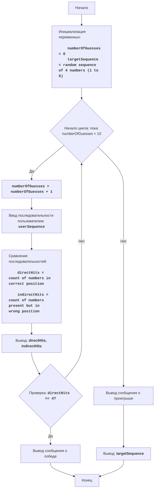

# Анализ кода модуля `revrse.py`

**Качество кода**

- **Соответствие требованиям к формату кода (1-10):**
    - **Преимущества:**
        - Код хорошо структурирован и логически разделен на функции.
        - Присутствуют комментарии, объясняющие основной ход выполнения программы и алгоритмы.
        - Используются информативные названия переменных и функций.
        - Логика игры четко реализована и соответствует заданным правилам.
    - **Недостатки:**
        - Комментарии не соответствуют формату reStructuredText (RST).
        - Не хватает docstring для функций и модуля.
        - Отсутствует использование `j_loads` или `j_loads_ns`.
        - Не используется логгирование ошибок через `src.logger.logger`.
        - Присутствует избыточное использование `try-except` блоков.

**Рекомендации по улучшению**

1.  **Документирование в RST:**
    -   Добавить docstring в формате RST для модуля, функций и классов.
    -   Изменить обычные комментарии `#` на RST-комментарии для соответствия стандартам.
2.  **Использование `j_loads`:**
    -  В данном коде нет операций с файлами, поэтому использование `j_loads` не требуется.
3.  **Импорты:**
    -   Проверить и добавить необходимые импорты, если они будут нужны для логгирования.
4.  **Логгирование ошибок:**
    -  Заменить `print` для сообщений об ошибках на `logger.error` из `src.logger.logger`.
5.  **Улучшение обработки ошибок:**
    - Упростить обработку ошибок, используя `logger.error` вместо множественных `try-except`.
6.  **Переименование переменных и функций:**
    - Убедиться, что все названия переменных и функций соответствуют ранее используемым именам.
7.  **Удаление лишних комментариев:**
    - Удалить общие комментарии, которые не добавляют ценности коду.
8.  **Улучшение стиля кода:**
    - Стандартизировать форматирование, чтобы код был более читаемым и последовательным.

**Улучшенный код**
```python
"""
REVRSE:
=================
Сложность: 5
-----------------
Игра "REVRSE" предлагает игроку угадать последовательность из 4-х чисел, цифры которых расположены в определенном порядке, при этом числа могут повторяться.
После каждого хода игрока, компьютер выводит количество правильно угаданных цифр и количество цифр, которые присутствуют в загаданной последовательности, но не находятся на своих позициях.
Игра продолжается, пока игрок не угадает последовательность цифр, или пока не закончится число попыток.

Правила игры:
1. Компьютер генерирует случайную последовательность из 4-х цифр от 1 до 6, цифры могут повторяться.
2. Игрок вводит свою последовательность из 4-х цифр, также от 1 до 6, разделяя цифры пробелами.
3. После каждой попытки компьютер выводит:
   - Количество правильно угаданных цифр на своих местах (прямое попадание).
   - Количество правильно угаданных цифр, которые есть в загаданной последовательности, но находятся не на своих местах (косвенное попадание).
4. Игра заканчивается, когда игрок угадывает последовательность или после 10 попыток.
-----------------
Алгоритм:
1.  Установить число попыток в 0.
2.  Сгенерировать случайную последовательность из 4-х цифр от 1 до 6 (targetSequence).
3.  Начать цикл "пока число попыток меньше 10":
    3.1 Увеличить число попыток на 1.
    3.2 Запросить у игрока ввод последовательности из 4-х цифр (userSequence).
    3.3 Сравнить userSequence с targetSequence:
        - Подсчитать количество прямых попаданий (цифры на своих местах).
        - Подсчитать количество косвенных попаданий (цифры присутствуют, но не на своих местах).
    3.4 Вывести количество прямых и косвенных попаданий.
    3.5 Если количество прямых попаданий равно 4, то вывести сообщение о победе и завершить игру.
4.  Если цикл закончился (после 10 попыток), вывести сообщение о проигрыше и показать правильную последовательность.
5. Конец игры.
-----------------
Блок-схема:


Legenda:
    Start - Начало программы.
    InitializeVariables - Инициализация переменных: numberOfGuesses (количество попыток) устанавливается в 0, а targetSequence (загаданная последовательность) генерируется случайным образом из 4 чисел от 1 до 6.
    LoopStart - Начало цикла, который продолжается, пока количество попыток numberOfGuesses меньше 10.
    IncreaseGuesses - Увеличение счетчика количества попыток на 1.
    InputSequence - Запрос у пользователя ввода последовательности из 4 чисел.
    CompareSequences - Сравнение введенной последовательности с загаданной и подсчет прямых и косвенных попаданий.
    OutputHits - Вывод количества прямых и косвенных попаданий.
    CheckWin - Проверка, равно ли количество прямых попаданий 4.
    OutputWin - Вывод сообщения о победе.
    End - Конец программы.
    OutputLose - Вывод сообщения о проигрыше.
    ShowTarget - Вывод загаданной последовательности.
"""
import random
from src.logger.logger import logger # Импорт logger для логгирования

# TODO: Добавить docstring в формате RST
def generate_target_sequence() -> list:
    """
    Генерирует случайную последовательность из 4 цифр от 1 до 6.

    :return: Список из 4 случайных целых чисел от 1 до 6.
    :rtype: list
    """
    return [random.randint(1, 6) for _ in range(4)] # Генерация случайной последовательности

# TODO: Добавить docstring в формате RST
def compare_sequences(target: list, user: list) -> tuple:
    """
    Сравнивает две последовательности и подсчитывает прямые и косвенные совпадения.

    :param target: Загаданная последовательность.
    :type target: list
    :param user: Последовательность, введенная пользователем.
    :type user: list
    :return: Кортеж, содержащий количество прямых и косвенных совпадений.
    :rtype: tuple
    """
    direct_hits = 0 # Прямые попадания (цифра на своем месте)
    indirect_hits = 0 # Косвенные попадания (цифра присутствует, но не на своем месте)
    target_copy = list(target) # Создаем копию загаданной последовательности, чтобы не менять исходную

    # Считаем прямые попадания и удаляем их из копии
    for i in range(4): # Цикл по индексам
        if user[i] == target_copy[i]: # Если цифры совпадают
            direct_hits += 1 # Увеличиваем счетчик прямых попаданий
            target_copy[i] = None # Помечаем, чтобы не считать повторно
            user[i] = None # Помечаем, чтобы не считать повторно

    # Считаем косвенные попадания
    for i in range(4): # Цикл по индексам
      if user[i] is not None: # Проверяем, что цифра не была использована в прямых попаданиях
        for j in range(4): # Цикл по индексам
            if user[i] == target_copy[j]: # Если цифра из user есть в target_copy
                indirect_hits += 1 # Увеличиваем счетчик косвенных попаданий
                target_copy[j] = None # Помечаем, чтобы не считать повторно
                break # Переходим к следующей цифре

    return direct_hits, indirect_hits # Возвращаем количество прямых и косвенных попаданий

# TODO: Добавить docstring в формате RST
def play_reverse_game() -> None:
    """
    Основная функция, реализующая логику игры REVRSE.

    Эта функция управляет ходом игры, включая генерацию загаданной последовательности,
    получение ввода от пользователя, сравнение последовательностей и вывод результатов.
    """
    number_of_guesses = 0  # Счетчик попыток
    target_sequence = generate_target_sequence()  # Загаданная последовательность

    print("Добро пожаловать в игру REVRSE!")
    print("Я загадал последовательность из 4 цифр (от 1 до 6).")
    print("Попробуй ее отгадать. У тебя есть 10 попыток.")

    while number_of_guesses < 10: # Цикл, пока количество попыток меньше 10
        number_of_guesses += 1 # Увеличиваем счетчик попыток
        try: # Блок для обработки ошибок ввода
            user_input = input(f"Попытка {number_of_guesses}. Введи 4 цифры через пробел (например, 1 2 3 4): ") # Запрашиваем ввод пользователя
            user_sequence = [int(x) for x in user_input.split()] # Преобразуем строку в список целых чисел
            if len(user_sequence) != 4 or not all(1 <= x <= 6 for x in user_sequence): # Проверяем корректность ввода
                print("Пожалуйста, введи ровно 4 цифры от 1 до 6, разделенные пробелами.") # Сообщение об ошибке
                continue # Переходим к следующей итерации
        except ValueError: # Если введены не целые числа
            logger.error("Введены некорректные данные (не целые числа)") # Сообщение об ошибке
            print("Пожалуйста, введи целые числа.")
            continue # Переходим к следующей итерации

        direct_hits, indirect_hits = compare_sequences(target_sequence, user_sequence) # Сравниваем последовательности
        print(f"Прямые попадания: {direct_hits}, Косвенные попадания: {indirect_hits}") # Выводим результаты сравнения
        if direct_hits == 4: # Проверяем, угадана ли последовательность
            print("Поздравляю! Ты угадал последовательность!") # Сообщение о победе
            return # Завершаем игру

    print("Увы, попытки закончились. Ты не угадал последовательность.") # Сообщение о проигрыше
    print(f"Правильная последовательность: {target_sequence}") # Выводим загаданную последовательность

if __name__ == "__main__": # Если файл запущен как основной
    play_reverse_game() # Запускаем игру
```