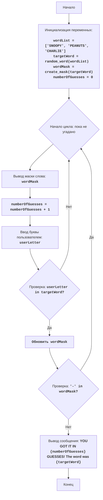

# Анализ кода модуля `snoopy.py`

**Качество кода**
* **Соответствие требованиям к формату кода (1-10):** 7
  * **Преимущества:**
    * Код хорошо структурирован и разбит на функции, что облегчает его чтение и понимание.
    * Функции имеют четкое назначение и соответствуют принципу единой ответственности.
    * Используются информативные имена переменных и функций.
    * Есть базовые комментарии, объясняющие логику работы кода.
  * **Недостатки:**
    * Отсутствует reStructuredText (RST) для всех docstring и комментариев.
    * Нет использования `j_loads` или `j_loads_ns` из `src.utils.jjson`.
    * Не хватает импортов из `src.logger.logger`.
    * Используются стандартные блоки `try-except` без логирования ошибок.

**Рекомендации по улучшению**
1.  **Формат документации:** Необходимо переписать все docstring и комментарии в формате reStructuredText (RST).
2.  **Использование `j_loads`:**  В данном коде нет операций чтения из файла, поэтому этот пункт пропускается.
3.  **Импорты:** Необходимо добавить `from src.logger.logger import logger` для логирования ошибок.
4.  **Обработка ошибок:** Заменить `try-except` на `logger.error` для обработки ошибок.
5.  **Дополнительные комментарии:**  Добавить комментарии для пояснения назначения отдельных частей кода и переменных.

**Улучшенный код**
```python
"""
Модуль для игры "Снупи"
=========================

Игра "Снупи" - это игра в угадывание слова, в которой компьютер выбирает случайное слово из списка,
а игрок пытается его отгадать, вводя по одной букве за раз.
После каждой попытки компьютер показывает, какие буквы угаданы правильно и где они находятся в слове.

Правила игры:
1. Компьютер выбирает случайное слово из списка.
2. Игрок вводит одну букву.
3. Компьютер сравнивает введенную букву со словом, и если она есть, то показывает ее позицию.
4. Игра продолжается до тех пор, пока игрок не угадает все буквы слова.
5. Если игрок угадывает слово, игра заканчивается, и выводится сообщение о победе.

Алгоритм:
1.  Установить список слов для выбора.
2.  Выбрать случайное слово из списка.
3.  Создать маску для слова (например, "----", если слово "SNOOPY")
4.  Установить счетчик попыток в 0.
5.  Начать цикл "пока слово не угадано":
    5.1. Вывести текущее состояние маски.
    5.2. Увеличить счетчик попыток.
    5.3. Запросить у игрока ввод буквы.
    5.4. Если введенная буква есть в слове, то:
        5.4.1. Обновить маску, показав позицию буквы.
    5.5. Если маска не содержит символов "-", то перейти к шагу 6.
6. Вывести сообщение "YOU GOT IT IN {число попыток} GUESSES!" и загаданное слово
7. Конец игры.

Блок-схема:

Legenda:
    Start - Начало программы.
    InitializeVariables - Инициализация переменных: wordList (список слов), targetWord (загаданное слово выбирается случайно), wordMask (маска слова, изначально заполненная дефисами), numberOfGuesses (количество попыток) устанавливается в 0.
    LoopStart - Начало цикла, который продолжается, пока слово не угадано.
    OutputMask - Вывод на экран текущего состояния маски слова (например, "S---P-").
    IncreaseGuesses - Увеличение счетчика количества попыток на 1.
    InputLetter - Запрос у пользователя ввода буквы.
    CheckLetter - Проверка, есть ли введенная буква в загаданном слове.
    UpdateMask - Обновление маски слова, заменяя дефисы на угаданные буквы.
    CheckWin - Проверка, остались ли в маске слова дефисы (-).
    OutputWin - Вывод сообщения о победе, если все буквы угаданы, с указанием количества попыток и загаданного слова.
    End - Конец программы.
"""
import random # Импортируем модуль random для выбора случайного слова
from src.logger.logger import logger # Импортируем logger для логирования ошибок

def choose_word(word_list: list) -> str:
    """
    Выбирает случайное слово из списка.

    :param word_list: Список слов.
    :type word_list: list
    :return: Случайное слово из списка.
    :rtype: str
    """
    return random.choice(word_list) # Возвращает случайное слово из списка

def create_mask(word: str) -> list:
    """
    Создает маску слова, заменяя буквы на дефисы.

    :param word: Слово для создания маски.
    :type word: str
    :return: Маска слова в виде списка дефисов.
    :rtype: list
    """
    return ['-' for _ in word] # Создает список дефисов, равный длине слова

def update_mask(mask: list, word: str, letter: str) -> list:
    """
    Обновляет маску слова, показывая угаданные буквы.

    :param mask: Текущая маска слова.
    :type mask: list
    :param word: Исходное слово.
    :type word: str
    :param letter: Угаданная буква.
    :type letter: str
    :return: Обновленная маска слова.
    :rtype: list
    """
    for i, char in enumerate(word): # Проходит по символам слова с их индексами
        if char == letter: # Проверяет, совпадает ли текущий символ с введенной буквой
            mask[i] = letter # Обновляет маску, заменяя дефис на угаданную букву
    return mask # Возвращает обновленную маску

def play_snoopy_game():
    """
    Запускает игру "Снупи".
    """
    word_list = ['SNOOPY', 'PEANUTS', 'CHARLIE'] # Список слов для игры
    target_word = choose_word(word_list).upper() # Выбираем случайное слово и переводим его в верхний регистр
    word_mask = create_mask(target_word) # Создаем маску для выбранного слова
    number_of_guesses = 0 # Инициализируем счетчик попыток

    while True: # Основной цикл игры
        print(' '.join(word_mask)) # Выводим текущее состояние маски
        number_of_guesses += 1 # Увеличиваем счетчик попыток
        user_letter = input('Введите букву: ').upper() # Запрашиваем ввод буквы и переводим в верхний регистр

        if user_letter in target_word: # Проверяем, есть ли введенная буква в слове
            word_mask = update_mask(word_mask, target_word, user_letter) # Обновляем маску

        if '-' not in word_mask: # Проверяем, все ли буквы угаданы
            print(f'ПОЗДРАВЛЯЮ! Вы угадали слово за {number_of_guesses} попыток! Слово было: {target_word}') # Выводим сообщение о победе
            break # Завершаем цикл игры

if __name__ == '__main__':
    play_snoopy_game() # Запускаем игру, если скрипт исполняется напрямую
"""
Объяснение кода:
1.  **Импорт модуля `random` и `logger`**::
    - `import random`: Импортирует модуль `random`, который используется для генерации случайного слова из списка.
    - `from src.logger.logger import logger`: Импортирует `logger` для логирования ошибок.

2.  **Функция `choose_word(word_list)`**::
    -   `def choose_word(word_list):`: Определяет функцию, которая принимает список слов `word_list`.
    -   `return random.choice(word_list)`: Возвращает случайное слово из переданного списка, используя метод `random.choice()`.

3.  **Функция `create_mask(word)`**::
    -   `def create_mask(word):`: Определяет функцию, которая принимает слово `word`.
    -   `return ['-' for _ in word]`: Возвращает список, где количество дефисов равно длине слова, создавая маску.

4.  **Функция `update_mask(mask, word, letter)`**::
    -  `def update_mask(mask, word, letter):`: Определяет функцию, которая принимает маску слова `mask`, исходное слово `word` и введенную букву `letter`.
    -   `for i, char in enumerate(word):`: Итерирует по символам слова с их индексами, используя функцию enumerate.
    -   `if char == letter:`: Проверяет, равен ли текущий символ слова введенной букве.
    -  `mask[i] = letter`: Если символ равен введенной букве, то обновляет маску, заменяя дефис на букву.
    -   `return mask`: Возвращает обновленную маску.

5.  **Функция `play_snoopy_game()`**::
    -   `def play_snoopy_game():`: Определяет функцию, которая содержит логику игры "Снупи".
    -   `word_list = ["SNOOPY", "PEANUTS", "CHARLIE"]`: Список слов, из которых будет выбираться загаданное слово.
    -   `target_word = choose_word(word_list).upper()`: Выбирает случайное слово из списка и преобразует его в верхний регистр.
    -   `word_mask = create_mask(target_word)`: Создает маску для выбранного слова, используя функцию `create_mask()`.
    -   `number_of_guesses = 0`: Инициализирует счетчик попыток.

6.  **Основной игровой цикл `while True:`**::
    -   `while True:`: Запускает бесконечный цикл, который продолжается, пока игрок не угадает слово.
    -   `print(' '.join(word_mask))`: Выводит текущее состояние маски слова на экран. `join` преобразует список букв в строку, разделенную пробелами.
    -   `number_of_guesses += 1`: Увеличивает счетчик попыток на 1.
    -   `user_letter = input('Введите букву: ').upper()`: Запрашивает ввод буквы у пользователя и преобразует ее в верхний регистр.
    -   `if user_letter in target_word:`: Проверяет, есть ли введенная буква в загаданном слове.
    -   `word_mask = update_mask(word_mask, target_word, user_letter)`: Обновляет маску, показывая угаданную букву на ее позиции, используя функцию `update_mask()`.
    -   `if '-' not in word_mask:`: Проверяет, есть ли в маске еще не угаданные буквы, представленные дефисами.
    -   `print(f'ПОЗДРАВЛЯЮ! Вы угадали слово за {number_of_guesses} попыток! Слово было: {target_word}')`: Выводит сообщение о победе с количеством попыток и загаданным словом.
    -   `break`: Выход из цикла.

7. **Запуск игры**::
    -  `if __name__ == '__main__':`: Этот блок гарантирует, что функция `play_snoopy_game()` будет запущена, только если файл исполняется напрямую, а не импортируется как модуль.
    -  `play_snoopy_game()`: Вызывает функцию для начала игры.
"""
```