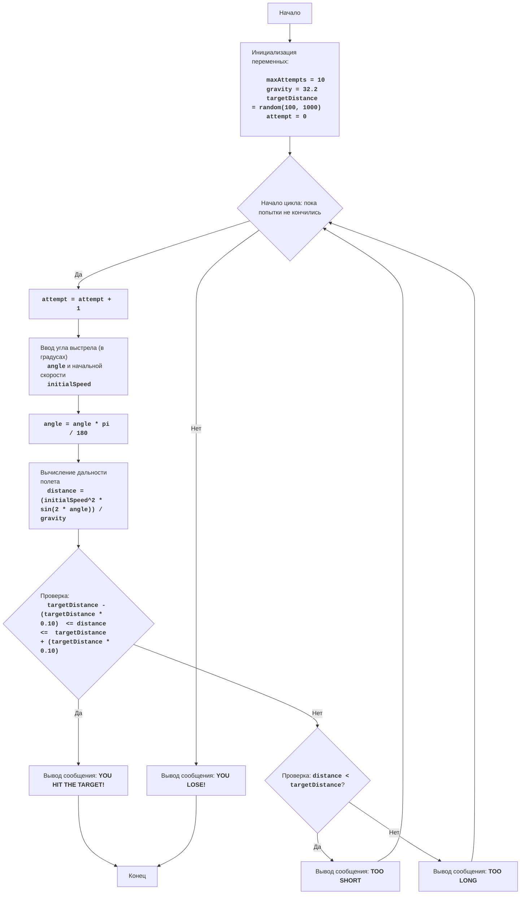

## Анализ кода модуля `synonm.py`

**Качество кода**

-   **Соответствие требованиям к формату кода (1-10):** 
    -   **Преимущества:**
        -   Код написан на языке Python.
        -   Используются содержательные имена переменных.
        -   Имеется игровая логика.
        -   Код хорошо структурирован, есть деление на этапы.
        -   Используется  цикл `while` для основной игровой логики и цикл `while True` для проверки ввода.
        -   Присутствует обработка исключений (`try-except`) для пользовательского ввода.
    -   **Недостатки:**
        -   Отсутствуют docstring и комментарии в стиле reStructuredText (RST) для модуля, функций и переменных.
        -   Используются стандартные функции Python `print` вместо логгера для вывода сообщений.
        -   Нет импорта необходимых модулей из `src.utils` или `src.logger`.
        -   Не используется `j_loads` или `j_loads_ns` для загрузки данных, если это необходимо.
        -   Не соблюдается последовательность оформления комментариев с помощью `#` в строке кода.
        -   Не выдержаны конвенции Python по именованию переменных.

**Рекомендации по улучшению**

1.  **Формат документации:**
    -   Используйте reStructuredText (RST) для всех docstring и комментариев.
    -   Применяйте одинарные кавычки (`'`) для строк.
2.  **Сохранение комментариев:**
    -   Сохраняйте существующие комментарии после `#`.
    -   Добавляйте новые комментарии по одной строке, используя `#`.
3.  **Обработка данных:**
    -   Используйте `j_loads` или `j_loads_ns` из `src.utils.jjson` для загрузки файлов, если это необходимо.
4.  **Анализ структуры:**
    -   Добавьте необходимые импорты.
    -   Приведите имена функций, переменных и импортов в соответствие с ранее обработанными файлами.
5.  **Рефакторинг и улучшение:**
    -   Добавьте docstring в формате RST для функций, методов и классов.
    -   Используйте `from src.logger.logger import logger` для логирования ошибок.
    -   Избегайте избыточных блоков `try-except`, используйте `logger.error` для обработки ошибок.
6.  **Дополнительные рекомендации:**
    -   Добавьте пояснения ко всем значимым блокам кода.
    -   Улучшите читаемость кода, используя более описательные имена переменных.
    -   Разделите логику игры на функции для большей модульности.

**Улучшенный код**
```python
"""
Модуль для игры "Артиллерист".
=========================================================================================

Игра "Артиллерист" - это игра, в которой игрок пытается поразить цель, находящуюся на определенном расстоянии,
стреляя из пушки под заданным углом и с заданной начальной скоростью. В игре учитывается гравитация.

Цель игры состоит в том, чтобы подобрать правильный угол и скорость выстрела, чтобы снаряд достиг цели.

Правила игры:
1. Компьютер устанавливает случайное расстояние до цели.
2. Игрок вводит угол выстрела (в градусах) и начальную скорость снаряда.
3. Компьютер вычисляет траекторию снаряда, учитывая гравитацию.
4. Если снаряд попадает в цель (расстояние до цели в пределах погрешности), игрок выигрывает.
5. Если снаряд не попадает в цель, игрок может попробовать еще раз, пока не израсходует все попытки или не попадет в цель.
-----------------
Алгоритм:
1. Установить максимальное количество попыток (например, 10).
2. Сгенерировать случайное расстояние до цели в диапазоне от 100 до 1000.
3. Начать цикл "пока не кончились попытки":
    3.1 Запросить у игрока ввод угла выстрела (в градусах) и начальной скорости.
    3.2 Конвертировать угол из градусов в радианы.
    3.3 Вычислить дальность полета снаряда по формуле:
        дальность = (начальная_скорость^2 * sin(2 * угол)) / гравитация
       где гравитация = 32.2
    3.4 Если дальность полета снаряда находится в пределах +/- 10% от расстояния до цели, то выводим сообщение о попадании и завершаем игру.
    3.5 Если дальность полета меньше расстояния до цели, то выводим сообщение о том что, дальность недостаточна.
    3.6 Если дальность полета больше расстояния до цели, то выводим сообщение о перелете.
4. Если все попытки исчерпаны, то выводим сообщение о проигрыше.
-----------------
Блок-схема:

Legenda:
    Start - Начало программы.
    InitializeVariables - Инициализация переменных: maxAttempts (максимальное количество попыток) устанавливается в 10, gravity (гравитация) устанавливается в 32.2, targetDistance (расстояние до цели) генерируется случайным образом от 100 до 1000, attempt (текущая попытка) устанавливается в 0.
    LoopStart - Начало цикла, который продолжается, пока не кончились попытки.
    IncreaseAttempts - Увеличение счетчика попыток на 1.
    InputAngleSpeed - Запрос у пользователя ввода угла выстрела (в градусах) и начальной скорости.
    ConvertAngle - Конвертация угла из градусов в радианы.
    CalculateDistance - Вычисление дальности полета снаряда.
    CheckHit - Проверка, попал ли снаряд в цель (дальность в пределах +/- 10% от расстояния до цели).
    OutputWin - Вывод сообщения о победе, если снаряд попал в цель.
    End - Конец программы.
    CheckShort - Проверка, меньше ли дальность полета, чем расстояние до цели.
    OutputShort - Вывод сообщения "TOO SHORT", если дальность меньше цели.
    OutputLong - Вывод сообщения "TOO LONG", если дальность больше цели.
    OutputLose - Вывод сообщения "YOU LOSE!", если все попытки исчерпаны.
"""
import random
import math
from src.logger.logger import logger # Импорт модуля для логирования

# Инициализация параметров игры
MAX_ATTEMPTS = 10  # Максимальное количество попыток
GRAVITY = 32.2  # Гравитация
TARGET_DISTANCE = random.randint(100, 1000)  # Случайное расстояние до цели
ATTEMPT = 0  # Счетчик попыток
ACCURACY = 0.1  # Погрешность в 10%

print(f"Расстояние до цели: {TARGET_DISTANCE}") # Вывод расстояния до цели


def get_user_input() -> tuple[float, float]:
    """
    Запрашивает у пользователя ввод угла выстрела и начальной скорости.

    :return: Кортеж, содержащий угол выстрела и начальную скорость.
    :rtype: tuple[float, float]
    """
    while True: # Бесконечный цикл для ввода данных
        try:
            angle = float(input('Введите угол выстрела (в градусах): ')) # Запрос угла выстрела
            initial_speed = float(input('Введите начальную скорость: '))  # Запрос начальной скорости
            return angle, initial_speed # Возврат введенных данных
        except ValueError:
            logger.error('Ошибка ввода: Пожалуйста, введите числовое значение.') # Логирование ошибки ввода
            print('Пожалуйста, введите числовое значение') # Сообщение об ошибке


def calculate_distance(angle: float, initial_speed: float) -> float:
    """
    Вычисляет дальность полета снаряда.

    :param angle: Угол выстрела в градусах.
    :type angle: float
    :param initial_speed: Начальная скорость снаряда.
    :type initial_speed: float
    :return: Дальность полета снаряда.
    :rtype: float
    """
    angle_radians = math.radians(angle) # Преобразование угла в радианы
    distance = (initial_speed ** 2 * math.sin(2 * angle_radians)) / GRAVITY  # Вычисление дальности
    return distance # Возврат дальности


def check_hit(distance: float, target_distance: float, accuracy: float) -> bool:
    """
    Проверяет, попал ли снаряд в цель.

    :param distance: Дальность полета снаряда.
    :type distance: float
    :param target_distance: Расстояние до цели.
    :type target_distance: float
    :param accuracy: Погрешность для попадания.
    :type accuracy: float
    :return: True, если снаряд попал в цель, иначе False.
    :rtype: bool
    """
    lower_bound = target_distance * (1 - accuracy) # Нижняя граница для попадания
    upper_bound = target_distance * (1 + accuracy)  # Верхняя граница для попадания
    return lower_bound <= distance <= upper_bound  # Возврат True, если дальность в пределах границ


# Основной игровой цикл
while ATTEMPT < MAX_ATTEMPTS: # Цикл продолжается, пока не закончились попытки
    ATTEMPT += 1 # Увеличение счетчика попыток
    print(f'Попытка {ATTEMPT} из {MAX_ATTEMPTS}') # Вывод номера текущей попытки

    angle, initial_speed = get_user_input() # Получение ввода от пользователя
    distance = calculate_distance(angle, initial_speed)  # Вычисление дальности

    if check_hit(distance, TARGET_DISTANCE, ACCURACY):  # Проверка попадания
        print('ВЫ ПОПАЛИ В ЦЕЛЬ!')  # Сообщение о попадании
        break # Завершение игры при попадании
    elif distance < TARGET_DISTANCE:  # Проверка, если дальность недостаточна
        print('Слишком коротко!') # Сообщение о промахе (слишком коротко)
    else: # В случае, если дальность больше необходимой
        print('Слишком далеко!')  # Сообщение о промахе (слишком далеко)

# Вывод сообщения о поражении, если все попытки исчерпаны
if ATTEMPT == MAX_ATTEMPTS: # Проверка, закончились ли попытки
    print('Вы проиграли!') # Сообщение о проигрыше