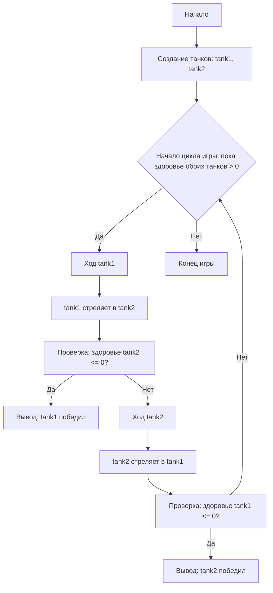

# Анализ кода модуля `README.MD`

**Качество кода**
*   **Соблюдение требований к формату кода (1-10):** 9
    *   **Преимущества:**
        *   Документация четко описывает правила, алгоритм и блок-схему игры.
        *   Приведен пример работы программы, который помогает понять игровой процесс.
        *   Логичная структура документа, разделенная на разделы.
        *   Блок-схема на Mermaid помогает визуализировать логику игры.
    *   **Недостатки:**
        *   Документ не содержит кода на языке Python.
        *   Отсутствует docstring.
        *   Нет раздела с описанием классов и функций, только описание алгоритма и пример работы.
        *   Не используется формат reStructuredText (RST) для форматирования документа.

**Рекомендации по улучшению**
1.  Добавить описание каждого из пунктов алгоритма в формате reStructuredText (RST).
2.  Добавить описание классов `Tank` и `SuperTank` с их атрибутами и методами.
3.  Добавить пример кода на Python с использованием описанных классов.
4.  Добавить описание возможных ограничений, представленное в документе.
5.  Перевести всю документацию на reStructuredText (RST).

**Улучшенный код**
```markdown
# Танки (текстовая игра)
=========================
Сложность: 3
-----------------
Простая текстовая игра, в которой два танка обмениваются выстрелами, пока один из них не будет уничтожен.

## Правила
1. Два танка имеют характеристики: здоровье, урон и броня.
2. Танки стреляют друг в друга по очереди.
3. Урон наносится случайным образом в заданном диапазоне.
4. Супер-танк имеет повышенное здоровье и броню.
5. Игра заканчивается, когда у одного из танков здоровье становится 0.
-----------------
## Алгоритм:

1.  Создать классы для `Tank` и `SuperTank`, которые имеют характеристики `model`, `armor`, `min_damage`, `max_damage`, и `health`.
2.  Реализовать метод `health_down` для уменьшения здоровья танка.
3.  Реализовать метод `shot` для нанесения урона противнику.
4.  Создать метод `calculate_damage` для расчета случайного урона.
5.  В основной части программы создать экземпляры танков.
6.  Организовать цикл, в котором танки будут по очереди стрелять друг в друга, пока один из танков не будет уничтожен (здоровье 0).
7.  Вывести сообщение о победе, когда один из танков будет уничтожен.

   .. note::
      **Описание шагов алгоритма:**

      *   Шаг 1: Инициализация классов `Tank` и `SuperTank` с заданными характеристиками.
      *   Шаг 2: Метод `health_down` уменьшает здоровье танка на полученный урон.
      *   Шаг 3: Метод `shot` реализует нанесение урона противнику, вызывая метод `health_down` у противника.
      *   Шаг 4: Метод `calculate_damage` рассчитывает урон случайным образом в диапазоне от `min_damage` до `max_damage`.
      *   Шаг 5: Создание экземпляров танков (`Tank` или `SuperTank`) для игры.
      *   Шаг 6: Игровой цикл, где каждый танк поочередно атакует противника, пока здоровье одного из танков не опустится до нуля.
      *   Шаг 7: После завершения цикла объявляется победитель.

-----------------

## Описание классов:

.. code-block:: python
   
    class Tank:
        """
        Базовый класс для танка.

        :param model: Модель танка (строка).
        :param armor: Броня танка (целое число).
        :param min_damage: Минимальный урон (целое число).
        :param max_damage: Максимальный урон (целое число).
        :param health: Здоровье танка (целое число).
        """

        def __init__(self, model: str, armor: int, min_damage: int, max_damage: int, health: int):
            """Инициализация танка."""
            self.model = model
            self.armor = armor
            self.min_damage = min_damage
            self.max_damage = max_damage
            self.health = health

        def health_down(self, damage: int):
            """Уменьшает здоровье танка."""
            self.health -= damage
            
        def calculate_damage(self) -> int:
            """Вычисляет урон в заданном диапазоне."""
            import random
            return random.randint(self.min_damage, self.max_damage)

        def shot(self, enemy_tank: 'Tank'):
           """
           Наносит урон противнику.

           :param enemy_tank: Объект танка, в который будет производиться выстрел.
           """
           damage = self.calculate_damage()
           enemy_tank.health_down(damage)
           print(f"{self.model}:\nТочно в цель, у противника {enemy_tank.model} осталось {enemy_tank.health} единиц здоровья")


    class SuperTank(Tank):
        """
        Класс для супер-танка, наследован от Tank.

        :param model: Модель танка (строка).
        :param armor: Броня танка (целое число).
        :param min_damage: Минимальный урон (целое число).
        :param max_damage: Максимальный урон (целое число).
        :param health: Здоровье танка (целое число).
        """
        def __init__(self, model: str, armor: int, min_damage: int, max_damage: int, health: int):
           """Инициализация супер танка."""
           super().__init__(model, armor, min_damage, max_damage, health)

    

## Блок-схема:


**Legenda**:
  Start - Начало игры.
  CreateTanks - Создание экземпляров танков (tank1 и tank2).
  GameLoopStart - Начало игрового цикла (пока здоровье обоих танков > 0).
  Tank1Turn - Ход танка tank1.
  Tank1Shot - tank1 стреляет в tank2.
  CheckTank2Health - Проверка: здоровье tank2 <= 0?
   OutputTank1Win - Вывод сообщения о победе tank1.
  Tank2Turn - Ход танка tank2.
  Tank2Shot - tank2 стреляет в tank1.
  CheckTank1Health - Проверка: здоровье tank1 <= 0?
   OutputTank2Win - Вывод сообщения о победе tank2.
  End - Конец игры.
"""
## Пример работы программы
```
Начинается танковый бой!
Т-34 имеет лобовую броню 50мм при 100ед. здоровья и урон в диапазоне от 20 до 30 единиц
Тигр имеет лобовую броню 80мм при 150ед. здоровья и урон в диапазоне от 25 до 35 единиц

Т-34:
Точно в цель, у противника Тигр осталось 120 единиц здоровья

Тигр:
Командир, по экипажу Т-34 попали, у нас осталось 77 очков здоровья

Т-34:
Точно в цель, у противника Тигр осталось 87 единиц здоровья

Тигр:
Командир, по экипажу Т-34 попали, у нас осталось 49 очков здоровья

Т-34:
Экипаж танка Тигр уничтожен

Победил Т-34!
```
## Возможные ограничения
- Текстовый интерфейс.
- Ограниченное взаимодействие с пользователем (только просмотр результатов).

## Пример кода игры
```python
import random

class Tank:
    """
    Базовый класс для танка.

    :param model: Модель танка (строка).
    :param armor: Броня танка (целое число).
    :param min_damage: Минимальный урон (целое число).
    :param max_damage: Максимальный урон (целое число).
    :param health: Здоровье танка (целое число).
    """

    def __init__(self, model: str, armor: int, min_damage: int, max_damage: int, health: int):
        """Инициализация танка."""
        self.model = model
        self.armor = armor
        self.min_damage = min_damage
        self.max_damage = max_damage
        self.health = health

    def health_down(self, damage: int):
        """Уменьшает здоровье танка."""
        self.health -= damage
            
    def calculate_damage(self) -> int:
        """Вычисляет урон в заданном диапазоне."""
        return random.randint(self.min_damage, self.max_damage)

    def shot(self, enemy_tank: 'Tank'):
        """
        Наносит урон противнику.

        :param enemy_tank: Объект танка, в который будет производиться выстрел.
        """
        damage = self.calculate_damage()
        enemy_tank.health_down(damage)
        print(f"{self.model}:\nТочно в цель, у противника {enemy_tank.model} осталось {enemy_tank.health} единиц здоровья")


class SuperTank(Tank):
    """
    Класс для супер-танка, наследован от Tank.

    :param model: Модель танка (строка).
    :param armor: Броня танка (целое число).
    :param min_damage: Минимальный урон (целое число).
    :param max_damage: Максимальный урон (целое число).
    :param health: Здоровье танка (целое число).
    """
    def __init__(self, model: str, armor: int, min_damage: int, max_damage: int, health: int):
       """Инициализация супер танка."""
       super().__init__(model, armor, min_damage, max_damage, health)

def main():
    """Главная функция для запуска игры."""
    print('Начинается танковый бой!')

    tank1 = Tank(model='Т-34', armor=50, min_damage=20, max_damage=30, health=100)
    tank2 = SuperTank(model='Тигр', armor=80, min_damage=25, max_damage=35, health=150)

    print(f'{tank1.model} имеет лобовую броню {tank1.armor}мм при {tank1.health}ед. здоровья и урон в диапазоне от {tank1.min_damage} до {tank1.max_damage} единиц')
    print(f'{tank2.model} имеет лобовую броню {tank2.armor}мм при {tank2.health}ед. здоровья и урон в диапазоне от {tank2.min_damage} до {tank2.max_damage} единиц')
    
    while tank1.health > 0 and tank2.health > 0:
        tank1.shot(tank2)
        if tank2.health <= 0:
            print(f"\nЭкипаж танка {tank2.model} уничтожен")
            break
        tank2.shot(tank1)
        if tank1.health <= 0:
             print(f"\nЭкипаж танка {tank1.model} уничтожен")
             break

    if tank1.health <= 0:
        print(f'\nПобедил {tank2.model}!')
    else:
        print(f'\nПобедил {tank1.model}!')

if __name__ == '__main__':
    main()
```
```