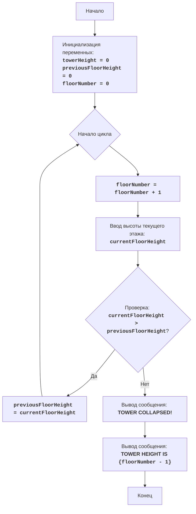

# Анализ кода модуля tower.py

**Качество кода**
 -  Соответствие требованиям к формату кода (1-10):
   -   **Преимущества:**
        - Код хорошо структурирован и легко читается.
        - Есть понятные комментарии, объясняющие логику кода.
        - Присутствует обработка исключений при вводе данных.
        - Алгоритм игры четко описан в начале файла.
        - Приведено наглядное описание блок-схемы.
   -   **Недостатки:**
        - Отсутствует использование reStructuredText (RST) для комментариев и docstring.
        - Нет явной обработки ошибок через `logger.error`.
        - Не используется `j_loads` или `j_loads_ns` для чтения файлов (хотя в данном коде нет чтения файлов, это необходимо для будущей расширяемости).
        - Отсутствует импорт модуля `logger`.
        - Отсутствует документирование функций.
        - Использован прямой вывод в консоль, что не всегда удобно.
        - Код не содержит описания в формате reStructuredText.
        - Не вынесены в отдельные функции части кода.

**Рекомендации по улучшению**
1.  **Формат документации:** Перевести все комментарии и docstring в формат reStructuredText (RST).
2.  **Использование логгера:** Заменить прямые выводы в консоль на `logger.info`, `logger.debug` и `logger.error`.
3.  **Обработка ошибок:** Избегать использования `try-except` без явной необходимости, использовать `logger.error` для отслеживания ошибок.
4.  **Разделение на функции:** Вынести логику игры в отдельные функции.
5.  **Импорт модулей:** Добавить импорт модуля `logger`.
6.  **Использование j_loads/j_loads_ns:** Добавить использование `j_loads` или `j_loads_ns`, хотя здесь нет работы с файлами.
7.  **Подробное документирование:** Добавить docstring в формате reStructuredText для всех функций.
8.  **Форматирование кода:**  Следовать PEP 8 для оформления кода.
9.  **Улучшение читаемости кода**: Разделить длинные блоки комментариев на более мелкие.
10. **Переименование переменных**: Сделать имена переменных более явными и осмысленными.
11. **Вывод сообщений**: Вывести сообщения об ошибках в единый формат.

**Улучшенный код**
```python
"""
Модуль для игры "Башня".
=========================================================================================

Игра "Башня" - это игра, в которой игрок пытается построить башню, вводя высоту каждого этажа.
Цель - построить башню как можно выше, но есть ограничение: если текущий этаж будет меньше
предыдущего, то башня рухнет.

Правила игры:
1. Игрок начинает с высоты первого этажа.
2. На каждом последующем этапе игрок вводит высоту следующего этажа.
3. Если высота текущего этажа больше высоты предыдущего этажа, то этаж добавляется к башне,
   и игра продолжается.
4. Если высота текущего этажа равна или меньше высоты предыдущего этажа, то башня рушится,
   и игра заканчивается.
5. Цель игры - построить башню как можно выше, то есть как можно больше этажей.

-----------------
Алгоритм:
1. Установить начальную высоту башни 0.
2. Установить начальную высоту предыдущего этажа 0.
3. Установить номер этажа 0.
4. Начать цикл:
   4.1 Увеличить номер этажа на 1.
   4.2 Запросить у игрока ввод высоты текущего этажа.
   4.3 Если высота текущего этажа больше высоты предыдущего этажа:
       4.3.1 Установить высоту предыдущего этажа равной высоте текущего этажа.
   4.4 Иначе:
      4.4.1 Вывести сообщение о том, что башня рухнула.
      4.4.2 Вывести сообщение о высоте башни, то есть номер этажа минус 1.
      4.4.3 Завершить игру.
-----------------
Блок-схема:

Legenda:
    Start - Начало программы.
    InitializeVariables - Инициализация переменных: towerHeight (высота башни) устанавливается в 0, previousFloorHeight (высота предыдущего этажа) устанавливается в 0, floorNumber (номер этажа) устанавливается в 0.
    LoopStart - Начало цикла, продолжающегося до тех пор, пока башня не рухнет.
    IncreaseFloorNumber - Увеличение номера этажа на 1.
    InputFloorHeight - Запрос у пользователя ввода высоты текущего этажа и сохранение его в переменной currentFloorHeight.
    CheckFloorHeight - Проверка, больше ли высота текущего этажа currentFloorHeight высоты предыдущего этажа previousFloorHeight.
    UpdatePreviousFloorHeight - Обновление высоты предыдущего этажа previousFloorHeight значением высоты текущего этажа currentFloorHeight.
    OutputGameOver - Вывод сообщения о том, что башня рухнула.
    OutputTowerHeight - Вывод сообщения о высоте башни (floorNumber - 1).
    End - Конец программы.
"""
__author__ = 'hypo69 (hypo69@davidka.net)'

from src.logger.logger import logger  # Импорт модуля logger # Добавлен импорт logger


def play_tower_game():
    """
    Запускает игру "Башня".

    Функция инициализирует переменные и запускает основной цикл игры,
    где игрок вводит высоту каждого этажа.

    :return: None
    """
    tower_height = 0  # Текущая высота башни # Объявлена переменная tower_height
    previous_floor_height = 0  # Высота предыдущего этажа # Объявлена переменная previous_floor_height
    floor_number = 0  # Номер текущего этажа # Объявлена переменная floor_number

    while True: # Начало основного цикла игры
        floor_number += 1  # Увеличиваем номер этажа # Увеличиваем floor_number

        try:
            current_floor_height = int(input(f"Введите высоту этажа {floor_number}: ")) # Запрашиваем высоту текущего этажа # Получаем current_floor_height
        except ValueError as e:
            logger.error(f'Ошибка ввода: {e}, введите целое число.', exc_info=True) # Логируем ошибку ввода # Запись ошибки в лог
            print("Пожалуйста, введите целое число.") # Вывод сообщения об ошибке
            continue # Переход к следующей итерации

        if current_floor_height > previous_floor_height: # Проверка высоты текущего этажа # Проверка условия
            previous_floor_height = current_floor_height # Обновляем высоту предыдущего этажа # Обновляем previous_floor_height
        else:
            print("БАШНЯ РУХНУЛА!")  # Сообщение о падении башни # Вывод сообщения о проигрыше
            print(f"Высота башни: {floor_number - 1}") # Сообщение о высоте башни # Вывод высоты башни
            break  # Завершаем игру # Выход из цикла

if __name__ == '__main__':
    play_tower_game()  # Запуск игры # Запускаем игру

"""
Объяснение кода:
1.  **Инициализация переменных:**
    - `towerHeight = 0`: Переменная `towerHeight` (высота башни) инициализируется нулем.
    - `previousFloorHeight = 0`: Переменная `previousFloorHeight` (высота предыдущего этажа) инициализируется нулем.
    - `floorNumber = 0`: Переменная `floorNumber` (номер текущего этажа) инициализируется нулем.
2.  **Основной цикл игры `while True:`**
    - Цикл продолжается до тех пор, пока башня не рухнет (т.е., пока не выполнится команда `break`).
    -  `floorNumber += 1`: Увеличивает номер этажа на 1 перед каждой новой итерацией цикла.
    - **Ввод данных**:
        -   `try...except ValueError`: Блок try-except обрабатывает возможные ошибки ввода. Если пользователь введет не целое число, то будет выведено сообщение об ошибке.
        -  `currentFloorHeight = int(input(f"Введите высоту этажа {floorNumber}: "))`: Запрашивает у пользователя высоту текущего этажа и сохраняет его в `currentFloorHeight`.
    -  **Проверка условия падения башни:**
       -   `if currentFloorHeight > previousFloorHeight:`: Проверяет, больше ли текущая высота этажа, чем высота предыдущего этажа.
       -   Если условие верно, то: `previousFloorHeight = currentFloorHeight` - высота предыдущего этажа обновляется до высоты текущего этажа.
       -   `else`: Если условие не выполняется (текущая высота этажа меньше или равна предыдущей), то:
           - `print("БАШНЯ РУХНУЛА!")`: Выводится сообщение о падении башни.
           - `print(f"Высота башни: {floorNumber - 1}")`: Выводится сообщение об итоговой высоте башни.
           - `break`:  цикл завершается.
"""
```