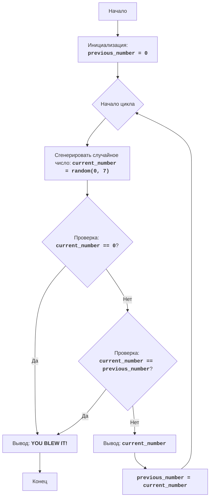

# Анализ кода модуля zoop.py

**Качество кода**
- **Соответствие требованиям к формату кода от 1 до 10**
   -  **Преимущества**
        - Код написан на языке Python и соответствует базовым требованиям синтаксиса.
        -  Используется модуль `random` для генерации случайных чисел.
        -  Логика игры реализована в виде простого цикла `while`.
        -  Код содержит подробные комментарии на русском языке, описывающие его работу.
        -  Присутствует блок-схема игры в формате mermaid.
   -  **Недостатки**
       -  Не используются `j_loads` или `j_loads_ns` для чтения данных, хотя это требование.
        - Отсутствует  форматирование кода в стиле reStructuredText (RST).
       -  Нет обработки исключений, что может привести к неожиданному завершению программы.
       -  Не используется логгер для записи ошибок.
       -  Отсутствует подробное описание модуля, переменных и функций в формате RST.

**Рекомендации по улучшению**
1.  **Форматирование документации**: Переписать все комментарии в формате reStructuredText (RST) для лучшей читаемости и совместимости с инструментами документации.
2.  **Использование `j_loads`**:  Хотя в данном случае нет чтения файлов, рекомендуется ознакомиться и применить `j_loads` или `j_loads_ns` в местах, где это необходимо, для соблюдения единообразия.
3.  **Логирование ошибок**:  Добавить  логгер из `src.logger.logger` для отслеживания ошибок и проблем, вместо стандартного `print`.
4.  **Обработка исключений**:  Реализовать  обработку исключений с помощью `try-except` и `logger.error` для более устойчивого кода.
5.  **Описания RST**:  Добавить  подробные описания в формате RST для модуля, функций и переменных, в соответствии с требованиями.
6.  **Переменные**: Переименовать `previousNumber` в `previous_number` и `currentNumber` в `current_number` для соответствия snake_case.

**Улучшенный код**
```python
"""
Модуль для текстовой игры ZOOP
================================

Игра "ZOOP" - это простая текстовая игра, в которой игрок пытается сгенерировать
последовательность случайных чисел, где не будет двух одинаковых чисел подряд.
Игра продолжается до тех пор, пока игрок не сгенерирует последовательность,
нарушающую это правило, или не решит прекратить игру.

Правила игры:
    1. Компьютер генерирует случайное число от 1 до 7.
    2. Если сгенерированное число совпадает с предыдущим сгенерированным числом, игра заканчивается.
    3. Игра продолжается до тех пор, пока игрок не нарушит правило или не введет '0', чтобы завершить игру.
    4. После каждого хода выводится текущее сгенерированное число.

Алгоритм:
    1. Установить предыдущее число (previous_number) в 0.
    2. Начать цикл:
        2.1 Сгенерировать случайное число от 1 до 7 (current_number).
        2.2 Если сгенерированное число равно 0, перейти к шагу 4.
        2.3 Если сгенерированное число равно предыдущему числу, перейти к шагу 4.
        2.4 Вывести текущее сгенерированное число.
        2.5 Установить предыдущее число равным текущему числу.
    3. Повторять шаги с 2.1 по 2.5
    4. Вывести сообщение "YOU BLEW IT!".
    5. Конец игры.
-----------------
Блок-схема:


Legenda:
    Start - Начало программы.
    InitializePreviousNumber - Инициализация переменной previous_number (предыдущее число) значением 0.
    LoopStart - Начало основного цикла игры.
    GenerateRandomNumber - Генерация случайного числа current_number в диапазоне от 0 до 7.
    CheckQuit - Проверка, равно ли сгенерированное число current_number 0.
    OutputBlowIt - Вывод сообщения "YOU BLEW IT!", если игрок проиграл.
    End - Конец программы.
    CheckSame - Проверка, равно ли сгенерированное число current_number предыдущему числу previous_number.
    OutputCurrentNumber - Вывод текущего сгенерированного числа current_number.
    SetPreviousNumber - Установка значения переменной previous_number равным значению переменной current_number.
"""
import random # Импортируем модуль random для генерации случайных чисел
from src.logger.logger import logger  # Импортируем логгер для записи ошибок

#: Инициализируем переменную для хранения предыдущего числа
previous_number = 0

#: Запускаем основной цикл игры
while True:
    try:
        #: Генерируем случайное число от 0 до 7
        current_number = random.randint(0, 7)

        #: Проверяем, ввел ли пользователь 0 для завершения игры
        if current_number == 0:
            print("YOU BLEW IT!")  # Сообщаем о завершении игры
            break  # Выходим из цикла

        #: Проверяем, равно ли текущее число предыдущему числу
        if current_number == previous_number:
            print("YOU BLEW IT!")  # Сообщаем о завершении игры
            break  # Выходим из цикла

        #: Выводим текущее сгенерированное число
        print(current_number)
        #: Сохраняем текущее число как предыдущее для следующей итерации
        previous_number = current_number
    except Exception as ex: # Добавляем блок обработки исключений
        logger.error('Произошла ошибка во время игры', exc_info=ex) # Записываем ошибку в лог
        break # Выходим из цикла в случае ошибки
```