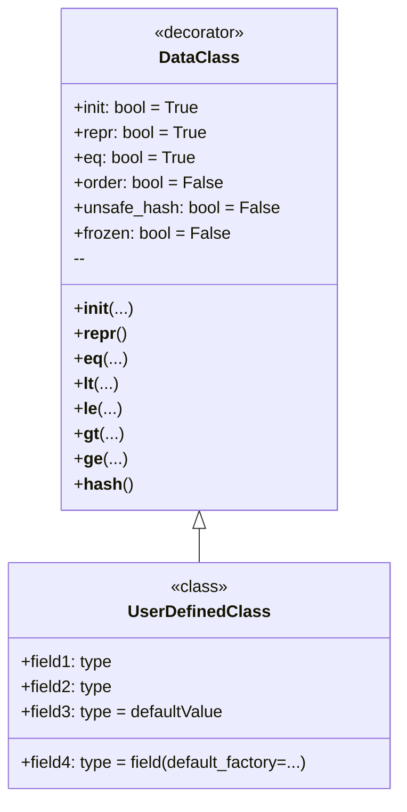

# Анализ кода модуля `dataclass`

**Качество кода**
- **Соответствие требованиям к формату кода (1-10):**
    - *Плюсы:*
        - Код хорошо структурирован и предоставляет четкое объяснение концепции `dataclass` в Python.
        - Включает примеры использования `dataclass` с различными параметрами и типами данных.
        - Присутствует диаграмма, визуализирующая основные концепции `dataclass`.
    - *Минусы:*
        -  Используется формат `markdown`, а не `reStructuredText` (RST), как требуется.
        -  Отсутствуют docstrings в формате RST.
        -  Не используются `j_loads` или `j_loads_ns` для загрузки данных (в данном случае это не требуется, поскольку нет загрузки из файла).
        -  Отсутствует обработка ошибок и логирование с использованием `src.logger.logger`.
        -  Не выполнены требования по написанию комментариев после `#` и по пошаговым комментариям.

**Рекомендации по улучшению**

1.  **Переформатирование в RST**: Заменить форматирование `markdown` на `reStructuredText` (RST).
2.  **Добавление docstrings**: Добавить docstrings в формате RST к каждому модулю, функции, классу, если таковые имеются.
3.  **Логирование ошибок**: Внедрить логирование ошибок с использованием `src.logger.logger`.
4.  **Унификация комментариев**: Переформатировать комментарии после `#` для более ясного описания каждой строки кода.
5.  **Уточнение примеров**: Добавить более явные комментарии для сложных примеров.
6.  **Избегание шаблонных try-except**: Использовать `logger.error` для обработки исключений, где это уместно.

**Улучшенный код**

```markdown
"""
Модуль, объясняющий использование декоратора `dataclass` в Python.
=========================================================================================

Модуль предоставляет информацию о том, что такое `dataclass`, зачем его использовать, как его использовать,
а также рассматривает различные варианты использования `dataclass` с примерами.

Пример использования
--------------------

Пример использования `dataclass` для создания класса `Point`:

.. code-block:: python

    from dataclasses import dataclass

    @dataclass
    class Point:
        x: int
        y: int

    point1 = Point(1, 2)
    print(point1)
"""
**Что такое `dataclass`?**

`dataclass` — это декоратор, введенный в Python 3.7, который автоматически генерирует специальные методы (такие как `__init__`, `__repr__`, `__eq__` и другие) для классов, которые в основном служат контейнерами для данных. Это избавляет тебя от необходимости писать много шаблонного кода.

**Зачем использовать `dataclass`?**

1.  **Сокращение кода:** Вместо того чтобы вручную определять методы `__init__`, `__repr__`, `__eq__` и т.д., ты просто объявляешь поля данных, и `dataclass` сделает всё остальное.
2.  **Улучшение читаемости:** Классы становятся более лаконичными и понятными, поскольку сосредотачиваются на данных, а не на технической реализации.
3.  **Уменьшение количества ошибок:** Автоматически сгенерированный код обычно более надежный, чем код, написанный вручную.
4.  **Ускорение разработки:** Ты можешь быстрее создавать классы для работы с данными, не тратя время на рутину.

**Как использовать `dataclass`?**

Для начала, тебе нужно импортировать декоратор `dataclass` из модуля `dataclasses`:

.. code-block:: python

    from dataclasses import dataclass # Импортируем декоратор dataclass

Затем ты помечаешь класс декоратором `@dataclass`, и определяешь поля данных, как обычные переменные класса с аннотациями типов:

.. code-block:: python

    from dataclasses import dataclass # Импортируем декоратор dataclass

    @dataclass # Применяем декоратор dataclass к классу Point
    class Point:
        x: int # Определение поля x целого типа
        y: int # Определение поля y целого типа

В этом примере, `Point` — это `dataclass`, которая имеет два поля: `x` и `y`, оба целого типа. `dataclass` автоматически создаст:
    * Конструктор `__init__`, позволяющий создавать экземпляры класса, например `Point(1, 2)`.
    *  `__repr__`, возвращающий строковое представление объекта, например `Point(x=1, y=2)`.
    * `__eq__`, позволяющий сравнивать объекты, например `Point(1, 2) == Point(1, 2)`.

**Пример простого использования**
.. code-block:: python

    from dataclasses import dataclass # Импортируем декоратор dataclass

    @dataclass # Применяем декоратор dataclass к классу Point
    class Point:
        x: int # Определение поля x целого типа
        y: int # Определение поля y целого типа

    # Создание экземпляра класса
    point1 = Point(1, 2) # Создаем экземпляр класса Point с x=1 и y=2
    point2 = Point(1, 2) # Создаем экземпляр класса Point с x=1 и y=2
    point3 = Point(3, 4) # Создаем экземпляр класса Point с x=3 и y=4

    # Вывод на экран
    print(point1) # Выведет: Point(x=1, y=2)
    print(point1 == point2) # Выведет: True
    print(point1 == point3) # Выведет: False

**Варианты `dataclass`**

`dataclass` предоставляет несколько параметров для настройки поведения:

*   `init`: Если `True` (по умолчанию), генерируется метод `__init__`. Если `False`, метод `__init__` не создается.
*   `repr`: Если `True` (по умолчанию), генерируется метод `__repr__`. Если `False`, метод `__repr__` не создается.
*   `eq`: Если `True` (по умолчанию), генерируется метод `__eq__`. Если `False`, метод `__eq__` не создается.
*   `order`: Если `True`, генерируются методы сравнения (`__lt__`, `__le__`, `__gt__`, `__ge__`). По умолчанию `False`.
*   `unsafe_hash`: Если `False` (по умолчанию), метод `__hash__` не генерируется. Если `True`, метод `__hash__` будет сгенерирован, а  `dataclass` станет хешируемым.
*   `frozen`: Если `True`, экземпляры класса будут неизменяемыми (read-only). По умолчанию `False`.

**Примеры использования параметров**
1. Отключаем метод `__repr__` и делаем класс неизменяемым
.. code-block:: python

    from dataclasses import dataclass # Импортируем декоратор dataclass

    @dataclass(repr=False, frozen=True) # Отключаем метод __repr__ и делаем класс неизменяемым
    class Point:
        x: int # Определение поля x целого типа
        y: int # Определение поля y целого типа

    # Создание экземпляра класса
    point1 = Point(1, 2) # Создаем экземпляр класса Point с x=1 и y=2
    # Вывод на экран
    print(point1) # Выведет: <__main__.Point object at 0x000001D8322F6770> (т.к. __repr__ не определен)

    # Изменение экземпляра вызовет ошибку
    try:
        point1.x = 10 # Попытка изменить атрибут x неизменяемого класса
    except Exception as e:
        print (e) # Выведет: cannot assign to field 'x'

2. Устанавливаем порядок, добавляем метод hash и делаем класс неизменяемым
.. code-block:: python

    from dataclasses import dataclass # Импортируем декоратор dataclass

    @dataclass(order=True, unsafe_hash=True, frozen=True) # Устанавливаем порядок, добавляем метод hash и делаем класс неизменяемым
    class Point:
        x: int # Определение поля x целого типа
        y: int # Определение поля y целого типа

    # Создание экземпляра класса
    point1 = Point(1, 2) # Создаем экземпляр класса Point с x=1 и y=2
    point2 = Point(3, 4) # Создаем экземпляр класса Point с x=3 и y=4
    point3 = Point(1, 2) # Создаем экземпляр класса Point с x=1 и y=2
    # Вывод на экран
    print(point1 < point2) # Выведет: True
    print(point1 == point3) # Выведет: True

    # Теперь можно использовать класс как ключ словаря
    my_dict = {point1: "first", point2: "second"} # Используем экземпляры класса в качестве ключей словаря
    print(my_dict) # Выведет: {Point(x=1, y=2): 'first', Point(x=3, y=4): 'second'}

**Значения по умолчанию**

Ты можешь задавать значения по умолчанию для полей:
.. code-block:: python

    from dataclasses import dataclass # Импортируем декоратор dataclass

    @dataclass # Применяем декоратор dataclass к классу Point
    class Point:
        x: int = 0 # Определение поля x целого типа со значением по умолчанию 0
        y: int = 0 # Определение поля y целого типа со значением по умолчанию 0

    # Создание экземпляра класса
    point1 = Point() # Создаем экземпляр класса Point без передачи аргументов
    point2 = Point(1, 2) # Создаем экземпляр класса Point с x=1 и y=2

    # Вывод на экран
    print(point1) # Выведет: Point(x=0, y=0)
    print(point2) # Выведет: Point(x=1, y=2)

При создании экземпляра класса, если значения не переданы, будет использовано значение по умолчанию.

**Использование `dataclass` с изменяемыми типами**

Будь осторожен при использовании изменяемых типов данных (списки, словари) в качестве значений по умолчанию. Они будут созданы только один раз и будут использоваться всеми экземплярами класса:
.. code-block:: python

    from dataclasses import dataclass # Импортируем декоратор dataclass
    from typing import List # Импортируем List из typing

    @dataclass # Применяем декоратор dataclass к классу BadExample
    class BadExample:
        items: List[int] = [] # Определение поля items типа List[int] со значением по умолчанию []

    bad1 = BadExample() # Создаем экземпляр класса BadExample
    bad2 = BadExample() # Создаем экземпляр класса BadExample

    bad1.items.append(1) # Добавляем 1 в список items экземпляра bad1
    print (bad1.items) # Выведет: [1]
    print (bad2.items) # Выведет: [1]

В примере выше изменения в `bad1.items` также отображаются в `bad2.items`. Это происходит из-за того, что оба экземпляра класса используют один и тот же список по умолчанию.

Чтобы этого избежать, используй `dataclasses.field` и `default_factory`:
.. code-block:: python

    from dataclasses import dataclass, field # Импортируем декораторы dataclass и field
    from typing import List # Импортируем List из typing

    @dataclass # Применяем декоратор dataclass к классу GoodExample
    class GoodExample:
        items: List[int] = field(default_factory=list) # Используем field с default_factory для создания нового списка для каждого экземпляра

    good1 = GoodExample() # Создаем экземпляр класса GoodExample
    good2 = GoodExample() # Создаем экземпляр класса GoodExample

    good1.items.append(1) # Добавляем 1 в список items экземпляра good1
    print (good1.items) # Выведет: [1]
    print (good2.items) # Выведет: []

В этом случае `default_factory=list` создаст новый пустой список для каждого нового экземпляра класса.

**Диаграмма**

Вот диаграмма, показывающая основные концепции `dataclass`:



В этой диаграмме:
*   `DataClass` представляет декоратор `@dataclass` и его параметры.
*   `UserDefinedClass` — это класс, который ты объявляешь, используя декоратор `@dataclass`.
*   Стрелка от `DataClass` к `UserDefinedClass` показывает, что `DataClass` применяется к `UserDefinedClass`
```