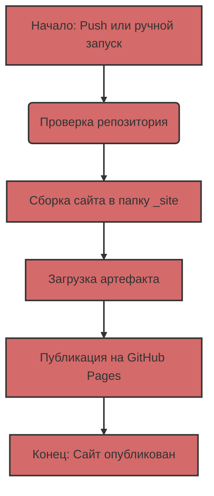

# ניתוח קוד המודול jekyll.md

**איכות קוד**

-   **עמידה בדרישות לפורמט הקוד מ-1 עד 10**
    -   יתרונות
        -   הקוד מפורמט היטב וקל לקריאה.
        -   קיימת חלוקה ברורה לסעיפים עם כותרות, מה שמקל על ההבנה של התהליך.
        -   הקוד כולל הסברים מפורטים על כל שלב בתהליך ה-workflow.
        -   הקוד כולל דיאגרמה המסבירה את זרימת העבודה.
    -   חסרונות
        -   הקוד כתוב בפורמט Markdown, אך לא נעשה שימוש ב-reStructuredText (RST) לתיעוד כמו בדרישה.
        -   חסר תיעוד מפורט בפונקציות ושיטות.
        -   אין שימוש ב-`j_loads` או `j_loads_ns` מקובץ `src.utils.jjson` מכיוון שאין קריאת קבצים.
        -   אין ייבוא של מודולים או שימוש ב- `from src.logger.logger import logger` מכיוון שהקוד הוא קובץ markdown ולא python.
        -   אין בלוקי try-except.

**המלצות לשיפור**

1.  **הוספת תיעוד reStructuredText (RST)**: יש להמיר את התיעוד הקיים לפורמט RST כדי לעמוד בדרישה. זה כולל שימוש בתחביר RST עבור כותרות, רשימות, קטעי קוד וכו'.
2.  **שיפור הסברים** : יש לפרט עוד את מהות הפעולות והאינטראקציות עם GitHub Actions.
3.  **שימוש בפורמט עקבי** : יש להשתמש בפורמט עקבי להצגת קטעי קוד (למשל, תמיד להשתמש ב-```yaml``` עבור קוד YAML).
4.  **הוספת דוגמאות קונקרטיות**: לשלב דוגמאות נוספות לקוד YAML ואופן ההגדרה של הפרמטרים השונים.
5.  **הוספת קישורים רלוונטיים**: יש להוסיף קישורים למסמכי GitHub Actions ו-Jekyll רשמיים כדי להקל על המשתמשים להעמיק בהבנה.
6. **הסרת קוד מובנה**: אין צורך בשימוש ב-```python``` מכיוון שאין כאן קוד פייתון.

**קוד משופר**

```markdown
# Автоматический Деплой Jekyll Сайта на GitHub Pages
# ====================================================
#
# Этот документ описывает, как автоматизировать процесс деплоя Jekyll сайта на GitHub Pages с использованием GitHub Actions.
#
# .. note::
#   Используйте этот документ для понимания и настройки автоматического деплоя.

Для автоматизации процесса деплоя мы будем использовать GitHub Actions, которые позволяют выполнять различные задачи, включая сборку и публикацию сайтов, прямо в твоем репозитории.

### 1: Обзор Workflow-файла
# ----------------------------
#
#   Рассмотрим основной файл workflow, который управляет процессом сборки и деплоя. Этот файл написан на языке YAML и обычно находится в директории `.github/workflows`.
#
#   .. code-block:: yaml
#
#      # Sample workflow for building and deploying a Jekyll site to GitHub Pages
#      name: Deploy Jekyll with GitHub Pages dependencies preinstalled
#
#      on:
#        # Runs on pushes targeting the default branch
#        push:
#          branches: ["master"]
#
#        # Allows you to run this workflow manually from the Actions tab
#        workflow_dispatch:
#
#      # Sets permissions of the GITHUB_TOKEN to allow deployment to GitHub Pages
#      permissions:
#        contents: read
#        pages: write
#        id-token: write
#
#      # Allow only one concurrent deployment, skipping runs queued between the run in-progress and latest queued.
#      # However, do NOT cancel in-progress runs as we want to allow these production deployments to complete.
#      concurrency:
#        group: "pages"
#        cancel-in-progress: false
#
#      jobs:
#        # Build job
#        build:
#          runs-on: ubuntu-latest
#          steps:
#            - name: Checkout
#              uses: actions/checkout@v4
#            - name: Setup Pages
#              uses: actions/configure-pages@v5
#            - name: Build with Jekyll
#              uses: actions/jekyll-build-pages@v1
#              with:
#                source: ./docs/gemini/consultant/ru/src
#                destination: ./_site
#            - name: Upload artifact
#              uses: actions/upload-pages-artifact@v3
#
#        # Deployment job
#        deploy:
#          environment:
#            name: github-pages
#            url: ${{ steps.deployment.outputs.page_url }}
#          runs-on: ubuntu-latest
#          needs: build
#          steps:
#            - name: Deploy to GitHub Pages
#              id: deployment
#              uses: actions/deploy-pages@v4

```yaml
# Sample workflow for building and deploying a Jekyll site to GitHub Pages
name: Deploy Jekyll with GitHub Pages dependencies preinstalled

on:
  # Runs on pushes targeting the default branch
  push:
    branches: ["master"]

  # Allows you to run this workflow manually from the Actions tab
  workflow_dispatch:

# Sets permissions of the GITHUB_TOKEN to allow deployment to GitHub Pages
permissions:
  contents: read
  pages: write
  id-token: write

# Allow only one concurrent deployment, skipping runs queued between the run in-progress and latest queued.
# However, do NOT cancel in-progress runs as we want to allow these production deployments to complete.
concurrency:
  group: "pages"
  cancel-in-progress: false

jobs:
  # Build job
  build:
    runs-on: ubuntu-latest
    steps:
      - name: Checkout
        uses: actions/checkout@v4
      - name: Setup Pages
        uses: actions/configure-pages@v5
      - name: Build with Jekyll
        uses: actions/jekyll-build-pages@v1
        with:
          source: ./docs/gemini/consultant/ru/src
          destination: ./_site
      - name: Upload artifact
        uses: actions/upload-pages-artifact@v3

  # Deployment job
  deploy:
    environment:
      name: github-pages
      url: ${{ steps.deployment.outputs.page_url }}
    runs-on: ubuntu-latest
    needs: build
    steps:
      - name: Deploy to GitHub Pages
        id: deployment
        uses: actions/deploy-pages@v4
```
###  2: Разбор структуры Workflow
# ------------------------------
#
#   Разберем каждый раздел файла workflow:
#
#   2.1 Общая информация
#      - `name`: Название workflow, которое отображается в списке Actions в репозитории.
#      - `on`: Описывает, когда workflow должен запускаться:
#        - `push`: Запускается при каждом push в ветку `master`.
#        - `workflow_dispatch`: Позволяет запускать workflow вручную.
#      - `permissions`: Настраивает разрешения для работы workflow:
#        - `contents: read`: Разрешение на чтение кода из репозитория.
#        - `pages: write`: Разрешение на публикацию на GitHub Pages.
#        - `id-token: write`: Разрешение на получение токена аутентификации.
#      - `concurrency`: Настраивает параллельное выполнение workflow:
#        - `group: "pages"`: Гарантирует, что только один workflow для GitHub Pages выполняется за раз.
#        - `cancel-in-progress: false`: Запрещает отмену текущего выполнения workflow при новом запуске.
#
#   2.2 Секция `jobs`
#     Эта секция описывает задачи, которые должны быть выполнены.
#     У нас есть два job: `build` и `deploy`.
#
#     2.2.1 `build`: Сборка сайта
#        - `runs-on: ubuntu-latest`: Запускает job на сервере с Ubuntu.
#        - `steps`: Список задач, выполняемых при сборке:
#           - `name: Checkout`: Выгружает исходный код репозитория.
#           - `uses: actions/checkout@v4`: Готовое действие для выгрузки кода.
#           - `name: Setup Pages`: Настраивает окружение для GitHub Pages.
#           - `uses: actions/configure-pages@v5`: Готовое действие для настройки.
#           - `name: Build with Jekyll`: Запускает сборку Jekyll-сайта.
#           - `uses: actions/jekyll-build-pages@v1`: Готовое действие для сборки.
#           - `with`: Настраивает параметры действия:
#              - `source: ./docs/gemini/consultant/ru/src`: Путь к исходным файлам сайта.
#              - `destination: ./_site`: Путь для скомпилированных файлов.
#           - `name: Upload artifact`: Загружает собранные файлы для следующего job.
#           - `uses: actions/upload-pages-artifact@v3`: Готовое действие для загрузки артефактов.
#     2.2.2 `deploy`: Публикация сайта
#        - `environment`: Настраивает среду публикации:
#          - `name: github-pages`: Имя среды.
#          - `url: ${{ steps.deployment.outputs.page_url }}`: Получает URL опубликованного сайта.
#        - `runs-on: ubuntu-latest`: Запускает job на сервере с Ubuntu.
#        - `needs: build`: Указывает, что `deploy` запустится после `build`.
#        - `steps`: Список задач, выполняемых при публикации:
#          - `name: Deploy to GitHub Pages`: Публикует сайт на GitHub Pages.
#          - `id: deployment`: Идентификатор для задачи.
#          - `uses: actions/deploy-pages@v4`: Готовое действие для деплоя.

Теперь давай разберем каждый раздел этого файла:

#### 2.1. Общая информация

-   `name: Deploy Jekyll with GitHub Pages dependencies preinstalled`: Название workflow, которое ты увидишь в списке Actions в репозитории.
-   `on`: Описывает, когда workflow должен запускаться:
    -   `push`: Workflow запускается при каждом push в ветку `master`.
    -   `workflow_dispatch`: Позволяет тебе вручную запускать workflow через интерфейс GitHub.
-   `permissions`: Настраивает разрешения для работы workflow:
    -   `contents: read`: Разрешение на чтение кода из репозитория.
    -   `pages: write`: Разрешение на публикацию на GitHub Pages.
    -   `id-token: write`: Разрешение на получение токена аутентификации (необходимо для GitHub Actions).
-   `concurrency`: Настраивает параллельное выполнение workflow:
    -   `group: "pages"`: Гарантирует, что только один workflow для GitHub Pages выполняется за раз.
    -   `cancel-in-progress: false`: Запрещает отмену текущего выполнения workflow при новом запуске.

#### 2.2. Секция `jobs`
Эта секция описывает, какие задачи должны быть выполнены. У нас есть два job: `build` и `deploy`.

##### 2.2.1. `build`: Сборка сайта
    -   `runs-on: ubuntu-latest`: Указывает, что job выполняется на сервере с Ubuntu.
    -   `steps`: Перечисляет и, которые выполняются при сборке:
        -   `name: Checkout`: Выгружает исходный код репозитория.
        -   `uses: actions/checkout@v4`: Использует готовое действие для выгрузки кода.
        -   `name: Setup Pages`: Настраивает окружение для работы с GitHub Pages.
        -    `uses: actions/configure-pages@v5`: Использует готовое действие для настройки.
        -   `name: Build with Jekyll`: Запускает сборку Jekyll-сайта.
        -   `uses: actions/jekyll-build-pages@v1`: Использует готовое действие для сборки.
        -   `with:`: Настраивает параметры действия:
            -   `source: ./docs/gemini/consultant/ru/src`: Указывает, где лежат исходные файлы твоего сайта. **Обрати внимание**: путь к твоим файлам `docs/gemini/consultant/ru/src`
            -    `destination: ./_site`: Указывает, куда положить собранные файлы.
        -   `name: Upload artifact`: Загружает собранные файлы, чтобы передать их в следующий job.
        -   `uses: actions/upload-pages-artifact@v3`: Использует готовое действие для загрузки артефактов.
    
##### 2.2.2. `deploy`: Публикация сайта
    -   `environment`: Настраивает среду для публикации.
        -  `name: github-pages`: Имя среды.
        -   `url: ${{ steps.deployment.outputs.page_url }}`: Получает URL опубликованного сайта.
    -   `runs-on: ubuntu-latest`: Указывает, что job выполняется на сервере с Ubuntu.
    -   `needs: build`: Указывает, что job `deploy` должен запуститься после успешного выполнения job `build`.
    -   `steps`: Перечисляет и, которые выполняются при публикации:
        -   `name: Deploy to GitHub Pages`: Выполняет публикацию сайта на GitHub Pages.
        -   `id: deployment`: Устанавливает идентификатор для а.
        -    `uses: actions/deploy-pages@v4`: Использует готовое действие для деплоя.

###  3: Что делают Markdown файлы?
# --------------------------------
#
#   Файлы с расширением `.md` (Markdown) являются основой для Jekyll-сайта. Markdown — это простой язык разметки,
#   который позволяет форматировать текст.
#   Jekyll автоматически обрабатывает `.md`-файлы, превращая их в HTML-страницы. Файлы должны лежать в папке `docs/gemini/consultant/ru/src`.

Файлы с расширением `.md` (Markdown) являются основой для Jekyll-сайта. Markdown — это простой язык разметки, который позволяет тебе форматировать текст. 
Jekyll автоматически обрабатывает `.md`-файлы, превращая их в HTML-страницы. Твои файлы должны лежать в указанной в workflow папке `docs/gemini/consultant/ru/src`. 

###  4: Блок-схема
# -----------------
#
#   Представление процесса в виде блок-схемы:



###  5: Как это работает
# ----------------------
#
#   Описание последовательности действий при деплое:
#
#   1. **Изменение кода:** Внесение изменений в `.md` или `.html`-файлы в папке `docs/gemini/consultant/ru/src`.
#   2. **Push:** Отправка изменений в ветку `master` репозитория на GitHub.
#   3. **Запуск Workflow:** Автоматический запуск workflow, описанного в YAML-файле.
#   4. **Сборка:** Скачивание кода, сборка Jekyll-сайта в папку `_site`.
#   5. **Публикация:** Публикация собранного сайта на GitHub Pages.
#   6. **Сайт готов:** Сайт доступен по URL, указанному в настройках GitHub Pages.

1.  **Изменение кода:** Ты вносишь изменения в свои `.md` или `.html`-файлы, которые находятся в папке `docs/gemini/consultant/ru/src`.
2.  **Push:** Ты отправляешь (push) изменения в ветку `master` своего репозитория на GitHub.
3.  **Запуск Workflow:** GitHub Actions автоматически запускает workflow, описанный в YAML-файле.
4.  **Сборка:** Workflow сначала скачивает код из репозитория, затем собирает Jekyll-сайт из твоих исходных файлов в папку `_site`.\n
5.  **Публикация:** Собранный сайт публикуется на GitHub Pages.
6.  **Сайт готов:** После этого твой сайт доступен по URL, указанному в настройках GitHub Pages.
```