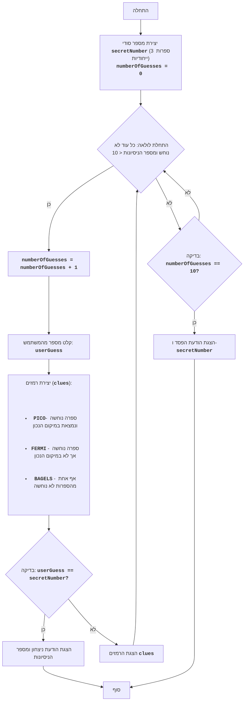

# BAGELS

## סקירה כללית

משחק "בייגלס" הוא משחק פאזל לוגי שבו השחקן מנסה לנחש מספר בעל שלוש ספרות, המורכב מספרות ייחודיות. לאחר כל ניסיון, השחקן מקבל רמזים: "PICO" פירושו שאחת הספרות נוחשה ונמצאת במיקום הנכון, "FERMI" פירושו שאחת הספרות נוחשה, אך לא במיקום הנכון, ו-"BAGELS" פירושו שאף אחת מהספרות לא נוחשה.

## תוכן עניינים

- [חוקי המשחק](#חוקי-המשחק)
- [אלגוריתם](#אלגוריתם)
- [תרשים זרימה](#תרשים-זרימה)

## חוקי המשחק

1. המחשב יוצר מספר אקראי בעל שלוש ספרות, המורכב מספרות ייחודיות.
2. השחקן מזין את ניחושיו כמספר תלת-ספרתי.
3. המחשב מספק רמזים:
    - "PICO" - ספרה אחת נוחשה והיא במיקום הנכון.
    - "FERMI" - ספרה אחת נוחשה, אך אינה במיקום הנכון.
    - "BAGELS" - אף אחת מהספרות לא נוחשה.
4. הרמזים ניתנים לפי סדר מיקום הספרות במספר המסתורי. לדוגמה, אם המספר המסתורי הוא `123` והשחקן הזין `142`, הרמזים יהיו `PICO FERMI`.
5. המשחק נמשך עד שהשחקן מנחש את המספר.
6. אם לאחר 10 ניסיונות השחקן לא מנחש את המספר, המשחק מסתיים והמספר המסתורי מוצג.

## אלגוריתם

1. צור מספר אקראי תלת-ספרתי המורכב מספרות ייחודיות (לדוגמה, 123).
2. הגדר את מספר הניסיונות ל-0.
3. לולאה "כל עוד המספר לא נוחש או מספר הניסיונות קטן מ-10":
    3.1. הגדל את מספר הניסיונות ב-1.
    3.2. בקש מהשחקן להזין מספר תלת-ספרתי.
    3.3. השווה את המספר שהוזן למספר המסתורי וצור את הרמזים "PICO", "FERMI" ו-"BAGELS".
    3.4. אם המספר נוחש, הצג הודעת ניצחון ומספר הניסיונות.
    3.5. אם המספר לא נוחש, הצג את הרמזים שנוצרו.
4. אם לאחר 10 ניסיונות המספר לא נוחש, הצג את המספר המסתורי והודעה על הפסד.
5. סוף המשחק.

## תרשים זרימה

### מקרא

- `Start` - תחילת המשחק.
- `GenerateSecretNumber` - יצירת המספר הסודי `secretNumber` המורכב מ-3 ספרות ייחודיות ואיפוס מספר הניסיונות `numberOfGuesses = 0`.
- `LoopStart` - תחילת הלולאה, הנמשכת כל עוד המספר לא נוחש ומספר הניסיונות קטן מ-10.
- `IncreaseGuesses` - הגדלת מונה מספר הניסיונות ב-1.
- `InputGuess` - קליטת מספר מהמשתמש ושמירתו במשתנה `userGuess`.
- `GenerateClues` - יצירת רמזים בהתבסס על השוואה בין `userGuess` ל-`secretNumber`.
- `CheckWin` - בדיקה האם המספר שהוזן `userGuess` שווה למספר הסודי `secretNumber`.
- `OutputWin` - הצגת הודעת ניצחון ומספר הניסיונות.
- `End` - סוף המשחק.
- `OutputClues` - הצגת הרמזים שנוצרו.
- `CheckLose` - בדיקה האם מספר הניסיונות הגיע ל-10.
- `OutputLose` - הצגת הודעת הפסד והמספר הסודי `secretNumber`.