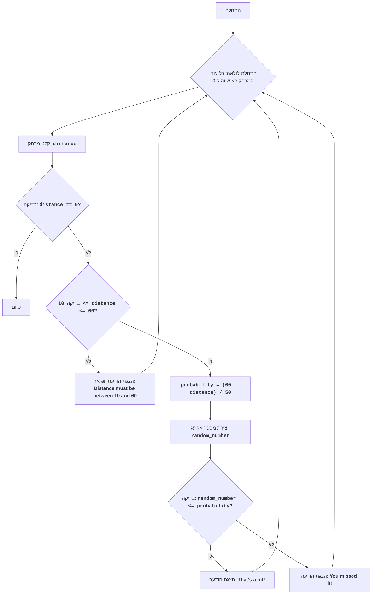

# BASKET

## סקירה כללית

משחק "כדורסל" הוא משחק טקסט המדמה זריקות כדורסל. השחקן בוחר מרחק זריקה (בין 10 ל-60 רגל), והמחשב קובע את תוצאת הזריקה (פגיעה או החמצה) בהתבסס על הסתברות התלויה במרחק. המשחק נמשך עד שהשחקן מחליט לסיים אותו.

## תוכן עניינים
* [סקירה כללית](#סקירה-כללית)
* [תיאור המשחק](#תיאור-המשחק)
* [קוד](#קוד)
* [הסבר על הקוד](#הסבר-על-הקוד)

## תיאור המשחק

### חוקי המשחק:
1. השחקן מזין את מרחק הזריקה ברגל (מספר שלם בין 10 ל-60).
2. המחשב מחשב את הסתברות הפגיעה בהתבסס על המרחק.
3. המחשב מייצר מספר אקראי ומשווה אותו להסתברות הפגיעה.
4. אם המספר האקראי קטן או שווה להסתברות, הזריקה נחשבת מוצלחת (פגיעה), אחרת - לא מוצלחת (החטאה).
5. המשחק מציג את תוצאת הזריקה (פגיעה או החטאה).
6. השחקן יכול להמשיך לזרוק עד שהוא מזין 0 כדי לסיים את המשחק.

### אלגוריתם:
1. התחל לולאה "כל עוד השחקן לא הזין 0":
    1.1. בקש מהשחקן את מרחק הזריקה ברגל (10-60, או 0 לסיום).
    1.2. אם המרחק שווה ל-0, סיים את הלולאה.
    1.3. אם המרחק קטן מ-10 או גדול מ-60, הצג הודעת שגיאה וחזור לתחילת הלולאה.
    1.4. חשב את הסתברות הפגיעה לפי הנוסחה: הסתברות = (60 - מרחק) / 50.
    1.5. צור מספר אקראי בין 0 ל-1.
    1.6. אם המספר האקראי קטן או שווה להסתברות, הצג הודעה "That's a hit!".
    1.7. אחרת, הצג הודעה "You missed it!".
2. סיום המשחק.

### תרשים זרימה:


### מקרא:
*   **Start** - תחילת התוכנית.
*   **LoopStart** - תחילת לולאה שמתמשכת כל עוד השחקן לא הזין 0.
*   **InputDistance** - בקשה מהמשתמש להזין את מרחק הזריקה ושמירתו במשתנה `distance`.
*   **CheckEnd** - בדיקה האם מרחק הקלט שווה ל-0.
*   **End** - סיום התוכנית.
*   **CheckRange** - בדיקה האם מרחק הקלט נמצא בטווח בין 10 ל-60.
*   **OutputError** - הצגת הודעת שגיאה במידה והמרחק לא בטווח הנכון.
*   **CalculateProbability** - חישוב הסתברות הפגיעה בהתבסס על מרחק הקלט.
*   **GenerateRandom** - יצירת מספר אקראי בין 0 ל-1.
*   **CheckHit** - בדיקה האם המספר האקראי קטן או שווה להסתברות המחושבת.
*   **OutputHit** - הצגת הודעה על פגיעה "That's a hit!".
*   **OutputMiss** - הצגת הודעה על החטאה "You missed it!".

## קוד

```python
import random

# לולאת משחק ראשית
while True:
    # מבקש מהמשתמש מרחק זריקה
    try:
        distance = int(input("הכנס את מרחק הזריקה (10-60 רגל, 0 לצאת): "))
    except ValueError:
        print("נא להזין מספר שלם.")
        continue

    # בודק אם השחקן רוצה לסיים את המשחק
    if distance == 0:
        print("המשחק הסתיים.")
        break

    # בודק אם המרחק בטווח המותר
    if distance < 10 or distance > 60:
        print("המרחק חייב להיות בין 10 ל-60 רגל.")
        continue

    # מחשב את סיכויי הפגיעה
    probability = (60 - distance) / 50

    # מייצר מספר אקראי בין 0 ל-1
    random_number = random.random()

    # בודק אם הזריקה הצליחה
    if random_number <= probability:
        print("That's a hit!")  # מציג הודעה על פגיעה
    else:
        print("You missed it!")  # מציג הודעה על החטאה
```

## הסבר על הקוד

1.  **ייבוא מודול `random`**:
    -   `import random`: מייבא את המודול `random`, המשמש ליצירת מספרים אקראיים.

2.  **לולאה ראשית `while True:`**:
    -   לולאה אינסופית, שמתמשכת עד שהשחקן מזין 0.
    -   **קלט נתונים**:
        -   `try...ex ValueError`: מטפל בשגיאות קלט אפשריות. אם המשתמש מזין מספר לא שלם, תופיע הודעת שגיאה.
        -   `distance = int(input("הכנס את מרחק הזריקה (10-60 רגל, 0 לצאת): "))`: מבקש מהמשתמש להזין את מרחק הזריקה וממיר אותו למספר שלם, ושומר את התוצאה במשתנה `distance`.
    -   **תנאי יציאה**:
        -   `if distance == 0:`: בודק האם המרחק שווה ל-0.
        -   `print("המשחק הסתיים.")`: מציג הודעה שהמשחק הסתיים.
        -   `break`: מסיים את הלולאה.
    -   **בדיקת מרחק**:
        -   `if distance < 10 or distance > 60:`: בודק האם המרחק נמצא בטווח המותר בין 10 ל-60.
        -   `print("המרחק חייב להיות בין 10 ל-60 רגל.")`: מציג הודעת שגיאה אם המרחק לא בטווח.
        -   `continue`: עובר לאיטרציה הבאה של הלולאה.
    -   **חישוב הסתברות**:
        -   `probability = (60 - distance) / 50`: מחשב את הסתברות הפגיעה בהתבסס על הנוסחה מהמשחק המקורי.
    -   **יצירת מספר אקראי**:
        -   `random_number = random.random()`: יוצר מספר אקראי בין 0 ל-1 ושומר אותו ב-`random_number`.
    -   **בדיקת תוצאה**:
        -   `if random_number <= probability:`: בודק האם המספר האקראי קטן או שווה להסתברות המחושבת.
        -   `print("That's a hit!")`: מציג הודעה על פגיעה.
        -   `else`: אם המספר האקראי גדול מההסתברות.
        -   `print("You missed it!")`: מציג הודעה על החטאה.